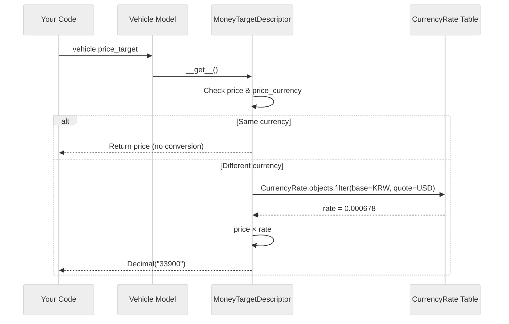

import { Callout } from 'nextra/components';

# MoneyField

`MoneyField` is a composite Django model field that stores monetary amounts with their currency, providing automatic conversion to a target currency via the `CurrencyRate` table.

## Import

```python
from django_cfg.modules.django_currency import MoneyField
```

---

## What It Creates

When you add a `MoneyField` named `price` to your model:

```python
class Vehicle(models.Model):
    price = MoneyField(
        default_currency="KRW",
        target_currency="USD",
    )
```

Django-CFG automatically creates:

| Attribute | Type | Storage | Description |
|-----------|------|---------|-------------|
| `price` | `DecimalField` | Database | The monetary amount |
| `price_currency` | `CharField` | Database | Currency code (e.g., "KRW") |
| `price_target` | Property | Calculated | Raw amount converted to `target_currency` |
| `price_target_rounded` | Property | Calculated | Smart-rounded converted amount |
| `price_display` | Property | Calculated | Formatted original price (e.g., "₩50M") |
| `price_target_display` | Property | Calculated | Formatted target price using rounded value (e.g., "$34,000") |
| `price_full_display` | Property | Calculated | Combined display using rounded value (e.g., "$34,000 (₩50M)") |

<Callout type="info">
**Key insight:** `price_target` and `price_target_rounded` are **not database fields**.
They read from the `CurrencyRate` table on every access, ensuring you always get the current rate.
Display properties use `price_target_rounded` for prettier output.
</Callout>

---

## Parameters

```python
MoneyField(
    max_digits=15,
    decimal_places=2,
    default_currency="USD",
    target_currency="USD",
    round_to=None,  # Optional: round target to nearest N
    null=True,
    blank=True,
    **kwargs  # Standard DecimalField kwargs
)
```

| Parameter | Type | Default | Description |
|-----------|------|---------|-------------|
| `max_digits` | `int` | `15` | Total digits (including decimals) |
| `decimal_places` | `int` | `2` | Decimal precision |
| `default_currency` | `str` | `"USD"` | Currency for new records |
| `target_currency` | `str` | `"USD"` | Conversion target for `_target` properties |
| `round_to` | `int` | `None` | Override rounding for `_target_rounded` (default: smart rounding) |
| `null` | `bool` | `True` | Allow NULL in database |
| `blank` | `bool` | `True` | Allow empty in forms |

All standard `DecimalField` parameters are also supported.

---

## Rounding Target Values

MoneyField provides two target properties:

- **`price_target`** - Raw converted amount (always precise)
- **`price_target_rounded`** - Smart-rounded amount for display

### Smart Rounding (Default)

Rounding precision based on magnitude:

| Value Range | Rounding |
|-------------|----------|
| < 100 | to 1 |
| 100-1,000 | to 10 |
| 1,000-10,000 | to 100 |
| 10,000-100,000 | to 500 |
| > 100,000 | to 1,000 |

### Override with `round_to`

```python
class Property(models.Model):
    price = MoneyField(
        default_currency="IDR",
        target_currency="USD",
        round_to=1000,  # Override: always round to nearest 1000
    )
```

**Result:**

```python
property.price                # Decimal("150000000.00") - original IDR
property.price_currency       # "IDR"
property.price_target         # Decimal("9523.45") - raw (always precise)
property.price_target_rounded # Decimal("10000") - rounded (round_to=1000)
```

### Common Rounding Values

| `round_to` | Raw Value | Rounded |
|------------|-----------|---------|
| `None` (smart) | $9,523.45 | $9,500 (magnitude-based) |
| `100` | $9,523.45 | $9,500 |
| `1000` | $9,523.45 | $10,000 |

<Callout type="tip">
Use `price_target_rounded` for frontend prices where exact precision isn't needed.
Use `price_target` when you need the precise converted value.
</Callout>

---

## Basic Usage

### Model Definition

```python
from django.db import models
from django_cfg.modules.django_currency import MoneyField

class Product(models.Model):
    name = models.CharField(max_length=200)

    price = MoneyField(
        max_digits=12,
        decimal_places=2,
        default_currency="USD",
        target_currency="EUR",
        help_text="Product price",
    )
```

### Accessing Values

```python
product = Product.objects.create(
    name="Laptop",
    price=1000,
    price_currency="USD",
)

# Stored values
product.price           # Decimal("1000.00")
product.price_currency  # "USD"

# Calculated properties
product.price_target         # Decimal("920.53") - raw converted to EUR
product.price_target_rounded # Decimal("920") - smart-rounded
```

### Querying

```python
# Filter by original amount
Product.objects.filter(price__gte=500)

# Filter by currency
Product.objects.filter(price_currency="USD")

# Filter by both
Product.objects.filter(price__gte=500, price_currency="EUR")
```

---

## Conversion Mechanism

### How `price_target` Works



### Same Currency Optimization

If `price_currency` equals `target_currency`, no database lookup occurs:

```python
vehicle = Vehicle(price=1000, price_currency="USD")
# target_currency is also "USD"

vehicle.price_target  # Returns Decimal("1000") directly, no DB query
```

### Missing Rate Handling

If no rate exists in `CurrencyRate`, returns `None`:

```python
vehicle.price_target  # None if CurrencyRate.get_rate("KRW", "USD") is None
```

---

## Multiple MoneyFields

You can have multiple `MoneyField` instances on one model:

```python
class Invoice(models.Model):
    # Price in customer's currency
    subtotal = MoneyField(
        default_currency="USD",
        target_currency="USD",
    )

    # Shipping in different currency
    shipping = MoneyField(
        default_currency="USD",
        target_currency="USD",
    )

    # Tax amount
    tax = MoneyField(
        default_currency="USD",
        target_currency="USD",
    )
```

This creates:
- `subtotal`, `subtotal_currency`, `subtotal_target`, `subtotal_target_rounded`
- `shipping`, `shipping_currency`, `shipping_target`, `shipping_target_rounded`
- `tax`, `tax_currency`, `tax_target`, `tax_target_rounded`

---

## ORM Patterns

### Filter by Converted Price

Use `Subquery` to filter by USD equivalent:

```python
from django.db.models import F, Subquery, OuterRef
from django_cfg.apps.tools.currency.models import CurrencyRate

# Build rate subquery
rate_subquery = CurrencyRate.objects.filter(
    base_currency=OuterRef("price_currency"),
    quote_currency="USD"
).values("rate")[:1]

# Annotate with USD price
vehicles = Vehicle.objects.annotate(
    price_usd=F("price") * Subquery(rate_subquery)
)

# Filter by USD price
cheap = vehicles.filter(price_usd__lte=10000)
expensive = vehicles.filter(price_usd__gte=50000)
```

### Order by Converted Price

```python
# Order by USD equivalent (ascending)
Vehicle.objects.annotate(
    price_usd=F("price") * Subquery(rate_subquery)
).order_by("price_usd")

# Descending
Vehicle.objects.annotate(
    price_usd=F("price") * Subquery(rate_subquery)
).order_by("-price_usd")
```

### Aggregate by Currency

```python
from django.db.models import Sum, Count, Avg

# Total value per currency
Vehicle.objects.values("price_currency").annotate(
    total=Sum("price"),
    count=Count("id"),
    avg=Avg("price"),
)
# [{'price_currency': 'KRW', 'total': 500000000, 'count': 10, 'avg': 50000000}, ...]
```

### Total in Single Currency

```python
from decimal import Decimal

def get_total_value_usd(queryset):
    """Calculate total value in USD."""
    vehicles = queryset.annotate(
        price_usd=F("price") * Subquery(rate_subquery)
    )
    result = vehicles.aggregate(total=Sum("price_usd"))
    return result["total"] or Decimal("0")

total = get_total_value_usd(Vehicle.objects.filter(status="active"))
```

---

## Display Properties (Auto-Generated)

`MoneyField` automatically creates formatted display properties using `PriceFormatter`:

```python
class Property(models.Model):
    price = MoneyField(
        default_currency="IDR",
        target_currency="USD",
    )

# Auto-generated properties - no custom code needed!
property.price                # Decimal("150000000.00")
property.price_currency       # "IDR"
property.price_target         # Decimal("9523.45") - raw
property.price_target_rounded # Decimal("9500") - smart-rounded
property.price_display        # "Rp 150M"
property.price_target_display # "$9,500" (uses rounded value)
property.price_full_display   # "$9,500 (Rp 150M)" (uses rounded value)
```

### Smart Formatting

`PriceFormatter` handles currency-specific formatting automatically:

| Currency | Example Amount | Formatted |
|----------|----------------|-----------|
| USD | 9500 | `$9,500` |
| IDR | 150000000 | `Rp 150M` |
| KRW | 50000000 | `₩50M` |
| EUR | 8500 | `€8,500` |
| BTC | 0.5 | `₿0.5` |

### Using Formatter Directly

For custom formatting, use the formatter directly:

```python
from django_cfg.modules.django_currency import format_price, format_price_full

# Basic formatting
format_price(150_000_000, "IDR")  # "Rp 150M"
format_price(9500, "USD")          # "$9,500"

# With suffix (for rentals)
format_price(1500, "USD", suffix="/month")  # "$1,500/month"

# Full display with both currencies
format_price_full(
    amount=150_000_000,
    currency="IDR",
    target_amount=9500,
    target_currency="USD",
)  # "$9,500 (Rp 150M)"
```

---

## Migrations

### Adding to Existing Model

```python
# Step 1: Add MoneyField (nullable)
price = MoneyField(
    max_digits=15,
    decimal_places=2,
    default_currency="USD",
    target_currency="USD",
    null=True,
    blank=True,
)

# Step 2: makemigrations & migrate
# This creates: price, price_currency columns

# Step 3 (optional): Set defaults for existing records
Vehicle.objects.filter(price_currency__isnull=True).update(
    price_currency="USD"
)
```

### Migration File

The migration creates two columns:

```python
# Auto-generated migration
operations = [
    migrations.AddField(
        model_name='vehicle',
        name='price',
        field=models.DecimalField(
            blank=True,
            decimal_places=2,
            max_digits=15,
            null=True,
        ),
    ),
    migrations.AddField(
        model_name='vehicle',
        name='price_currency',
        field=models.CharField(
            db_index=True,
            default='USD',
            max_length=10,
        ),
    ),
]
```

<Callout type="info">
Note: `price_target` and `price_target_rounded` are NOT in migrations — they're Python properties, not database columns.
</Callout>

---

## Admin Integration

<Callout type="info">
**No extra mixins needed!** `PydanticAdmin` automatically includes `MoneyFieldAdminMixin`.
</Callout>

```python
from django_cfg.modules.django_admin.base import PydanticAdmin

@admin.register(Vehicle)
class VehicleAdmin(PydanticAdmin):
    config = config
```

See [Admin Integration](./admin-integration) for full details.

---

## Best Practices

### DO: Use for User-Facing Prices

```python
class Product(models.Model):
    # ✅ Good - stores customer's currency
    price = MoneyField(default_currency="USD", target_currency="USD")
```

### DON'T: Store Rates Per Record

```python
class Product(models.Model):
    # ❌ Bad - duplicates rate data
    price = models.DecimalField(...)
    price_currency = models.CharField(...)
    price_usd = models.DecimalField(...)      # Don't store!
    exchange_rate = models.DecimalField(...)  # Don't store!
    rate_updated_at = models.DateTimeField()  # Don't store!
```

### DO: Use Property for Conversion

```python
class Product(models.Model):
    price = MoneyField(...)

    # ✅ Good - use price_target_rounded for display
    @property
    def price_usd(self):
        return self.price_target_rounded

    # ✅ Good - use price_target for precise calculations
    @property
    def price_usd_precise(self):
        return self.price_target
```

### DO: Index Currency Field

The `price_currency` field is automatically indexed (`db_index=True`).

---

## See Also

- [Quick Start](./quick-start) - Get started in 5 minutes
- [Admin Integration](./admin-integration) - MoneyFieldDisplay and widget details
- [API Reference](./api-reference) - Complete API
