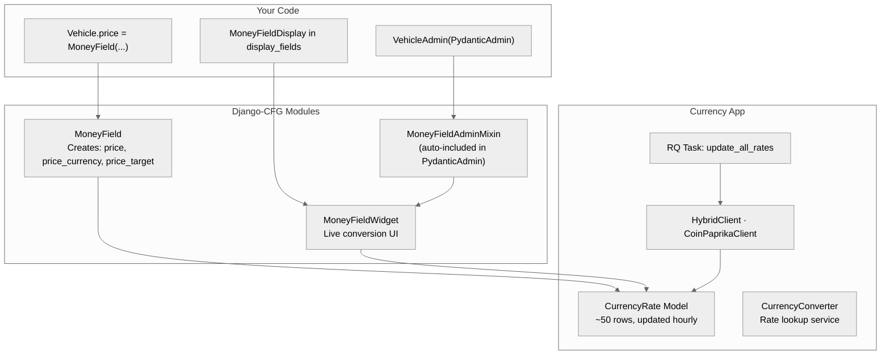
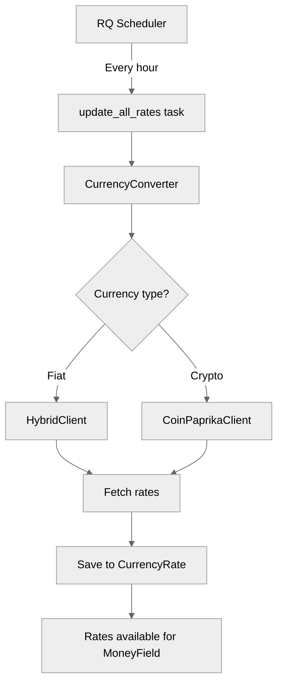

import { Callout } from 'nextra/components';

# Currency System

Django-CFG's **Currency System** provides database-backed exchange rates with automatic updates, a composite model field for storing monetary values, and seamless Django Admin integration.

## Architecture

The currency system consists of three layers:



### Layer 1: Your Code

What you write in your Django project:

| Component | Purpose |
|-----------|---------|
| `MoneyField` | Model field that stores amount + currency |
| `PydanticAdmin` | Admin base class (includes currency support) |
| `MoneyFieldDisplay` | Display field for admin lists |

### Layer 2: Django-CFG Modules

Internal components that handle the heavy lifting:

| Component | Location | Purpose |
|-----------|----------|---------|
| `MoneyField` | `django_cfg.modules.django_currency` | Creates composite fields |
| `MoneyFieldAdminMixin` | `django_cfg.modules.django_currency` | Admin form handling |
| `MoneyFieldWidget` | `django_cfg.modules.django_admin.widgets` | Live conversion widget |

### Layer 3: Currency App

Built-in app that manages exchange rates:

| Component | Location | Purpose |
|-----------|----------|---------|
| `CurrencyRate` | `django_cfg.apps.tools.currency` | Database model (~50 rows) |
| `CurrencyConverter` | `django_cfg.apps.tools.currency.services` | Rate lookup |
| `update_all_rates` | `django_cfg.apps.tools.currency.tasks` | RQ scheduled task |

---

## Philosophy

### "Rates in Database, Not Per Record"

<Callout type="warning">
**Anti-pattern:** Storing `price_usd`, `price_rate`, `price_rate_at` on every record.

With 1M records × 3 fields = massive storage and expensive hourly updates.
</Callout>

<Callout type="info">
**Our approach:** Single `CurrencyRate` table (~50 rows) updated hourly.

`MoneyField.price_target` is a **property** that reads from this table on access.
</Callout>

### "Configure Once, Works Everywhere"

Enable currency in your config, and everything auto-registers:

```python
from django_cfg import DjangoConfig, CurrencyConfig

class MyConfig(DjangoConfig):
    # Minimal config - uses sensible defaults
    currency = CurrencyConfig(
        enabled=True,
        update_interval=3600,  # Update rates every hour
    )
```

<Callout type="info">
**Default values:** `target_currency="USD"`, `auto_update_enabled=True`, `update_on_startup=True`
</Callout>

**What happens automatically:**
- `django_cfg.apps.tools.currency` added to `INSTALLED_APPS`
- `CurrencyRate` admin registered
- `update_all_rates` task added to RQ scheduler
- Stale rates updated on Django startup

### "Display vs Storage Separation"

| Use Case | Component | What It Does |
|----------|-----------|--------------|
| **Store** money in model | `MoneyField` | Creates `price`, `price_currency` fields |
| **Display** in admin list | `MoneyFieldDisplay` | Formats as `₩50,000,000 → $33,900` |
| **Edit** in admin form | `MoneyFieldWidget` | Amount input + currency dropdown |

---

## Key Components

### MoneyField

Composite model field that stores amount and currency:

```python
from django_cfg.modules.django_currency import MoneyField

class Vehicle(models.Model):
    # Creates: price, price_currency, price_target (property)
    price = MoneyField(
        max_digits=15,
        decimal_places=2,
        default_currency="KRW",
        target_currency="USD",
    )
```

**What gets created:**

| Attribute | Type | Storage | Description |
|-----------|------|---------|-------------|
| `price` | DecimalField | Database | Original amount |
| `price_currency` | CharField | Database | Currency code (e.g., "KRW") |
| `price_target` | Property | Calculated | Converted amount via CurrencyRate |
| `price_display` | Property | Calculated | Formatted original (e.g., "₩50M") |
| `price_target_display` | Property | Calculated | Formatted target (e.g., "$33,900") |
| `price_full_display` | Property | Calculated | Combined (e.g., "$33,900 (₩50M)") |

[Learn more about MoneyField →](./money-field)

### CurrencyRate Model

Single source of truth for exchange rates:

```python
from django_cfg.apps.tools.currency.models import CurrencyRate

# Get rate
rate = CurrencyRate.get_rate("KRW", "USD")
# Returns: CurrencyRate(base="KRW", quote="USD", rate=0.000678)

# Get rate value
value = CurrencyRate.get_rate_value("KRW", "USD")
# Returns: Decimal("0.000678")
```

**Table structure (~50 rows):**

| Field | Example | Description |
|-------|---------|-------------|
| `base_currency` | KRW | Source currency |
| `quote_currency` | USD | Target currency |
| `rate` | 0.000678 | Exchange rate |
| `provider` | hybrid | Rate source |
| `updated_at` | 2025-01-18 12:00 | Last update |

### PydanticAdmin (with MoneyFieldAdminMixin)

`PydanticAdmin` automatically includes `MoneyFieldAdminMixin`, so no extra mixins needed:

```python
from django_cfg.modules.django_admin.base import PydanticAdmin

@admin.register(Vehicle)
class VehicleAdmin(PydanticAdmin):
    config = vehicle_config
```

**Auto-provides:**
- Currency dropdown synced with model
- Currency saved on form submit
- Live conversion widget

### MoneyFieldDisplay

Compact display field for admin lists. Auto-detects related fields from base name:

```python
from django_cfg.modules.django_admin import MoneyFieldDisplay

display_fields = [
    # Auto-detects: price_currency, price_target, price_rate, price_rate_at
    MoneyFieldDisplay(
        name="price",
        title="Price",
    ),
]
# Renders: ₩50,000,000 → $33,900
```

[Learn more about MoneyFieldDisplay →](./admin-integration)

---

## Rate Providers

### Fiat Currencies (HybridClient)

Multi-source provider with fallbacks:

| Source | Coverage | Notes |
|--------|----------|-------|
| Fawaz Currency API | 200+ currencies | Primary, CDN-backed |
| Frankfurter API | EUR-based pairs | ECB data |
| ExchangeRate-API | USD-based pairs | Free tier |
| CBR API | RUB pairs | Russian Central Bank |

### Cryptocurrencies (CoinPaprikaClient)

| Feature | Value |
|---------|-------|
| Coverage | 100+ top cryptocurrencies |
| API Key | Not required |
| Supported | BTC, ETH, SOL, DOGE, USDT, USDC, etc. |

---

## Rate Update Flow



**Update triggers:**
1. **Scheduled:** RQ task `sync_all` runs based on `update_interval`
2. **On startup:** Background thread syncs currencies (if needed) + rates (if stale)
3. **Manual:** Management command or admin button

### Startup Behavior

When Django starts, a background thread runs `sync_all()`:

```
Django startup
    ↓
Background thread spawned (non-blocking)
    ↓
sync_currencies_if_needed() → adds missing currencies
    ↓
update_rates_if_needed() → updates stale rates
```

<Callout type="info">
**Non-blocking:** Django continues serving requests immediately. Currency sync runs in background.
</Callout>

### Management Command

```bash
# Update rates only
python manage.py update_currency_rates

# Sync currencies + rates
python manage.py update_currency_rates --all

# Show statistics
python manage.py update_currency_rates --stats --verbose
```

---

## When to Use What

| Scenario | Use |
|----------|-----|
| Store price in model | `MoneyField` |
| Display price in admin list | `MoneyFieldDisplay` in `display_fields` |
| Edit price in admin form | `PydanticAdmin` (auto-applies widget) |
| Get rate programmatically | `CurrencyRate.get_rate()` |
| Convert amount in code | `CurrencyConverter.convert()` |
| Update rates manually | Admin action or `update_all_rates()` |

---

## Quick Example

```python
# models.py
from django.db import models
from django_cfg.modules.django_currency import MoneyField

class Vehicle(models.Model):
    name = models.CharField(max_length=200)
    price = MoneyField(
        default_currency="KRW",
        target_currency="USD",
    )

# admin.py
from django.contrib import admin
from django_cfg.modules.django_admin import AdminConfig, MoneyFieldDisplay
from django_cfg.modules.django_admin.base import PydanticAdmin

config = AdminConfig(
    model=Vehicle,
    list_display=["name", "price"],
    display_fields=[
        # Auto-detects: price_currency, price_target
        MoneyFieldDisplay(
            name="price",
            title="Price",
        ),
    ],
)

@admin.register(Vehicle)
class VehicleAdmin(PydanticAdmin):
    config = config
```

---

## See Also

- [Quick Start](./quick-start) - Get started in 5 minutes
- [MoneyField](./money-field) - Model field deep dive
- [Admin Integration](./admin-integration) - MoneyFieldDisplay and widget details
- [API Reference](./api-reference) - Complete API documentation
