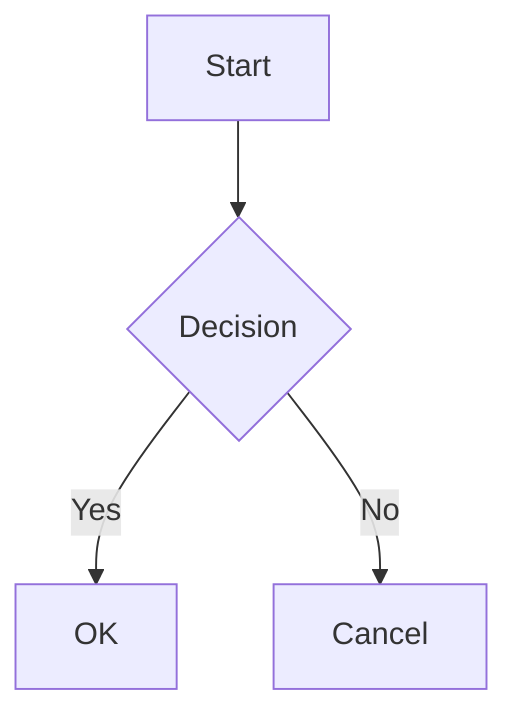

# Documentation & Management Commands

Automatically display markdown documentation and management commands in your Django Admin interface using a modern modal window with tree navigation.

## Overview

The Documentation feature provides:

- **📚 Markdown Documentation**: Auto-discover and render `.md` files from a directory
- **🪟 Modal Window**: Floating action button (FAB) opens modal with tree navigation
- **🌲 Tree Navigation**: Left sidebar with hierarchical file structure
- **🖥️ Management Commands**: Auto-discover Django management commands with arguments
- **🎨 Beautiful UI**: Modern modal interface with Unfold semantic styling
- **📂 Flexible Paths**: Support for relative, absolute, and app-relative paths
- **🌙 Dark Mode**: Full dark mode support with proper contrast
- **🎨 Mermaid Diagrams**: Built-in support for Mermaid.js diagrams
- **💡 Syntax Highlighting**: Code blocks with Prism.js highlighting

## Quick Start

### Directory Mode

```python
from django_cfg.modules.django_admin import AdminConfig, DocumentationConfig

coin_admin_config = AdminConfig(
    model=Coin,
    list_display=["symbol", "name", "current_price_usd"],

    # Auto-discover all .md files in docs/ directory
    documentation=DocumentationConfig(
        source_dir="docs",  # Relative to app directory
        title="📚 Coin Documentation",
        show_management_commands=True,  # Show commands too!
        enable_plugins=True,  # Enable Mermaid diagrams
    ),
)

@admin.register(Coin)
class CoinAdmin(PydanticAdmin):
    config = coin_admin_config
```

### Single File

```python
documentation=DocumentationConfig(
    source_file="docs/README.md",
    title="Documentation",
)
```

### String Content

```python
documentation=DocumentationConfig(
    source_content="""
# Quick Reference

- Command: `python manage.py import_coins`
- Format: CSV or JSON
    """,
    title="Quick Reference",
)
```


## DocumentationConfig

### Parameters

```python
class DocumentationConfig(BaseModel):
    # Content source (one required)
    source_dir: str | Path | None = None           # Directory to scan
    source_file: str | Path | None = None          # Single file path
    source_content: str | None = None              # Markdown string

    # Display options
    title: str = "Documentation"                   # Main title

    # Placement
    show_on_changelist: bool = True                # Show FAB on list page
    show_on_changeform: bool = True                # Show FAB on edit page

    # Markdown rendering
    enable_plugins: bool = True                    # Mistune + Mermaid plugins
    sort_sections: bool = True                     # Sort alphabetically

    # Management commands
    show_management_commands: bool = True          # Auto-discover commands
```

### Path Resolution

The system intelligently resolves file paths in this order:

1. **Absolute path**: `/full/path/to/docs`
2. **Project root**: `apps/crypto/docs` (relative to `BASE_DIR`)
3. **App directory**: `docs` (relative to current app)
4. **App search**: Searches through all `INSTALLED_APPS`


<Callout type="info">
**Recommended: Relative Paths**
Use app-relative paths like `"docs"` for portability and simplicity.

</Callout>

## Modal Window UI

The documentation opens in a modern modal window with:

- **Floating Action Button (FAB)**: Fixed in bottom-right corner (z-index: 49)
- **Tree Navigation**: Left sidebar (320px) with hierarchical file structure
- **Content Panel**: Right side with rendered markdown
- **Search**: Filter tree items by name
- **Responsive**: Independent scrolling for sidebar and content

### Modal Features

- **85vh height**: Optimal viewing size
- **Esc to close**: Keyboard accessible
- **Click outside**: Close by clicking overlay
- **Smooth animations**: Fade in/out transitions
- **Auto-select**: First section selected automatically

## Directory Mode

Directory mode automatically scans for all `.md` files recursively and builds a tree structure.

### File Structure

```
apps/crypto/
├── docs/
│   ├── README.md              # → "Overview"
│   ├── coin_documentation.md  # → "Coin Documentation"
│   ├── wallet_documentation.md
│   └── api/
│       ├── endpoints.md       # → "Endpoints" (under "api" folder)
│       └── authentication.md  # → "Authentication" (under "api" folder)
```

### Section Titles

Section titles are extracted in this order:

1. **First H1 heading** from file content
2. **README.md** → parent directory name
3. **Nested files** → organized under parent folder in tree
4. **Filename** → converted to title case

```markdown
<!-- coin_documentation.md -->
# Coin Model Documentation

This becomes the section title!
```

### Example

```python
documentation=DocumentationConfig(
    source_dir="docs",              # Scans apps/crypto/docs/**/*.md
    title="📚 Crypto Documentation",
    sort_sections=True,              # A-Z sorting
    enable_plugins=True,             # Mermaid + syntax highlighting
    show_management_commands=True,   # Commands section
)
```

## Management Commands

Automatically discovers and displays Django management commands from your app.

### Discovery

Commands are discovered from `<app>/management/commands/*.py`:

```
apps/crypto/
└── management/
    └── commands/
        ├── update_coin_prices.py
        ├── import_coins.py
        └── generate_report.py
```

### Command Information

For each command, the system extracts:

- **Command name**: `python manage.py command_name`
- **Help text**: From `help` attribute
- **Arguments**: From `add_arguments()` method
  - Argument names (`--arg`, `positional`)
  - Help text
  - Required/optional status
  - Default values

### Example Command

```python filename="apps/crypto/management/commands/update_coin_prices.py"
from django.core.management.base import BaseCommand

class Command(BaseCommand):
    help = 'Update cryptocurrency prices from CoinGecko API'

    def add_arguments(self, parser):
        parser.add_argument(
            '--coin',
            type=str,
            help='Update specific coin by symbol (e.g., BTC, ETH)',
        )
        parser.add_argument(
            '--limit',
            type=int,
            default=100,
            help='Maximum number of coins to update',
        )
        parser.add_argument(
            '--force',
            action='store_true',
            help='Force update even if data is recent',
        )

    def handle(self, *args, **options):
        # Implementation
        pass
```

## Markdown Features

Full markdown support via mistune 3.1.4:

### Supported Features

### Basic Syntax

```markdown
# Headings
## Level 2
### Level 3

**Bold text**
*Italic text*
`Inline code`

- Lists
- Items

1. Numbered
2. Lists
```

### Code Blocks

````markdown
```python
def example():
    return "Syntax highlighted!"
```

```bash
python manage.py update_coin_prices --limit 50
```
````

### Mermaid Diagrams

````markdown

````

Renders as interactive diagram with Unfold semantic colors!

### Tables

```markdown
| Feature | Supported | Notes |
|---------|-----------|-------|
| Tables  | ✅        | Full  |
| Images  | ✅        | Yes   |
| Links   | ✅        | All   |
```


## Complete Example

```python filename="apps/crypto/admin/coin_admin.py"
from django.contrib import admin
from django_cfg.modules.django_admin import (
    AdminConfig,
    BadgeField,
    CurrencyField,
    DocumentationConfig,
    FieldsetConfig,
    Icons,
)
from django_cfg.modules.django_admin.base import PydanticAdmin

from apps.crypto.models import Coin

coin_admin_config = AdminConfig(
    model=Coin,

    # List display
    list_display=[
        "symbol",
        "name",
        "current_price_usd",
        "market_cap_usd",
        "is_active"
    ],

    # Display fields with UI widgets
    display_fields=[
        BadgeField(
            name="symbol",
            title="Symbol",
            variant="primary",
            icon=Icons.CURRENCY_BITCOIN
        ),
        CurrencyField(
            name="current_price_usd",
            title="Price",
            currency="USD",
            precision=2
        ),
    ],

    # Filters and search
    list_filter=["is_active", "created_at"],
    search_fields=["symbol", "name"],

    # Fieldsets
    fieldsets=[
        FieldsetConfig(
            title="Basic Information",
            fields=["symbol", "name", "slug"]
        ),
        FieldsetConfig(
            title="Market Data",
            fields=["current_price_usd", "market_cap_usd"]
        ),
    ],

    # 📚 Documentation Configuration
    documentation=DocumentationConfig(
        source_dir="docs",              # Auto-discover all .md files
        title="📚 Coin Documentation",
        show_on_changelist=True,        # Show FAB on list page
        show_on_changeform=True,        # Show FAB on edit page
        enable_plugins=True,            # Mermaid + syntax highlighting
        sort_sections=True,             # A-Z sorting
        show_management_commands=True,  # Show commands
    ),
)

@admin.register(Coin)
class CoinAdmin(PydanticAdmin):
    """
    Enhanced admin with modal documentation window.
    """
    config = coin_admin_config
```

## Best Practices


<Callout type="info">
**Documentation Organization**

**Directory Structure**
```
apps/crypto/docs/
├── README.md           # Overview (shown first)
├── models.md           # Model documentation
├── api.md              # API reference
└── management.md       # Management commands guide
```

**File Naming**
- Use lowercase with underscores: `coin_model.md`
- Or kebab-case: `coin-model.md`
- First H1 becomes section title


</Callout>


<Callout type="warning">
**Path Resolution**

**Relative paths** are resolved in this order:
1. Project root (`BASE_DIR`)
2. Current app directory
3. All installed apps

**Recommendation**: Use app-relative paths like `"docs"` for simplicity.


</Callout>


<Callout type="info">
**Performance**

**Caching**: Rendered markdown is computed on each request.

**Optimization**:
- Keep markdown files reasonably sized
- Tree structure is built automatically
- Mermaid diagrams render on-demand


</Callout>

## Troubleshooting

### Documentation Not Showing

1. **Check path resolution**:
   ```python
   # Debug: Print resolved path
   doc_config = DocumentationConfig(source_dir="docs")
   app_path = Path(__file__).parent.parent  # App directory
   print(doc_config._resolve_path("docs", app_path))
   ```

2. **Verify file exists**:
   ```bash
   ls -la apps/crypto/docs/
   ```

3. **Check file permissions**: Ensure `.md` files are readable

### FAB Button Not Visible

1. **Check z-index conflicts**: FAB uses z-index: 49
2. **Verify placement**: FAB is fixed bottom-right
3. **Check CSS**: Ensure no conflicting styles

### Mermaid Diagrams Not Rendering

1. **Enable plugins**:
   ```python
   documentation=DocumentationConfig(
       enable_plugins=True,  # Must be True
   )
   ```

2. **Check syntax**: Use proper mermaid code fence
3. **Browser console**: Check for JavaScript errors

## See Also

- [Field Types Reference](../field-types)
- [Configuration Guide](../configuration)
- [Unfold Admin](https://unfoldadmin.com/)
- [Mistune Documentation](https://mistune.lepture.com/)
- [Mermaid.js](https://mermaid.js.org/)
