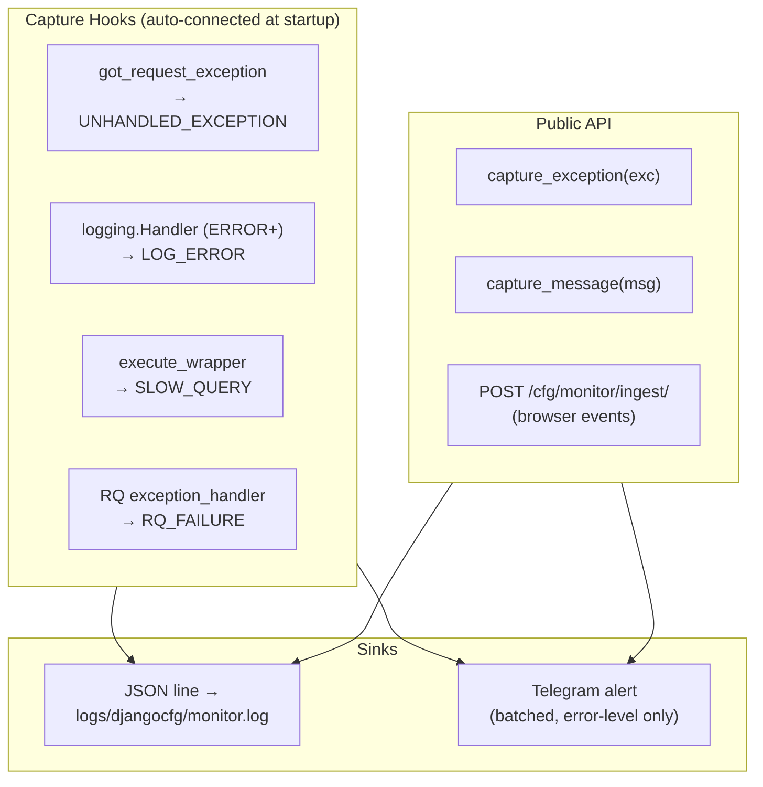

# Monitor — `django_monitor`

`django_monitor` captures server-side errors, slow queries, background-task
failures and browser events, writes each as a **JSON line** through the standard
Django-CFG logging pipeline, and (when Telegram is configured) batches error
events into **Telegram alerts**.

<Callout type="info">
**Zero-config.** There is no `MonitorConfig` — nothing to switch on. Capture
hooks connect automatically at startup. Telegram alerts turn on by themselves
the moment a `TelegramConfig` is present on your `DjangoConfig`; with no Telegram
configured, capture still records events, it just doesn't send alerts.
</Callout>

---

## How It Fits Together



Every event lands in `logs/djangocfg/monitor.log` (daily rotation, 30-day
retention — the same file infrastructure as all other Django-CFG logs).
Error-level events additionally join a Telegram batch when Telegram is set up.

---

## What Gets Captured

| Source | Event type | Alerts? |
|---|---|---|
| `got_request_exception` signal | `UNHANDLED_EXCEPTION` | yes |
| `logging.Handler` (ERROR+) | `LOG_ERROR` | yes |
| `execute_wrapper` (slow DB query) | `SLOW_QUERY` | over threshold |
| RQ `exception_handler` | `RQ_FAILURE` | yes |
| `capture_exception()` | `SERVER_ERROR` | yes |
| `capture_message()` | `LOG_ERROR` | yes (by level) |
| Browser events (`/cfg/monitor/ingest/`) | `FRONTEND_ERROR`, … | error-level only |

Alerts are **batched**: the first occurrence of a new fingerprint is sent
immediately, and repeats within the window are folded into a single 60-second
digest so a crash loop can't flood your chat.

Each alert line also ends with a `<code>fingerprint</code>` token when one is
available — a stable 16-hex-char SHA-256 join key you can use to correlate
repeat occurrences of the same error across alerts, and against `monitor.log`
entries (`ev.fingerprint` is stored there too). It's computed per source: from
the exception signature for `UNHANDLED_EXCEPTION`, `RQ_FAILURE` and
`LOG_ERROR`, or from the query SQL with literal values stripped for
`SLOW_QUERY` — so the same query with different parameters shares one
fingerprint. The fingerprint is omitted (not faked) when none is available,
which only happens for browser-originated events.

---

## Quick Start

There is nothing to configure for capture. To receive alerts, add a
`TelegramConfig`:

```python
# djangoconfig.py
from django_cfg import DjangoConfig, TelegramConfig

class MyConfig(DjangoConfig):
    telegram: TelegramConfig = TelegramConfig(
        bot_token="${TELEGRAM_BOT_TOKEN}",
        chat_id="${TELEGRAM_CHAT_ID}",
    )
```

That's the whole setup — errors now flow to `monitor.log` and to Telegram.

### Manual capture (optional)

```python
from django_cfg.modules.django_monitor import capture_exception, capture_message

try:
    process_payment(order)
except Exception as e:
    capture_exception(e, url="/api/orders/", http_method="POST")

capture_message("payment gateway slow", level="warning", extra={"latency_ms": 3200})
```

Both calls are **fire-and-forget** — they never raise.

### Check status

```bash
python manage.py monitor_status
```

Reports whether alerts are on (i.e. whether Telegram is configured) and
summarizes today's events from `monitor.log`.

---

## Browser events

The frontend counterpart is the [`@djangocfg/devtools`](/features/modules/django-monitor/devtools)
package. It captures JS errors, console errors and failed requests in the
browser and posts them in batches to `POST /cfg/monitor/ingest/`, where they are
enriched and written to `monitor.log` like any server event (error-level ones
also alert). It ships an in-app debug panel for inspecting the same feed live.

Browser events are the one path where an alert may show no fingerprint token —
server-side capture always stamps one, but frontend ingest doesn't compute one
upstream.

---

## What's Next

<Cards>
  <Card title="Frontend devtools" href="/features/modules/django-monitor/devtools">The `@djangocfg/devtools` browser package and debug panel</Card>
  <Card title="Management Commands" href="/features/modules/django-monitor/management-commands">`monitor_status`</Card>
</Cards>

---

TAGS: django_monitor, error-tracking, telegram, logging, zero-config
