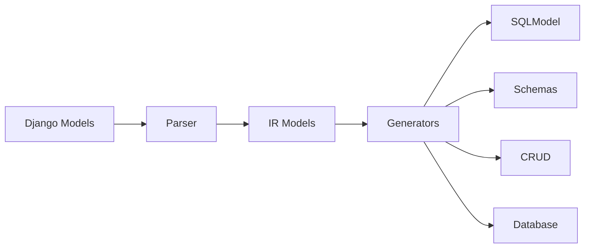

# FastAPI ORM Generator

Django-CFG includes a **FastAPI ORM Generator** that automatically converts Django models into production-ready FastAPI/SQLModel code using runtime introspection.

## Features

| Feature | Description |
|---------|-------------|
| **Runtime Introspection** | Parses Django models via `model._meta` API |
| **SQLModel Generation** | Type-safe table classes with relationships |
| **Pydantic Schemas** | Create/Read/Update schemas per model |
| **CRUD Repositories** | Async repository pattern with pagination |
| **PostgreSQL Types** | Native JSONB, ARRAY, UUID support |
| **Async-First** | AsyncSession-based with connection pooling |
| **Type-Safe** | Full Python type hints throughout |

## Quick Start

```bash
# Generate ORM for all apps
python manage.py generate_fastapi

# Generate for specific apps
python manage.py generate_fastapi users products orders

# Preview without writing files
python manage.py generate_fastapi --dry-run
```

## Generated Structure

```
orm/
├── __init__.py          # Root exports
├── database.py          # Async session factory
├── CLAUDE.md            # AI assistant instructions
├── users/
│   ├── __init__.py
│   ├── models.py        # SQLModel table classes
│   ├── schemas.py       # Pydantic schemas
│   └── crud.py          # Async CRUD repository
└── products/
    └── ...
```

## How It Works



The generator uses a multi-stage pipeline:

1. **Parse** - Introspects Django models at runtime
2. **Transform** - Creates intermediate representation (IR)
3. **Generate** - Produces SQLModel, schemas, and repositories
4. **Write** - Outputs formatted Python files

## Example Output

**Django Model:**
```python
class User(models.Model):
    email = models.EmailField(unique=True)
    username = models.CharField(max_length=150)
    is_active = models.BooleanField(default=True)
    created_at = models.DateTimeField(auto_now_add=True)
    metadata = models.JSONField(default=dict)
```

**Generated SQLModel:**
```python
class User(SQLModel, table=True):
    __tablename__ = "users_user"

    id: int = Field(default=None, primary_key=True)
    email: str = Field(max_length=255, unique=True)
    username: str = Field(max_length=150)
    is_active: bool = Field(default=True, index=True)
    created_at: datetime = Field()
    metadata: dict = Field(default_factory=dict, sa_column=Column(JSONB))
```

**Generated Repository:**
```python
class UserRepository:
    @staticmethod
    async def get_by_id(session: AsyncSession, id: int) -> Optional[User]:
        statement = select(User).where(User.id == id)
        result = await session.execute(statement)
        return result.scalars().first()

    @staticmethod
    async def create(session: AsyncSession, obj: User) -> User:
        session.add(obj)
        await session.commit()
        await session.refresh(obj)
        return obj
```

## FastAPI Integration

```python
from fastapi import FastAPI, Depends, HTTPException
from orm import get_session
from orm.users.models import User
from orm.users.schemas import UserCreate, UserRead
from orm.users.crud import UserRepository

app = FastAPI()

@app.get("/users/{user_id}", response_model=UserRead)
async def get_user(user_id: int, session = Depends(get_session)):
    user = await UserRepository.get_by_id(session, user_id)
    if not user:
        raise HTTPException(status_code=404)
    return user

@app.post("/users", response_model=UserRead, status_code=201)
async def create_user(data: UserCreate, session = Depends(get_session)):
    user = User(**data.model_dump())
    return await UserRepository.create(session, user)
```

## Programmatic Usage

```python
from django_cfg.modules.django_fastapi import FastAPIConfig, FastAPIOrchestrator

config = FastAPIConfig(
    output_dir="src/orm/",
    apps=["users", "products"],
    use_jsonb=True,
)

orchestrator = FastAPIOrchestrator(config=config)
result = orchestrator.generate()

print(f"Generated {result.models_count} models")
print(f"Created {len(result.files)} files")
```

## Related Documentation

- [Configuration](/docs/features/modules/fastapi-orm/configuration)
- [Generated Code](/docs/features/modules/fastapi-orm/generated-code)
- [Usage Patterns](/docs/features/modules/fastapi-orm/usage)

TAGS: fastapi, sqlmodel, orm, code-generation, async
DEPENDS_ON: [configuration]
