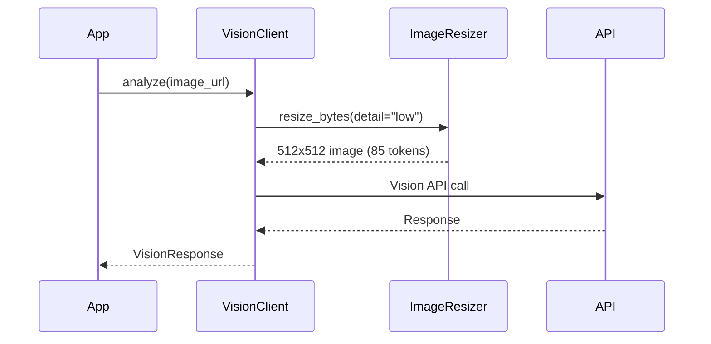

# Vision & OCR

The VisionClient provides image analysis and OCR capabilities with automatic resizing for token optimization.

## Token Cost Optimization

OpenAI Vision API charges based on image size:

| Detail Mode | Size | Tokens | Use Case |
|-------------|------|--------|----------|
| `low` | 512x512 | **85 fixed** | OCR, text extraction |
| `high` | 768px short | 85 + 170/tile | Detailed analysis |
| `auto` | Adaptive | Varies | Auto-select |

**Cost savings example:**
- 15,000 images/day: **$1.72 → $0.19** (90% savings)

## Quick Start

```python
from django_cfg.modules.django_llm.llm.vision import VisionClient

# Default: auto_resize=True, default_detail="low"
client = VisionClient()

# Analyze image (auto-resized to 512x512 = 85 tokens)
response = client.analyze(
    image_source="https://example.com/image.jpg",
    query="Describe this image"
)
print(response.content)
print(f"Cost: ${response.cost_usd:.4f}")
```

## VisionClient Configuration

```python
client = VisionClient(
    api_key="sk-or-v1-...",       # Optional, auto-detected
    auto_resize=True,              # Enable auto-resize (default)
    default_detail="low",          # low/high/auto (default: "low")
    max_tokens=1024,               # Max response tokens
    temperature=0.2,               # Generation temperature
)
```

## Image Analysis

### Basic Analysis

```python
# Simple analysis
response = client.analyze(
    image_source="https://example.com/image.jpg",
    query="What objects are in this image?"
)

# With resize override
response = client.analyze(
    image_source="https://example.com/detailed-chart.jpg",
    query="Analyze this chart in detail",
    resize=True,
    detail="high"  # Use high detail for this call
)

# Disable resize for specific call
response = client.analyze(
    image_source="https://example.com/image.jpg",
    query="Describe",
    resize=False
)
```

### Quality Presets

```python
# With quality preset
response = client.analyze_with_quality(
    image_url="https://example.com/image.jpg",
    prompt="Analyze this image",
    model_quality="balanced"  # fast, balanced, best
)
```

| Preset | Model | Use Case |
|--------|-------|----------|
| `fast` | Auto cheapest | Quick checks, high volume |
| `balanced` | llama-3.2-11b | General purpose |
| `best` | gpt-4o | Complex, accuracy critical |

### Structured Analysis

```python
# Returns ImageAnalysisResult + VisionResponse
result, response = client.analyze_structured(
    image_source="https://example.com/image.jpg",
    context="Product catalog image"
)
print(result.extracted_text)
print(result.description)
print(result.language)  # e.g., "en"
```

## OCR (Text Extraction)

### Basic OCR

```python
# Simple extraction
response = client.extract_text(
    image_url="https://example.com/document.jpg"
)
print(response.content)
```

### OCR with Modes

```python
response = client.ocr(
    image_url="https://example.com/receipt.jpg",
    mode="base"  # tiny, small, base, gundam
)
print(response.text)
```

| Mode | Description |
|------|-------------|
| `tiny` | Minimal, fastest |
| `small` | Basic extraction |
| `base` | Standard detailed |
| `gundam` | Maximum detail, preserves formatting |

### Async OCR

```python
response = await client.aocr(
    image="base64_encoded_data",
    mode="gundam"
)
```

## Image Resizer

Direct access to the resizer for custom workflows.

### Resize PIL Image

```python
from django_cfg.modules.django_llm.llm.vision import ImageResizer
from PIL import Image

img = Image.open("photo.jpg")
resized = ImageResizer.resize_image(img, detail="low")
# Returns PIL Image resized to fit 512x512
```

### Resize Bytes

```python
resized_bytes, content_type = ImageResizer.resize_bytes(
    image_bytes,
    detail="low",
    output_format="JPEG",
    quality=85
)
```

### Get Optimal Size

```python
new_w, new_h = ImageResizer.get_optimal_size(2000, 1500, "low")
# Returns (512, 384) - maintains aspect ratio
```

### Estimate Savings

```python
savings = ImageResizer.estimate_savings(4000, 3000, "low")
print(f"Original tokens: {savings['original_tokens']}")
print(f"Resized tokens: {savings['resized_tokens']}")
print(f"Saved: {savings['savings_percent']}%")
# Example: 88.9% savings
```

## Image Fetcher

Fetch images with automatic resize.

```python
from django_cfg.modules.django_llm.llm.vision import ImageFetcher

fetcher = ImageFetcher(
    timeout=30.0,
    max_size_mb=10,
    resize=True,       # Auto-resize (default)
    detail="low",      # Detail mode (default)
)

# Async fetch with resize
data, content_type = await fetcher.fetch(
    "https://example.com/image.jpg"
)

# Override resize per call
data, content_type = await fetcher.fetch(
    "https://example.com/image.jpg",
    resize=False,
    detail="high"
)

# Sync versions
data, content_type = fetcher.fetch_sync(url)
data_url = fetcher.fetch_as_base64_url_sync(url)
```

## Token Estimation

```python
from django_cfg.modules.django_llm.llm.vision import (
    estimate_image_tokens,
    get_optimal_detail_mode,
)

# Estimate tokens
tokens = estimate_image_tokens(
    width=1024,
    height=1024,
    detail="high"
)
# Returns: 765 (85 base + 170 * 4 tiles)

# Low detail is always 85
tokens = estimate_image_tokens(2000, 2000, "low")
# Returns: 85

# Auto-detect optimal mode
mode = get_optimal_detail_mode(512, 512)   # "low"
mode = get_optimal_detail_mode(2048, 2048) # "high"
```

## Async Methods

All methods have async versions:

```python
# Async analyze
response = await client.aanalyze(
    image_source="https://example.com/image.jpg",
    query="Describe"
)

# Async with quality preset
response = await client.aanalyze_with_quality(
    image="base64_data",
    model_quality="balanced"
)

# Async OCR
response = await client.aocr(
    image_url="https://example.com/doc.jpg",
    mode="base"
)
```

## Django Model Integration

Analyze images from Django model fields:

```python
from pydantic import BaseModel

class ChartAnalysis(BaseModel):
    trend: str
    confidence: float
    summary: str

# Analyze with schema
result = client.analyze_model(
    instance=media_instance,
    image_field="file",
    prompt="Analyze the chart trend",
    schema=ChartAnalysis
)

# result is ChartAnalysis instance
print(result.trend)
print(result.confidence)
```

## Best Practices

### When to Use Low Detail

- OCR and text extraction
- Quick content checks
- High-volume processing
- When 512x512 is sufficient

### When to Use High Detail

- Complex charts/diagrams
- Fine print analysis
- When detail matters
- Quality over cost

### Disable Resize When

- Image is already small
- You need exact pixels
- Using cached images

```python
# Already small - skip resize
if width <= 512 and height <= 512:
    response = client.analyze(url, query, resize=False)
```

## Flow Diagram



## Related

- [Cost Tracking](/docs/features/modules/llm/cost-tracking)
- [Caching](/docs/features/modules/llm/caching)
- [Image Generation](/docs/features/modules/llm/image-generation)

TAGS: vision, ocr, image-resize, token-optimization
