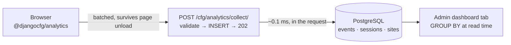

# Analytics

Django-CFG ships **first-party analytics**: pageviews, cookieless sessions, and — the thing hosted analytics structurally cannot give you — **attribution to your signed-in users**.

It is **on by default** and needs **no configuration**. A site registers itself on the first event, the admin tab appears once data arrives, and nothing else runs.

## Why it exists

Hosted analytics (Google Analytics, Plausible, Umami Cloud) can tell you that *someone* visited `/pricing`. They cannot tell you it was **the user on your Pro plan who opened a support ticket yesterday** — they do not have your user table.

Django-CFG does. `AnalyticsEvent.user` is a real FK to `AUTH_USER_MODEL`.

## Features

- **Zero configuration** — enabled by default; the site row is created automatically
- **Zero extra processes** — no Celery, no RQ worker, no daemon, no cron, no sidecar
- **User attribution** — events link to authenticated users
- **Cookieless** — no cookies, no consent banner needed for the mechanism itself
- **IP and User-Agent are never stored** — they are hashed away at ingest
- **Bot filtering** — crawlers are dropped silently
- **Channel classification** — search / social / AI assistants / paid / referral, resolved at write time
- **Admin dashboard** — a tab with visitors, pageviews, sessions, bounce rate, top pages, referrers, and breakdowns

## Quick start

There is no quick start. It is already running.

```python
from django_cfg import DjangoConfig

class MyConfig(DjangoConfig):
    project_name = "My Project"
    security_domains = ["example.com"]   # this is all analytics needs
```

Run migrations, and the first pageview from `example.com` registers the site and starts collecting.

To send events from a Next.js or React frontend, see [Frontend](/features/tools/analytics/frontend).

## Architecture



**The ingest is synchronous.** The event is written in the request thread and the endpoint answers `202`. There is no queue and no worker.

That is not a shortcut — it is the production baseline. Measured on durable storage:

| Operation | Time |
|---|---|
| INSERT + COMMIT | 1.895 ms |
| **same, with `synchronous_commit = off`** | **0.098 ms** |
| *opening a database connection* | *2.796 ms* |

**Opening the connection costs more than the durable write it carries.** Any design that adds a queue, a file, or a drain daemon to defer a 0.1 ms write is optimizing the wrong thing. (Umami, the most widely deployed self-hosted analytics on PostgreSQL, writes synchronously and ships no worker at all.)

## What gets stored

| Model | Purpose |
|---|---|
| `AnalyticsSite` | One row per domain. The tenant boundary and the timezone anchor. |
| `AnalyticsSession` | One row per visit. All mutable state (pageviews, duration, bounce). |
| `AnalyticsEvent` | Append-only. One row per pageview or custom event. |

Key event columns: `site`, `ts` (UTC), `visitor_id`, `session`, **`user`**, `pathname`, `route`, `locale`, `referrer_domain`, `channel`, `utm_*`, `props` (JSONB).

## Reports

Aggregation happens **at read time** — plain `GROUP BY` over the event table, backed by a `(site, ts, <dimension>)` index prefix. No rollup tables, no materialized views, no cron job.

```python
from django_cfg.apps.tools.analytics.models import AnalyticsSite
from django_cfg.apps.tools.analytics.services import Period, reports

site = AnalyticsSite.objects.get(domain="example.com")
period = Period.last_days(7)

reports.summary(site, period)         # visitors, pageviews, sessions, bounce_rate, known_users
reports.timeseries(site, period)      # per site-local day, gaps included as zeros
reports.top_pages(site, period)       # grouped by templated route
reports.top_referrers(site, period)
reports.breakdown(site, period, "channel")   # or browser / os / device / country / language
reports.online_now(site)              # distinct visitors in the last 5 minutes
reports.user_journey(site, user_id)   # every hit by one authenticated user
```

`reports.user_journey()` is the one no hosted analytics product can offer you.

## Read next

- [Configuration](/features/tools/analytics/configuration) — every setting and what it costs
- [Frontend](/features/tools/analytics/frontend) — `@djangocfg/analytics` for Next.js and React
- [Privacy](/features/tools/analytics/privacy) — what is collected, what is not, and GDPR
