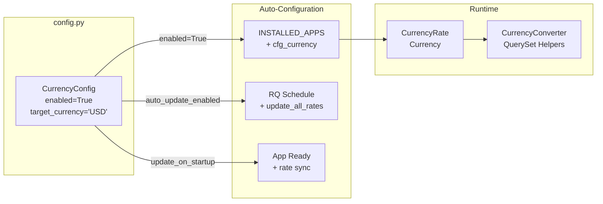
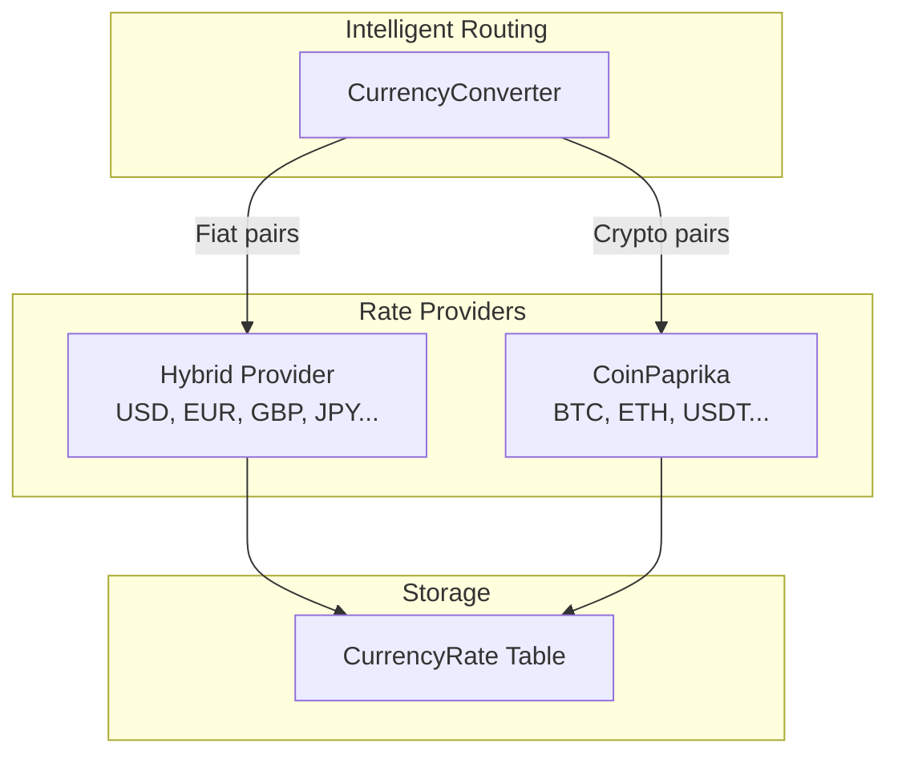

# Currency Configuration

Configure the Currency Tool via `CurrencyConfig` in your Django-CFG configuration.

## Basic Configuration

```python
from django_cfg import DjangoConfig, CurrencyConfig

class MyConfig(DjangoConfig):
    currency = CurrencyConfig(
        enabled=True,
        target_currency="USD",
        update_interval=3600,
    )
```

## Configuration Options

| Option | Type | Default | Description |
|--------|------|---------|-------------|
| `enabled` | bool | `True` | Enable currency app (auto-adds to INSTALLED_APPS) |
| `target_currency` | str | `"USD"` | Default target currency for conversions |
| `update_interval` | int | `3600` | Rate refresh interval in seconds |
| `update_on_startup` | bool | `True` | Refresh stale rates when Django starts |
| `auto_update_enabled` | bool | `True` | Enable automatic RQ scheduled task |

## Configuration Flow



## Environment-Specific Settings

### Development

```python
currency = CurrencyConfig(
    enabled=True,
    target_currency="USD",
    update_interval=3600,      # 1 hour
    update_on_startup=True,    # Sync rates on startup
    auto_update_enabled=True,  # Background updates
)
```

### Production

```python
currency = CurrencyConfig(
    enabled=True,
    target_currency="USD",
    update_interval=1800,      # 30 minutes (more frequent)
    update_on_startup=True,
    auto_update_enabled=True,
)
```

### Testing

```python
currency = CurrencyConfig(
    enabled=True,
    target_currency="USD",
    update_interval=86400,     # 24 hours (less frequent)
    update_on_startup=False,   # Don't sync on startup
    auto_update_enabled=False, # Disable background updates
)
```

## Rate Providers

Currency rates are fetched from multiple providers:

### Hybrid Provider (Fiat)
- Primary source for fiat currencies
- Multiple fallback APIs
- Supports 50+ fiat currencies

### CoinPaprika (Crypto)
- Primary source for cryptocurrencies
- Real-time crypto rates
- Supports 18 popular cryptocurrencies



## Migrations

After enabling currency, run migrations:

```bash
python manage.py migrate cfg_currency
```

This creates:
- `cfg_currency_rate` - Exchange rates table
- `cfg_currency` - Currency metadata table

## RQ Worker Setup

For automatic rate updates, run RQ worker and scheduler:

```bash
# Terminal 1: Worker
python manage.py rqworker default

# Terminal 2: Scheduler
python manage.py rqscheduler
```

The `update_all_rates` task runs automatically based on `update_interval`.

## Manual Rate Update

Force update rates manually:

```python
from django_cfg.apps.tools.currency.services import update_rates

# Update all rates to USD
update_rates(target_currency="USD")

# Update specific pairs
update_rates(target_currency="EUR")
```

## See Also

- **[Overview](./overview)** - Currency tool introduction
- **[Models](./models)** - CurrencyRate model API
- **[RQ Integration](/docs/features/integrations/django-rq)** - Background tasks
