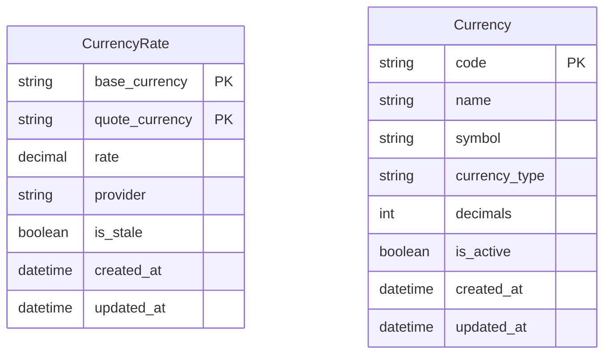

# Currency Models

The Currency Tool provides two Django models for storing exchange rates and currency metadata.

## Model Overview



## CurrencyRate Model

Stores exchange rates between currency pairs.

### Fields

| Field | Type | Description |
|-------|------|-------------|
| `base_currency` | CharField | Base currency code (e.g., "IDR") |
| `quote_currency` | CharField | Quote currency code (e.g., "USD") |
| `rate` | DecimalField | Exchange rate (1 base = X quote) |
| `provider` | CharField | Rate provider source |
| `is_stale` | BooleanField | Manually marked as needing refresh |
| `created_at` | DateTimeField | Record creation time |
| `updated_at` | DateTimeField | Last update time |

### Class Methods

```python
from django_cfg.apps.tools.currency.models import CurrencyRate

# Get rate for currency pair
rate = CurrencyRate.get_rate("IDR", "USD")
if rate:
    print(f"1 IDR = {rate.rate} USD")
    print(f"Updated: {rate.updated_at}")
    print(f"Expired: {rate.is_expired}")

# Get rate value directly
rate_value = CurrencyRate.get_rate_value("IDR", "USD")
# Returns Decimal or None

# Set/update rate
CurrencyRate.set_rate(
    base="IDR",
    quote="USD",
    rate=Decimal("0.0000625"),
    provider="hybrid"
)

# Mark rates as stale
CurrencyRate.mark_stale(base="IDR")  # All IDR rates
CurrencyRate.mark_stale(quote="USD")  # All rates to USD
CurrencyRate.mark_stale()  # All rates
```

### Properties

```python
rate = CurrencyRate.get_rate("IDR", "USD")

# Check if rate is expired (older than update_interval)
rate.is_expired  # True/False

# Get rate age in seconds
rate.age_seconds  # 3600.5
```

### Querying Rates

```python
from django_cfg.apps.tools.currency.models import CurrencyRate

# All rates
all_rates = CurrencyRate.objects.all()

# Rates to USD
usd_rates = CurrencyRate.objects.filter(quote_currency="USD")

# Stale rates
stale = CurrencyRate.objects.filter(is_stale=True)

# Recent rates (last hour)
from django.utils import timezone
from datetime import timedelta

recent = CurrencyRate.objects.filter(
    updated_at__gte=timezone.now() - timedelta(hours=1)
)
```

## Currency Model

Stores metadata about supported currencies.

### Fields

| Field | Type | Description |
|-------|------|-------------|
| `code` | CharField | Currency code (e.g., "USD", "BTC") |
| `name` | CharField | Full currency name |
| `symbol` | CharField | Currency symbol (e.g., "$", "€") |
| `currency_type` | CharField | "fiat" or "crypto" |
| `decimals` | SmallIntegerField | Decimal places for display |
| `is_active` | BooleanField | Available for conversion |
| `created_at` | DateTimeField | Record creation time |
| `updated_at` | DateTimeField | Last update time |

### Querying Currencies

```python
from django_cfg.apps.tools.currency.models import Currency

# All active currencies
active = Currency.objects.filter(is_active=True)

# Fiat currencies only
fiat = Currency.objects.filter(currency_type="fiat", is_active=True)

# Crypto currencies only
crypto = Currency.objects.filter(currency_type="crypto", is_active=True)

# Get specific currency
usd = Currency.objects.get(code="USD")
print(usd.display_name)  # "USD ($ US Dollar)"
```

## Validation Services

```python
from django_cfg.apps.tools.currency.services import (
    get_currency_codes,
    is_valid_currency,
    clear_currency_cache,
    CURRENCY_CODES,  # Static fallback set
    FIAT_CODES,      # Static fiat set
    CRYPTO_CODES,    # Static crypto set
)

# Get valid codes from DB (cached)
codes = get_currency_codes()  # {'USD', 'EUR', 'IDR', ...}

# Validate a currency code
if is_valid_currency("USD"):
    print("Valid!")

# Clear cache after adding new currencies
clear_currency_cache()
```

## Converter Service

High-level conversion API:

```python
from django_cfg.apps.tools.currency.services import get_converter

converter = get_converter()

# Convert amount
result = converter.convert(100, "EUR", "USD")
print(result.result)  # 108.50
print(result.rate.rate)  # 1.085
print(result.rate.source)  # "hybrid"

# Get rate only
rate = converter.get_rate("IDR", "USD")
print(rate.rate)  # 0.0000625
print(rate.source)  # "hybrid"
print(rate.timestamp)  # datetime

# Force refresh rate
rate = converter.refresh_rate("IDR", "USD")
```

## Rate Update Services

```python
from django_cfg.apps.tools.currency.services import (
    update_rates,
    update_rates_if_needed,
    sync_currencies,
    sync_all,
)

# Force update all rates
update_rates(target_currency="USD")

# Update only if stale
update_rates_if_needed()

# Sync currency list to DB
sync_currencies()

# Sync both currencies and rates
sync_all()
```

## Supported Currencies

### Fiat (50+)

| Region | Currencies |
|--------|------------|
| Major | USD, EUR, GBP, JPY, CNY, CHF |
| Asian | KRW, INR, THB, VND, IDR, SGD, HKD, TWD, MYR, PHP |
| European | RUB, UAH, PLN, CZK, TRY, SEK, NOK, DKK, HUF, RON |
| Americas | CAD, AUD, NZD, BRL, MXN, ARS, CLP, COP, PEN |
| Middle East | AED, SAR, ILS, QAR, KWD, BHD, OMR |
| Africa | ZAR, EGP, NGN, KES, MAD |

### Crypto (18)

BTC, ETH, USDT, USDC, BNB, SOL, XRP, ADA, DOGE, LTC, DOT, MATIC, AVAX, LINK, UNI, ATOM, XLM, TRX

## Admin Interface

Both models are registered in Django Admin:

- **CurrencyRate Admin**: View/edit rates, bulk refresh, filter by currency
- **Currency Admin**: Manage currency metadata, activate/deactivate

```
/admin/cfg_currency/currencyrate/
/admin/cfg_currency/currency/
```

## See Also

- **[Overview](./overview)** - Currency tool introduction
- **[Configuration](./configuration)** - CurrencyConfig options
- **[QuerySet Helpers](./queryset-helpers)** - Filter by converted price
