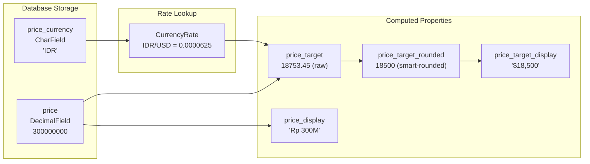

# MoneyField Integration

`MoneyField` is a composite Django field that stores amount + currency with automatic conversion to a target currency.

## What MoneyField Creates

When you add a `MoneyField` named `price`, it creates:

| Attribute | Type | Storage | Description |
|-----------|------|---------|-------------|
| `price` | DecimalField | Database | Original amount |
| `price_currency` | CharField | Database | Currency code (e.g., "IDR") |
| `price_target` | Property | Calculated | Raw converted amount via CurrencyRate |
| `price_target_rounded` | Property | Calculated | Smart-rounded converted amount |
| `price_display` | Property | Calculated | Formatted original (e.g., "Rp 300M") |
| `price_target_display` | Property | Calculated | Formatted target using rounded value (e.g., "$18,500") |
| `price_full_display` | Property | Calculated | Combined using rounded value (e.g., "$18,500 (Rp 300M)") |



## Model Definition

```python
from django.db import models
from django_cfg.modules.django_currency import MoneyField

class Property(models.Model):
    title = models.CharField(max_length=200)

    # MoneyField creates 2 stored fields + 4 properties
    price = MoneyField(
        max_digits=15,
        decimal_places=2,
        default_currency="IDR",     # Default for new records
        target_currency="USD",      # Conversion target
        round_to=1000,              # Round target to nearest 1000 (optional)
        null=True,
        blank=True,
    )
```

## Parameters

| Parameter | Type | Default | Description |
|-----------|------|---------|-------------|
| `max_digits` | `int` | `15` | Total digits (including decimals) |
| `decimal_places` | `int` | `2` | Decimal precision |
| `default_currency` | `str` | `"USD"` | Currency for new records |
| `target_currency` | `str` | `"USD"` | Conversion target for `_target` property |
| `round_to` | `int` | `None` | Round `_target` to nearest value (e.g., 1000) |
| `null` | `bool` | `True` | Allow NULL in database |
| `blank` | `bool` | `True` | Allow empty in forms |

## Rounding Target Values

MoneyField provides two target properties:

- **`price_target`** - Raw converted amount (e.g., `Decimal("18753.45")`)
- **`price_target_rounded`** - Smart-rounded amount for display

**Smart rounding** (default, based on magnitude):
- < 100: round to 1
- 100-1000: round to 10
- 1000-10000: round to 100
- 10000-100000: round to 500
- > 100000: round to 1000

**Override with `round_to`** parameter:

```python
price = MoneyField(
    default_currency="IDR",
    target_currency="USD",
    round_to=1000,  # Override: always round to nearest 1000
)

# Example:
# price = 300,000,000 IDR
# price_target = Decimal("18753.45")         # Raw value (always precise)
# price_target_rounded = Decimal("19000")    # Rounded (round_to=1000)
```

| `round_to` | Raw ($18,753.45) | Rounded |
|------------|------------------|---------|
| `None` (smart) | $18,753.45 | $18,500 (magnitude-based) |
| `100` | $18,753.45 | $18,800 |
| `1000` | $18,753.45 | $19,000 |

## Accessing Values

```python
property = Property.objects.first()

# Stored values (database fields)
property.price           # Decimal("300000000")
property.price_currency  # "IDR"

# Calculated properties (via CurrencyRate table)
property.price_target         # Decimal("18753.45") - raw converted
property.price_target_rounded # Decimal("18500") - smart-rounded

# Auto-generated display properties (use rounded value)
property.price_display        # "Rp 300M"
property.price_target_display # "$18,500"
property.price_full_display   # "$18,500 (Rp 300M)"

# Same currency = no conversion
if property.price_currency == "USD":
    property.price_target == property.price  # True
```

## Formatting Utilities

For custom formatting (e.g., with suffix for rentals):

```python
from django_cfg.modules.django_currency import format_price, format_price_full

# Basic formatting
format_price(50_000_000, "KRW")           # "₩50M"
format_price(1500, "USD", suffix="/month") # "$1,500/month"

# Full display with both currencies
format_price_full(
    amount=300_000_000,
    currency="IDR",
    target_amount=18750,
    target_currency="USD",
)  # "$18,750 (Rp 300M)"
```

## Admin Integration

### PydanticAdmin (Automatic)

`PydanticAdmin` automatically includes `MoneyFieldAdminMixin`:

```python
from django.contrib import admin
from django_cfg.modules.django_admin.base import PydanticAdmin

@admin.register(Property)
class PropertyAdmin(PydanticAdmin):
    """MoneyFieldAdminMixin is auto-included."""
    config = property_config
```

### MoneyFieldWidget

The admin widget shows:

```
┌─────────────────────────────────────────────────────────────┐
│  Amount                    │  Currency                      │
│  ┌──────────────────────┐  │  ┌──────────────────────────┐  │
│  │ 300,000,000          │  │  │ IDR ▼                    │  │
│  └──────────────────────┘  │  └──────────────────────────┘  │
│  → $18,750 | 1 IDR = 0.0000625 USD • 2h ago   [rates ↗]    │
└─────────────────────────────────────────────────────────────┘
```

**Features:**
- Amount input + currency dropdown
- Live conversion updates (Alpine.js)
- Rate info with timestamp
- Link to CurrencyRate admin

### MoneyFieldDisplay (List View)

```python
from django_cfg.modules.django_admin import AdminConfig, MoneyFieldDisplay

config = AdminConfig(
    model=Property,
    list_display=["id", "title", "price"],
    display_fields=[
        # Auto-detects: price_currency, price_target
        MoneyFieldDisplay(
            name="price",
            title="Price",
        ),
    ],
)
```

## Migrations

When adding MoneyField to existing model:

```python
# 1. Add MoneyField
price = MoneyField(
    max_digits=15,
    decimal_places=2,
    default_currency="USD",
    target_currency="USD",
    null=True,  # Allow null initially
    blank=True,
)

# 2. Run makemigrations - creates 2 fields:
#    - price (DecimalField)
#    - price_currency (CharField)

# 3. Run migrate

# 4. Optionally set defaults for existing records
Property.objects.filter(price_currency__isnull=True).update(
    price_currency="USD"
)
```

## Important Notes

<Callout type="warning">
**price_target is a Python Property**

`price_target` is calculated at runtime, not stored in the database. You cannot use it directly in Django ORM queries:

```python
# This will NOT work:
Property.objects.filter(price_target__gte=10000)  # Error!

# Use QuerySet Helpers instead:
from django_cfg.apps.tools.currency.services import annotate_converted_price

qs = annotate_converted_price(
    Property.objects.all(),
    price_field="price",
    currency_field="price_currency",
    target_currency="USD",
    annotation_name="price_usd",
)
qs.filter(price_usd__gte=10000)  # Works!
```

See [QuerySet Helpers](./queryset-helpers) for database filtering.
</Callout>

## See Also

- **[Overview](./overview)** - Currency tool introduction
- **[QuerySet Helpers](./queryset-helpers)** - Filter by converted price
- **[Models](./models)** - CurrencyRate model API
