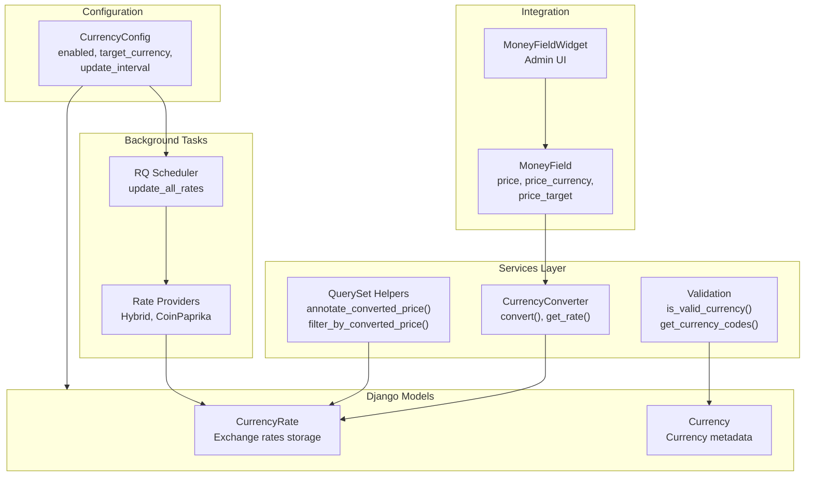
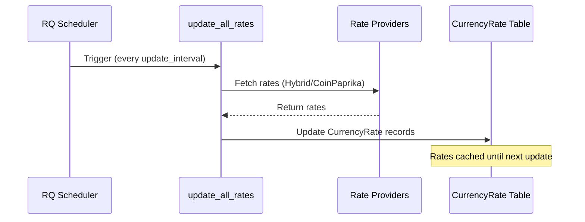
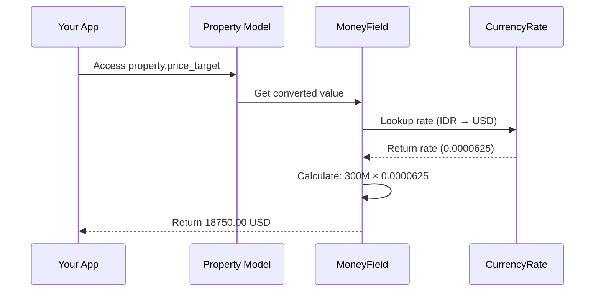

# Currency Tool

Django-CFG's **Currency Tool** provides centralized currency conversion with database-backed exchange rates. Supports 68 currencies (fiat + crypto) with automatic rate updates via RQ scheduler.

## Features

- **Database-Backed Rates** - Exchange rates stored in `CurrencyRate` model
- **Auto Updates** - RQ scheduler keeps rates fresh (configurable interval)
- **MoneyField** - Auto-converting composite field for Django models
- **QuerySet Helpers** - Filter/sort by converted prices in database queries
- **68 Currencies** - Major fiat + popular crypto out of the box
- **Admin Integration** - Full admin UI with rate management

## Architecture



## Quick Start

### 1. Enable in Config

```python
from django_cfg import DjangoConfig, CurrencyConfig

class MyConfig(DjangoConfig):
    currency = CurrencyConfig(
        enabled=True,
        target_currency="USD",
        update_interval=3600,  # 1 hour
    )
```

### 2. Use MoneyField in Models

```python
from django.db import models
from django_cfg.modules.django_currency import MoneyField

class Property(models.Model):
    # Creates: price, price_currency, price_target (USD)
    price = MoneyField(
        max_digits=15,
        decimal_places=2,
        default_currency="IDR",
        target_currency="USD",
    )
```

### 3. Access Converted Values

```python
property = Property.objects.get(id=1)

# Original price
print(property.price)           # 300000000 (IDR)
print(property.price_currency)  # "IDR"

# Auto-converted to USD
print(property.price_target)    # 18750.00 (USD)

# Formatted display
print(property.price_display)        # "Rp 300M"
print(property.price_target_display) # "$18,750"
```

### 4. Filter by Converted Price

```python
from django_cfg.apps.tools.currency.services import annotate_converted_price

# Annotate queryset with USD prices
qs = annotate_converted_price(
    Property.objects.all(),
    price_field="price",
    currency_field="price_currency",
    target_currency="USD",
    annotation_name="price_usd",
)

# Now filter/sort by converted price
affordable = qs.filter(price_usd__lte=50000).order_by("price_usd")
```

## Data Flow

### Rate Update Flow



### MoneyField Conversion Flow



## Documentation

| Document | Description |
|----------|-------------|
| [Overview](./overview) | This page - architecture and quick start |
| [Configuration](./configuration) | CurrencyConfig options and setup |
| [MoneyField](./moneyfield) | Composite field for models + admin |
| [QuerySet Helpers](./queryset-helpers) | Filter/sort by converted prices |
| [Models](./models) | CurrencyRate, Currency model API |

## See Also

- **[MoneyField Guide](./moneyfield)** - Field integration details
- **[QuerySet Helpers](./queryset-helpers)** - Database filtering by converted price
- **[RQ Integration](/docs/features/integrations/django-rq)** - Background tasks
