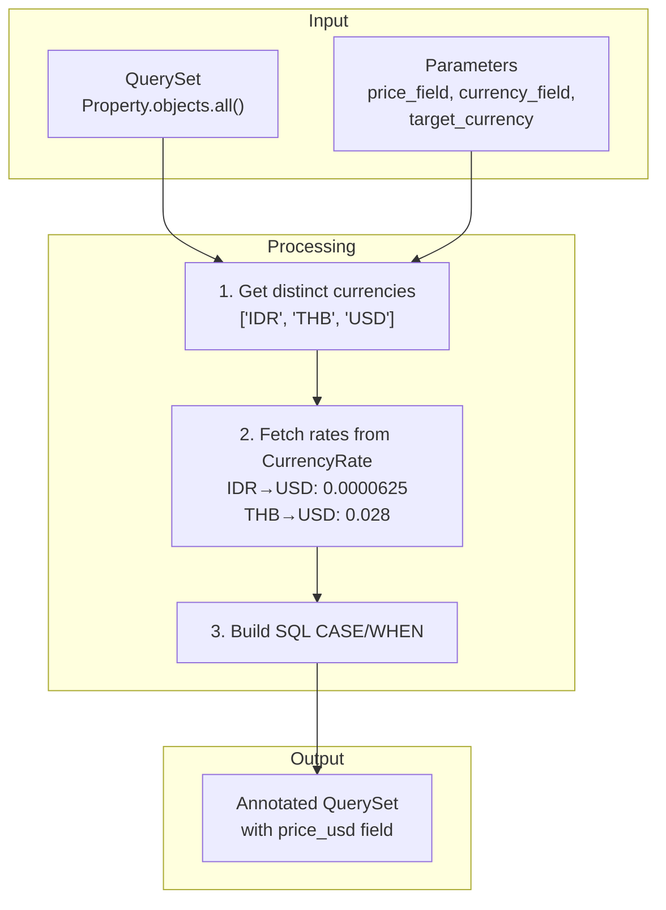
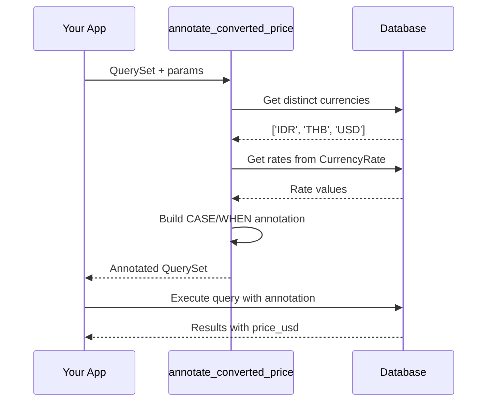

# QuerySet Helpers

Helper functions for filtering and sorting Django QuerySets by converted currency values.

## Why QuerySet Helpers?

`MoneyField.price_target` is a Python property calculated at runtime. It **cannot** be used in database queries:

```python
# This will NOT work - price_target is not a database field
Property.objects.filter(price_target__gte=10000)  # FieldError!
```

QuerySet Helpers solve this by annotating the queryset with converted prices using SQL `CASE/WHEN`:

```python
from django_cfg.apps.tools.currency.services import annotate_converted_price

# Annotate with converted price
qs = annotate_converted_price(
    Property.objects.all(),
    price_field="price",
    currency_field="price_currency",
    target_currency="USD",
    annotation_name="price_usd",
)

# Now you can filter/sort by price_usd
qs.filter(price_usd__gte=10000)  # Works!
```

## How It Works



### Generated SQL

```sql
SELECT *,
  CASE
    WHEN price_currency = 'IDR' THEN price * 0.0000625
    WHEN price_currency = 'THB' THEN price * 0.028
    WHEN price_currency = 'USD' THEN price * 1.0
    ELSE price
  END AS price_usd
FROM properties
WHERE price_usd >= 10000 AND price_usd <= 50000
```

## Functions

### annotate_converted_price

Annotates a QuerySet with a price field converted to the target currency.

```python
from django_cfg.apps.tools.currency.services import annotate_converted_price

qs = annotate_converted_price(
    queryset=Property.objects.all(),
    price_field="price",
    currency_field="price_currency",
    target_currency="USD",
    annotation_name="price_usd",
)

# Filter by converted price
expensive = qs.filter(price_usd__gte=100000)

# Order by converted price
sorted_qs = qs.order_by("price_usd")

# Access on instances
for prop in qs[:5]:
    print(f"{prop.price} {prop.price_currency} = {prop.price_usd:.2f} USD")
```

**Parameters:**

| Parameter | Type | Description |
|-----------|------|-------------|
| `queryset` | QuerySet | The QuerySet to annotate |
| `price_field` | str | Name of the price field (e.g., `"price"`) |
| `currency_field` | str | Name of the currency field (e.g., `"price_currency"`) |
| `target_currency` | str | Currency to convert to (e.g., `"USD"`, `"EUR"`) |
| `annotation_name` | str | Name for the annotated field (default: `"price_converted"`) |

### filter_by_converted_price

Convenience function that combines annotation and filtering:

```python
from django_cfg.apps.tools.currency.services import filter_by_converted_price

# Filter properties between $100k and $500k USD
qs = filter_by_converted_price(
    queryset=Property.objects.all(),
    price_field="price",
    currency_field="price_currency",
    target_currency="USD",
    min_price=100_000,
    max_price=500_000,
)
```

**Parameters:**

| Parameter | Type | Description |
|-----------|------|-------------|
| `queryset` | QuerySet | The QuerySet to filter |
| `price_field` | str | Name of the price field |
| `currency_field` | str | Name of the currency field |
| `target_currency` | str | Currency to convert to |
| `min_price` | number/None | Minimum price in target currency |
| `max_price` | number/None | Maximum price in target currency |
| `annotation_name` | str | Name for the annotated field |

### get_conversion_rates

Get conversion rates for multiple source currencies:

```python
from django_cfg.apps.tools.currency.services import get_conversion_rates

rates = get_conversion_rates(["IDR", "THB", "KRW"], "USD")
# {'IDR': Decimal('0.0000625'), 'THB': Decimal('0.028'), 'KRW': Decimal('0.00071')}
```

## Django Filter Integration

Use with `django-filter` FilterSet:

```python
import django_filters
from django_cfg.apps.tools.currency.services import annotate_converted_price

PRICE_TARGET_CURRENCY = "USD"

class PropertyFilter(django_filters.FilterSet):
    min_price = django_filters.NumberFilter(method='filter_min_price')
    max_price = django_filters.NumberFilter(method='filter_max_price')

    class Meta:
        model = Property
        fields = []

    def filter_min_price(self, queryset, name, value):
        """Filter by min price in USD."""
        queryset = annotate_converted_price(
            queryset,
            price_field="price",
            currency_field="price_currency",
            target_currency=PRICE_TARGET_CURRENCY,
            annotation_name="price_usd",
        )
        return queryset.filter(price_usd__gte=value)

    def filter_max_price(self, queryset, name, value):
        """Filter by max price in USD."""
        queryset = annotate_converted_price(
            queryset,
            price_field="price",
            currency_field="price_currency",
            target_currency=PRICE_TARGET_CURRENCY,
            annotation_name="price_usd",
        )
        return queryset.filter(price_usd__lte=value)
```

## Converting to Different Currencies

The helpers support any target currency, not just USD:

```python
# Convert to EUR
qs_eur = annotate_converted_price(
    Property.objects.all(),
    price_field="price",
    currency_field="price_currency",
    target_currency="EUR",
    annotation_name="price_eur",
)

# Convert to THB
qs_thb = annotate_converted_price(
    Property.objects.all(),
    price_field="price",
    currency_field="price_currency",
    target_currency="THB",
    annotation_name="price_thb",
)
```

## Performance Notes

- **Rate caching**: Rates are fetched once from `CurrencyRate` table
- **Single query**: Conversion happens in database, not Python
- **Efficient**: Uses SQL `CASE/WHEN`, no N+1 queries
- **Currency discovery**: Fetches distinct currencies from model



## See Also

- **[Overview](./overview)** - Currency tool introduction
- **[MoneyField](./moneyfield)** - Field for models
- **[Models](./models)** - CurrencyRate model API
