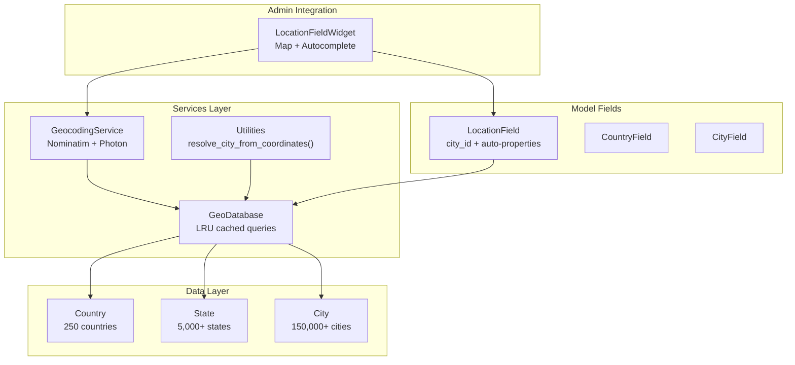
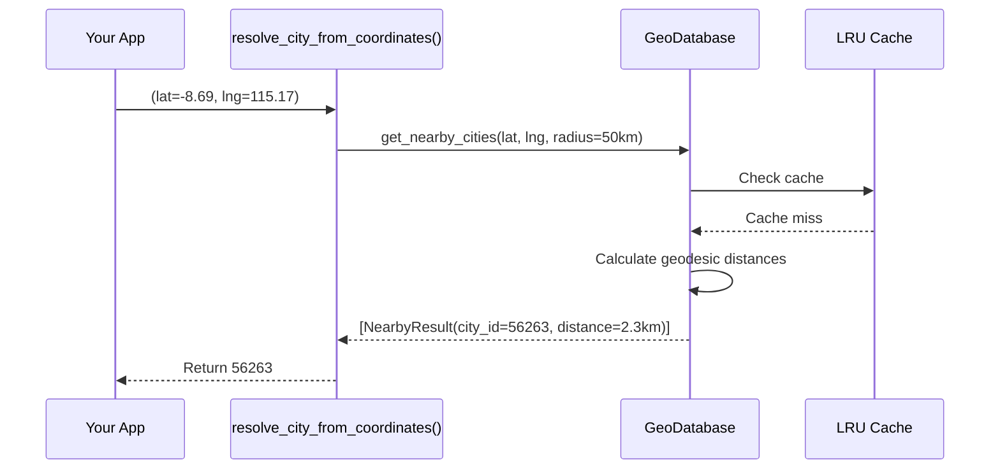
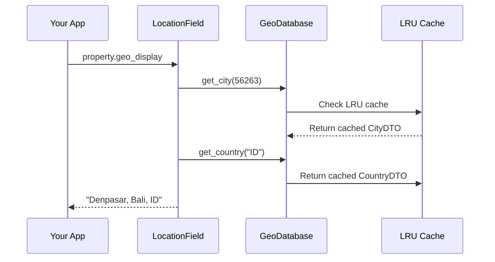

# Geo Tool

Django-CFG's **Geo Tool** provides a comprehensive geographic database with 150k+ cities worldwide. Includes LocationField for models, geocoding services, and coordinate-based city resolution.

## Features

- **150k+ Cities** - Complete geographic database from dr5hn repository
- **LocationField** - Smart field with auto-properties (country, state, coordinates)
- **City Resolution** - Find nearest city from coordinates
- **Geocoding** - Forward/reverse geocoding with Nominatim
- **Search** - Multi-word city search with relevance ranking
- **PostGIS Support** - Optional spatial queries for advanced use cases
- **Admin Integration** - LocationFieldWidget with map and autocomplete

## Architecture



## Quick Start

### 1. Populate Database

Data is downloaded on demand from GitHub (not bundled with package).

```bash
python manage.py geo_populate
```

### 2. Use LocationField in Models

```python
from django.db import models
from django_cfg.apps.tools.geo.fields import LocationField

class Property(models.Model):
    # Stores city_id, provides auto-properties
    geo = LocationField(null=True, blank=True)

    # Precise coordinates (optional)
    latitude = models.DecimalField(max_digits=10, decimal_places=7, null=True)
    longitude = models.DecimalField(max_digits=10, decimal_places=7, null=True)
```

### 3. Access Location Data

```python
property = Property.objects.get(id=1)

# City ID
print(property.geo)              # 56263

# Auto-properties (no extra queries - cached)
print(property.geo_display)      # "Denpasar, Bali, ID"
print(property.geo_city)         # CityDTO(name="Denpasar", ...)
print(property.geo_state)        # StateDTO(name="Bali", ...)
print(property.geo_country)      # CountryDTO(name="Indonesia", iso2="ID", emoji="🇮🇩")
print(property.geo_coordinates)  # (-8.6500, 115.2167)
print(property.geo_flag)         # "🇮🇩"
```

### 4. Resolve City from Coordinates

```python
from django_cfg.apps.tools.geo.services import resolve_city_from_coordinates

# Find nearest city within 50km
city_id = resolve_city_from_coordinates(-8.6908, 115.1688)
# 56263 (Denpasar)

# Use in data ingestion
if latitude and longitude:
    property.geo = resolve_city_from_coordinates(
        float(latitude),
        float(longitude),
        radius_km=50,
    )
```

### 5. Search Cities

```python
from django_cfg.apps.tools.geo.services import get_geo_db

db = get_geo_db()

# Simple search
cities = db.search_cities("bali", limit=10)

# Multi-word with context
cities = db.search_cities("seminyak bali indonesia", limit=10)
# Ranks matches by relevance

# With country filter
cities = db.search_cities("seoul", country_code="KR", limit=10)
```

## Data Flow

### City Resolution Flow



### LocationField Access Flow



## Documentation

| Document | Description |
|----------|-------------|
| [Overview](./overview) | This page - architecture and quick start |
| [LocationField](./fields) | Field types and auto-properties |
| [Services](./services) | GeoDatabase, geocoding, utilities |
| [Models](./models) | Country, State, City DTOs |

## See Also

- **[LocationField Guide](./fields)** - Field integration details
- **[Services Reference](./services)** - GeoDatabase and geocoding
- **[Currency Tool](/docs/features/tools/currency/overview)** - Similar pattern for currencies
