import Tabs from '@theme/Tabs';
import TabItem from '@theme/TabItem';

# Cache Models

:::tip[✨ Automatic Redis Cache - Zero Configuration!]
Simply set `redis_url` in your config and Django-CFG **automatically creates a Redis cache** for you! No need for explicit `cache_default` configuration.

```python
class MyConfig(DjangoConfig):
    redis_url: str = "redis://localhost:6379/0"  # That's it! 🎉
```

Django-CFG auto-selects the **best cache backend**: Redis for production, LocMem for development, DummyCache as safe fallback.
:::

Django-CFG provides `CacheConfig` model for type-safe cache configuration with **automatic Redis setup from `redis_url`**.

## CacheConfig

Type-safe cache backend configuration with environment-aware smart defaults.

### Complete Model

```python
from pydantic import BaseModel, Field, field_validator
from typing import Optional, Dict, Any

class CacheConfig(BaseModel):
    """Cache backend configuration"""

    redis_url: Optional[str] = Field(
        default=None,
        description="Redis connection URL"
    )
    timeout: int = Field(
        default=300,
        description="Default timeout in seconds",
        ge=0
    )
    max_connections: int = Field(
        default=50,
        description="Maximum Redis connections",
        ge=1
    )
    key_prefix: str = Field(
        default="",
        description="Cache key prefix"
    )
    version: int = Field(
        default=1,
        description="Cache key version",
        ge=1
    )

    # Advanced Redis settings
    connection_pool_kwargs: Dict[str, Any] = Field(
        default_factory=dict,
        description="Redis connection pool parameters"
    )

    @field_validator('redis_url')
    @classmethod
    def validate_redis_url(cls, v):
        """Validate Redis URL format"""
        if v and not v.startswith(('redis://', 'rediss://')):
            raise ValueError("Redis URL must start with redis:// or rediss://")
        return v

    def to_django_config(self, environment: str, debug: bool) -> Dict[str, Any]:
        """Convert to Django cache configuration"""
        from django_cfg.utils.smart_defaults import SmartDefaults

        backend = SmartDefaults.get_cache_backend(
            debug=debug,
            redis_url=self.redis_url,
            environment=environment
        )

        config = {
            'BACKEND': backend,
            'TIMEOUT': self.timeout,
            'KEY_PREFIX': self.key_prefix,
            'VERSION': self.version,
        }

        if backend == 'django_redis.cache.RedisCache' and self.redis_url:
            config['LOCATION'] = self.redis_url
            config['OPTIONS'] = {
                'CONNECTION_POOL_KWARGS': {
                    'max_connections': self.max_connections,
                    **self.connection_pool_kwargs
                }
            }
        elif backend == 'django.core.cache.backends.locmem.LocMemCache':
            config['LOCATION'] = f'{self.key_prefix}-{id(self)}'

        return config
```

## 🎯 How Auto Cache Works

Django-CFG uses a **3-tier priority** system for cache configuration:

```mermaid
graph TD
    A[Cache Configuration] --> B{cache_default set?}
    B -->|Yes| C[Use explicit CacheConfig]
    B -->|No| D{redis_url set?}
    D -->|Yes| E[✨ AUTO-CREATE Redis cache]
    D -->|No| F[Fallback cache]
    F --> G{Environment?}
    G -->|Development| H[LocMemCache]
    G -->|Production| I[FileBasedCache/tmp]
    E --> J[RedisCache - No tmp!]
```



### Priority Order:

1. **Explicit `cache_default`** - You have full control
2. **Auto from `redis_url`** ✨ - Magic happens here!
3. **Smart fallback** - LocMem (dev) or FileBased (prod)

### Auto-Creation Logic

When `redis_url` is set but `cache_default` is None:

```python
# In CacheSettingsGenerator.generate():
if self.config.cache_default:
    # User provided explicit config
    caches["default"] = self.config.cache_default.to_django_config(...)
elif self.config.redis_url:
    # ✨ AUTO-MAGIC: Create Redis cache automatically
    logger.info(f"Auto-creating Redis cache from redis_url: {self.config.redis_url}")
    caches["default"] = self._get_redis_cache_config()
else:
    # Fallback to LocMem (dev) or FileBased (prod)
    caches["default"] = self._get_default_cache_config()
```

**Auto-generated config includes:**
- `timeout=300` (5 minutes)
- `max_connections=50`
- `key_prefix=project_name.lower().replace(" ", "_")`

## Smart Backend Selection

Django-CFG automatically selects the best cache backend based on environment and configuration:

| Scenario | Backend | redis_url | cache_default | Result |
|----------|---------|-----------|---------------|--------|
| **Production + redis_url** | **RedisCache** | ✅ Set | ❌ None | ✨ **Auto-created!** |
| **Production + explicit** | **RedisCache** | ✅ Set | ✅ Set | Manual control |
| **Development + redis_url** | **RedisCache** | ✅ Set | ❌ None | ✨ **Auto-created!** |
| **Development + No Redis** | **LocMemCache** | ❌ None | ❌ None | Fallback |
| **Production + No Redis** | **FileBasedCache** | ❌ None | ❌ None | ⚠️ Creates tmp/ |

## Usage Examples

<Tabs>
  <TabItem value="auto-redis" label="✨ Auto Redis (Recommended)" default>

```python title="config.py - Automatic Magic!"
from django_cfg import DjangoConfig

class MyConfig(DjangoConfig):
    secret_key: str = "your-secret-key"
    debug: bool = False

    # 🎉 MAGIC: Just set redis_url - cache auto-created!
    redis_url: str = "redis://localhost:6379/0"
    # No cache_default needed! Django-CFG handles it automatically
```

**What Django-CFG auto-generates:**
```python
CACHES = {
    'default': {
        'BACKEND': 'django_redis.cache.RedisCache',
        'LOCATION': 'redis://localhost:6379/0',
        'TIMEOUT': 300,
        'KEY_PREFIX': 'my_config',  # Auto from project_name
        'VERSION': 1,
        'OPTIONS': {
            'CONNECTION_POOL_KWARGS': {
                'max_connections': 50
            }
        }
    }
}
```

:::tip[Why This Works]
Django-CFG's `CacheSettingsGenerator` automatically:
1. Detects `redis_url` is set
2. Creates `CacheConfig` with smart defaults
3. Generates Redis cache configuration
4. No tmp/ directory created! ✅
:::

  </TabItem>
  <TabItem value="explicit-redis" label="Explicit Redis (Advanced)">

```python title="config.py - Manual Control"
from django_cfg import DjangoConfig, CacheConfig

class MyConfig(DjangoConfig):
    secret_key: str = "your-secret-key"
    debug: bool = False
    redis_url: str = "redis://localhost:6379/0"  # Still used by tasks

    # Override auto-magic with explicit config
    cache_default: CacheConfig = CacheConfig(
        redis_url="redis://localhost:6379/0",
        timeout=600,  # Custom: 10 minutes
        key_prefix="myapp",  # Custom prefix
        max_connections=100  # Custom pool size
    )
```

**Generated Django settings:**
```python
CACHES = {
    'default': {
        'BACKEND': 'django_redis.cache.RedisCache',
        'LOCATION': 'redis://localhost:6379/0',
        'TIMEOUT': 300,
        'KEY_PREFIX': 'myapp',
        'VERSION': 1,
        'OPTIONS': {
            'CONNECTION_POOL_KWARGS': {
                'max_connections': 50
            }
        }
    }
}
```

:::info[Redis Benefits]
Redis cache provides:
- **Distributed caching** across multiple servers
- **Persistence** options for cache data
- **High performance** with sub-millisecond latency
- **Advanced features** like pub/sub, transactions
:::

  </TabItem>
  <TabItem value="redis-ssl" label="Redis SSL">

```python title="config.py (Production SSL)"
class MyConfig(DjangoConfig):
    secret_key: str = "your-secret-key"
    debug: bool = False

    cache_default: CacheConfig = CacheConfig(
        redis_url="rediss://cache.example.com:6380/0",  # SSL (note: rediss://)
        timeout=600,
        key_prefix="myapp_prod",
        max_connections=100,
        connection_pool_kwargs={
            'ssl_cert_reqs': 'required',
            'ssl_ca_certs': '/path/to/ca-cert.pem'
        }
    )
```

:::warning[Production Redis]
Always use SSL (`rediss://`) for Redis connections in production to encrypt cache data in transit.
:::

  </TabItem>
  <TabItem value="locmem" label="LocMem (Development)">

```python title="config.py (Development)"
class MyConfig(DjangoConfig):
    secret_key: str = "your-secret-key"
    debug: bool = True

    cache_default: CacheConfig = CacheConfig(
        # No redis_url - auto-selects LocMemCache in debug mode
        timeout=300,
        key_prefix="myapp_dev"
    )
```

**Generated Django settings:**
```python
CACHES = {
    'default': {
        'BACKEND': 'django.core.cache.backends.locmem.LocMemCache',
        'LOCATION': 'myapp_dev-140123456789',
        'TIMEOUT': 300,
        'KEY_PREFIX': 'myapp_dev',
        'VERSION': 1,
    }
}
```

:::note[LocMem Use Case]
LocMem cache is ideal for:
- **Development** - No Redis setup required
- **Testing** - Fast, isolated cache per process
- **Single-server** deployments with low traffic

**Not suitable for:**
- ❌ Multi-server deployments
- ❌ Persistent cache needs
- ❌ High-traffic production
:::

  </TabItem>
  <TabItem value="dummy" label="Dummy (Disabled)">

```python title="config.py (No Caching)"
class MyConfig(DjangoConfig):
    secret_key: str = "your-secret-key"
    debug: bool = False

    # No cache_default - DummyCache used as safe fallback
```

**Generated Django settings:**
```python
CACHES = {
    'default': {
        'BACKEND': 'django.core.cache.backends.dummy.DummyCache',
    }
}
```

:::warning[Dummy Cache]
DummyCache **doesn't cache anything** - all cache operations are no-ops. Used as safe fallback when:
- No Redis URL provided in production
- Cache explicitly disabled for testing
- Troubleshooting cache-related issues
:::

  </TabItem>
</Tabs>

## Multiple Cache Backends

### Default + Sessions Cache

```python
class MyConfig(DjangoConfig):
    secret_key: str = "your-secret-key"
    debug: bool = False

    # Default cache for application data
    cache_default: CacheConfig = CacheConfig(
        redis_url="redis://localhost:6379/0",
        timeout=300,
        key_prefix="myapp"
    )

    # Separate cache for sessions
    cache_sessions: CacheConfig = CacheConfig(
        redis_url="redis://localhost:6379/1",  # Different DB
        timeout=86400,  # 24 hours
        key_prefix="sessions"
    )
```

**Generated Django settings:**
```python
CACHES = {
    'default': {
        'BACKEND': 'django_redis.cache.RedisCache',
        'LOCATION': 'redis://localhost:6379/0',
        'TIMEOUT': 300,
        'KEY_PREFIX': 'myapp',
        'VERSION': 1,
        'OPTIONS': {
            'CONNECTION_POOL_KWARGS': {'max_connections': 50}
        }
    },
    'sessions': {
        'BACKEND': 'django_redis.cache.RedisCache',
        'LOCATION': 'redis://localhost:6379/1',
        'TIMEOUT': 86400,
        'KEY_PREFIX': 'sessions',
        'VERSION': 1,
        'OPTIONS': {
            'CONNECTION_POOL_KWARGS': {'max_connections': 50}
        }
    }
}

# Sessions backend
SESSION_ENGINE = 'django.contrib.sessions.backends.cache'
SESSION_CACHE_ALIAS = 'sessions'
```

## Advanced Redis Configuration

### Connection Pool Settings

```python
class MyConfig(DjangoConfig):
    secret_key: str = "your-secret-key"
    debug: bool = False

    cache_default: CacheConfig = CacheConfig(
        redis_url="redis://localhost:6379/0",
        max_connections=100,
        connection_pool_kwargs={
            'socket_connect_timeout': 5,
            'socket_timeout': 5,
            'retry_on_timeout': True,
            'max_connections': 100,
            'socket_keepalive': True,
            'socket_keepalive_options': {
                1: 1,  # TCP_KEEPIDLE
                2: 1,  # TCP_KEEPINTVL
                3: 3,  # TCP_KEEPCNT
            }
        }
    )
```

### Redis Sentinel

```python
class MyConfig(DjangoConfig):
    secret_key: str = "your-secret-key"
    debug: bool = False

    cache_default: CacheConfig = CacheConfig(
        redis_url="redis://localhost:6379/0",
        connection_pool_kwargs={
            'sentinels': [
                ('sentinel1.example.com', 26379),
                ('sentinel2.example.com', 26379),
                ('sentinel3.example.com', 26379),
            ],
            'service_name': 'mymaster',
            'sentinel_kwargs': {'password': 'sentinel_password'},
        }
    )
```

### Redis Cluster

```python
class MyConfig(DjangoConfig):
    secret_key: str = "your-secret-key"
    debug: bool = False

    cache_default: CacheConfig = CacheConfig(
        redis_url="redis://node1:6379/0",
        connection_pool_kwargs={
            'startup_nodes': [
                {'host': 'node1.example.com', 'port': 6379},
                {'host': 'node2.example.com', 'port': 6379},
                {'host': 'node3.example.com', 'port': 6379},
            ],
            'skip_full_coverage_check': True,
        }
    )
```

## Environment-Specific Configuration

### Using Properties

```python
import os

class MyConfig(DjangoConfig):
    secret_key: str = "your-secret-key"

    @property
    def cache_default(self) -> Optional[CacheConfig]:
        if self._environment == "production":
            return CacheConfig(
                redis_url=os.getenv('REDIS_URL'),
                timeout=600,
                key_prefix="prod",
                max_connections=200
            )
        elif self._environment == "development":
            return CacheConfig(
                # No redis_url - uses LocMemCache
                timeout=60,
                key_prefix="dev"
            )
        return None  # Dummy cache
```

### Using YAML

```yaml
# config.production.yaml
cache_default:
  redis_url: "redis://prod-cache.example.com:6379/0"
  timeout: 600
  key_prefix: "prod"
  max_connections: 200

# config.development.yaml
cache_default:
  timeout: 60
  key_prefix: "dev"
  # No redis_url - auto-selects LocMemCache
```

## Cache Key Versioning

```python
class MyConfig(DjangoConfig):
    secret_key: str = "your-secret-key"
    debug: bool = False

    cache_default: CacheConfig = CacheConfig(
        redis_url="redis://localhost:6379/0",
        key_prefix="myapp",
        version=2  # Increment when cache schema changes
    )
```

**Usage:**

```python
from django.core.cache import cache

# Set with version
cache.set('my_key', 'value', version=2)

# Get with version
value = cache.get('my_key', version=2)

# Different version = cache miss
value = cache.get('my_key', version=1)  # None
```

## Performance Tuning

### Timeout Settings

```python
class MyConfig(DjangoConfig):
    cache_default: CacheConfig = CacheConfig(
        redis_url="redis://localhost:6379/0",
        timeout=300,  # 5 minutes default
    )
```

**Common timeouts:**

- **60s** - Frequently changing data
- **300s (5m)** - Default for most data
- **3600s (1h)** - Semi-static data
- **86400s (24h)** - Very static data

### Connection Pool Size

```python
class MyConfig(DjangoConfig):
    cache_default: CacheConfig = CacheConfig(
        redis_url="redis://localhost:6379/0",
        max_connections=50,  # Adjust based on load
    )
```

**Guidelines:**

- **10-20** - Low traffic (< 1000 req/min)
- **50-100** - Medium traffic (1000-10000 req/min)
- **100-200** - High traffic (> 10000 req/min)

## Security Best Practices

### 1. Use Environment Variables

```python
import os

class MyConfig(DjangoConfig):
    cache_default: CacheConfig = CacheConfig(
        redis_url=os.getenv('REDIS_URL'),
        key_prefix=os.getenv('CACHE_PREFIX', 'myapp')
    )
```

### 2. Enable SSL/TLS

```python
class MyConfig(DjangoConfig):
    cache_default: CacheConfig = CacheConfig(
        redis_url="rediss://cache.example.com:6380/0",  # SSL
        connection_pool_kwargs={
            'ssl_cert_reqs': 'required'
        }
    )
```

### 3. Use Different Databases

```python
class MyConfig(DjangoConfig):
    cache_default: CacheConfig = CacheConfig(
        redis_url="redis://localhost:6379/0"  # DB 0 for cache
    )

    cache_sessions: CacheConfig = CacheConfig(
        redis_url="redis://localhost:6379/1"  # DB 1 for sessions
    )
```

## Troubleshooting

### Redis Connection Errors

**Error:**
```
ConnectionError: Error connecting to Redis
```

**Solution:**
```python
class MyConfig(DjangoConfig):
    cache_default: CacheConfig = CacheConfig(
        redis_url="redis://localhost:6379/0",
        connection_pool_kwargs={
            'socket_connect_timeout': 10,
            'retry_on_timeout': True
        }
    )
```

### Cache Key Too Long

**Error:**
```
ValueError: Cache key too long (max 250 chars)
```

**Solution:**
```python
class MyConfig(DjangoConfig):
    cache_default: CacheConfig = CacheConfig(
        redis_url="redis://localhost:6379/0",
        key_prefix="short"  # Use shorter prefix
    )
```

## See Also

- [**DjangoConfig**](./django-settings) - Base configuration class
- [**Configuration Overview**](./) - Configuration system overview
