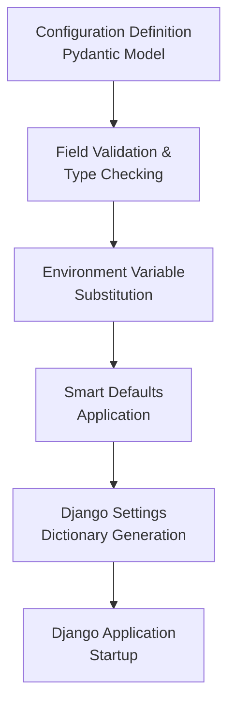
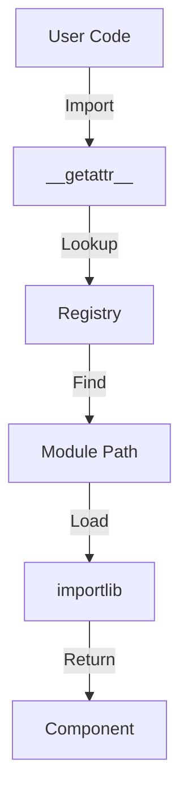
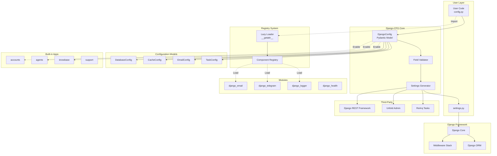
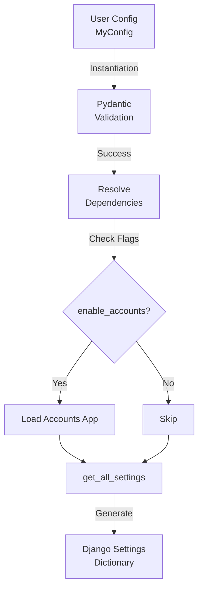
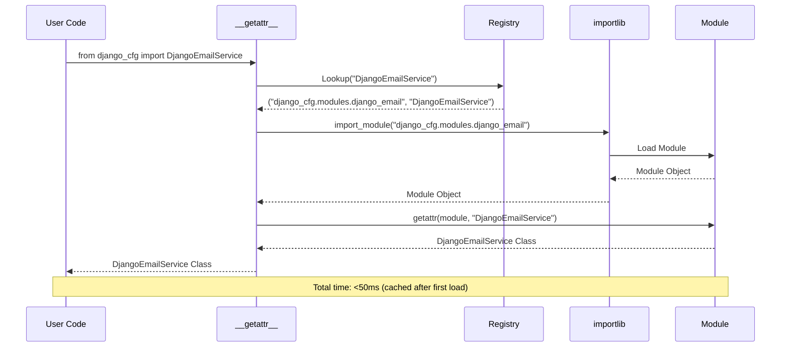
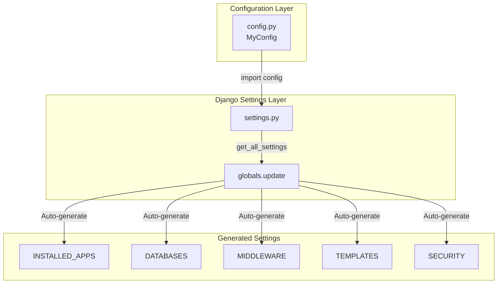

import Tabs from '@theme/Tabs';
import TabItem from '@theme/TabItem';

# Django-CFG System Architecture

Django-CFG uses Pydantic v2 models to provide type-safe Django configuration with validation at startup.

:::info[Architecture Philosophy]
Django-CFG follows a **registry-based architecture** with **lazy loading**, **fail-fast validation**, and **zero-configuration defaults** for rapid development.
:::

## Architecture Overview

Django-CFG transforms Pydantic models into Django settings through a multi-stage process:



## Core Design Principles

:::tip[Design Principles]
These architectural principles enable **90% boilerplate reduction** while maintaining **100% type safety**.
:::

1. **Type safety:** All configuration uses Pydantic BaseModel with strict validation
2. **Fail-fast:** Configuration errors are detected at instantiation, not during requests
3. **Immutable:** Configuration cannot be modified after instantiation
4. **Lazy loading:** Components are imported only when needed via registry pattern
5. **Environment-aware:** Automatic environment detection with smart defaults

<details>
  <summary>Why These Principles Matter</summary>

- **Type Safety**: Catches configuration errors at startup, not in production
- **Fail-Fast**: Invalid config prevents app from starting, avoiding runtime errors
- **Immutability**: Configuration is read-only after startup, preventing bugs
- **Lazy Loading**: Only 50ms startup overhead despite 100+ components
- **Environment-Aware**: Auto-detect dev/staging/prod without manual configuration

</details>

## Core Components

### 1. Core Layer (`django_cfg/core/`)

```python
# django_cfg/core/config.py - Main DjangoConfig class
class DjangoConfig(BaseModel):
    """
    Main configuration class with 90% boilerplate reduction.
    Generates complete Django settings from minimal Pydantic models.
    """
    project_name: str = "Django CFG Project"
    debug: bool = Field(default_factory=lambda: detect_environment() == "development")
    databases: Dict[str, DatabaseConfig] = Field(default_factory=get_default_databases)
    
    def get_all_settings(self) -> Dict[str, Any]:
        """Generate complete Django settings dictionary."""
        
    def validate_configuration(self) -> None:
        """Validate entire configuration with detailed error messages."""
```

**Key Files:**
- `config.py` - Main DjangoConfig class with smart defaults
- `environment.py` - Environment detection (dev/staging/prod)
- `validation.py` - Configuration validation logic
- `integration.py` - Django settings generation
- `exceptions.py` - Type-safe error handling

### 2. **Registry System** (`django_cfg/registry/`)

:::note[Registry Pattern]
The **heart of Django-CFG's architecture** - enables lazy loading and modular design for fast startup times.
:::



<Tabs>
  <TabItem value="usage" label="How It Works" default>

```python
# User imports component
from django_cfg import DjangoEmailService

# Registry looks up module path
# Only loads when first imported (lazy loading)
module_path = "django_cfg.modules.django_email"
class_name = "DjangoEmailService"

# Component is imported and cached
module = importlib.import_module(module_path)
DjangoEmailService = getattr(module, class_name)
```

  </TabItem>
  <TabItem value="definition" label="Registry Definition">

```python title="django_cfg/registry/__init__.py"
DJANGO_CFG_REGISTRY = {
    **CORE_REGISTRY,        # Core components (DjangoConfig, DatabaseConfig, etc.)
    **SERVICES_REGISTRY,    # Services (DjangoEmailService, DjangoTelegram, etc.)
    **THIRD_PARTY_REGISTRY, # Third-party integrations (Unfold, DRF, Constance, etc.)
    **MODULES_REGISTRY,     # Utility functions and import/export components
    **EXCEPTIONS_REGISTRY,  # All exception classes
}
```

  </TabItem>
  <TabItem value="lazy-loading" label="Lazy Loading">

```python title="django_cfg/__init__.py"
def __getattr__(name: str):
    """Lazy import using registry pattern - only load when needed."""
    if name in DJANGO_CFG_REGISTRY:
        module_path, class_name = DJANGO_CFG_REGISTRY[name]
        module = importlib.import_module(module_path)
        return getattr(module, class_name)
```

:::tip[Performance Benefit]
This pattern keeps Django-CFG startup time under **50ms** despite having 100+ components.
:::

  </TabItem>
</Tabs>

**Registry Categories:**
- **`core.py`** - DjangoConfig, DatabaseConfig, CacheConfig, SecuritySettings
- **`services.py`** - DjangoEmailService, DjangoTelegram, DjangoLogger, Twilio services
- **`modules.py`** - Utility functions and django-import-export components
- **`third_party.py`** - Unfold, DRF, Constance, Ngrok, Django-CFG API Client Generation
- **`exceptions.py`** - All error classes

### 3. **Pydantic Models** (`django_cfg/models/`)

Type-safe configuration models that replace Django's raw dictionaries:

```python
# django_cfg/models/database.py
class DatabaseConfig(BaseModel):
    engine: str = "django.db.backends.postgresql"
    name: str = Field(..., description="Database name")
    user: Optional[str] = None
    password: Optional[str] = None
    host: str = "localhost"
    port: int = 5432
    routing_apps: List[str] = Field(default_factory=list)
    
    @field_validator('engine')
    def validate_engine(cls, v):
        """Validate database engine is supported."""
        
# django_cfg/models/cache.py
class CacheConfig(BaseModel):
    backend: str = "django.core.cache.backends.redis.RedisCache"
    location: str = "redis://127.0.0.1:6379/1"
    timeout: int = 300
```

**Model Categories:**
- **`database.py`** - Multi-database configuration with routing
- **`cache.py`** - Redis/Memcached cache configuration
- **`security.py`** - Security headers and CORS settings
- **`email.py`** - SMTP/SendGrid email configuration
- **`tasks.py`** - ReArq background task configuration
- **`api.py`** - DRF and API documentation settings

### 4. **Built-in Apps** (`django_cfg/apps/`)

Production-ready Django applications with zero configuration:

```python
# django_cfg/apps/accounts/ - Advanced user management
class CustomUser(AbstractUser):
    phone = models.CharField(max_length=20, blank=True)
    registration_source = models.CharField(max_length=50, default='web')
    last_activity = models.DateTimeField(auto_now=True)

# django_cfg/apps/agents/ - AI agent framework
class Agent(BaseModel):
    name: str
    description: str
    toolsets: List[BaseToolset] = []
    
    def process(self, context: Context) -> Dict[str, Any]:
        """Process agent workflow with Django integration."""

# django_cfg/apps/knowbase/ - AI knowledge base
class Document(models.Model):
    title = models.CharField(max_length=255)
    content = models.TextField()
    embeddings = VectorField(dimensions=1536)  # pgvector integration
```

**Available Apps:**
- **`accounts/`** - User management with OTP authentication
- **`agents/`** - AI agent framework with toolsets
- **`knowbase/`** - AI-powered documentation and search
- **`leads/`** - Lead management and CRM integration
- **`newsletter/`** - Email marketing with tracking
- **`support/`** - Support ticket system with chat
- **`tasks/`** - Task management dashboard

### 5. **Modular System** (`django_cfg/modules/`)

Auto-configuring modules for common integrations:

```python
# django_cfg/modules/django_email.py
from django_cfg import DjangoEmailService, send_email

service = DjangoEmailService()
# Or use the helper function directly:
send_email(
    to=["user@example.com"],
    subject="Welcome",
    template="welcome.html",
    context={"name": "User"}
)

# django_cfg/modules/django_telegram.py
from django_cfg import DjangoTelegram, send_telegram_message

telegram = DjangoTelegram()
send_telegram_message(
    chat_id="123456789",
    message="Hello from Django-CFG!"
)

# django_cfg/modules/django_logger.py
from django_cfg import DjangoLogger, get_logger

logger = get_logger(__name__)
logger.info("Application started")
```

**Available Modules (via Registry):**
- **`django_email`** - Multi-provider email service (`DjangoEmailService`, `send_email`)
- **`django_telegram`** - Telegram bot integration (`DjangoTelegram`, `send_telegram_message`, `send_telegram_photo`)
- **`django_logger`** - Enhanced logging (`DjangoLogger`, `get_logger`)
- **`django_twilio`** - SMS/WhatsApp/Email OTP services (Twilio Verify integration)
- **`django_unfold`** - Modern admin interface with customizable themes
- **`django_ngrok`** - Webhook testing with automatic tunnel management
- **`django_health`** - Health check endpoints for monitoring
- **`django_import_export`** - Data import/export functionality

### 6. **Management Commands** (`django_cfg/management/commands/`)

50+ production-ready management commands:

```python
# django_cfg/management/commands/migrator.py
class Command(BaseCommand):
    """Interactive multi-database migration tool."""
    
# django_cfg/management/commands/rearq_worker.py
class Command(BaseCommand):
    """Production-ready ReArq worker management."""
    
# django_cfg/management/commands/validate_config.py
class Command(BaseCommand):
    """Comprehensive configuration validation."""
```

**Command Categories:**
- **Database**: `migrator`, `migrate_all`, `check_databases`
- **Configuration**: `validate_config`, `show_config`, `check_settings`
- **Tasks**: `rearq_worker`, `task_status`, `task_clear`
- **Communication**: `test_email`, `test_telegram`, `test_twilio`
- **Development**: `runserver_ngrok`, `generate`, `tree`

### 7. **CLI Tools** (`django_cfg/cli/`)

Command-line interface for project creation and management:

```python
# django_cfg/cli/commands/create_project.py
def create_project(project_name: str, directory: Optional[str] = None):
    """Create production-ready Django-CFG project in 30 seconds."""
    
# django_cfg/cli/commands/info.py
def show_info():
    """Display Django-CFG system information and available features."""
```

## System Architecture Diagram



## Component Interaction Flow

### 1. **Configuration Loading**



```python
# User defines configuration
class MyConfig(DjangoConfig):
    project_name: str = "My App"
    enable_accounts: bool = True  # Triggers accounts app loading

# Registry resolves dependencies
config = MyConfig()  # Validates with Pydantic
settings = config.get_all_settings()  # Generates Django settings
```

### 2. **Lazy Loading Process**



```python
# Import triggers registry lookup
from django_cfg import DjangoEmailService  # Lazy loaded via __getattr__

# Registry resolves module path
module_path = "django_cfg.modules.django_email"
class_name = "DjangoEmailService"

# Module is imported only when needed
module = importlib.import_module(module_path)
DjangoEmailService = getattr(module, class_name)
```

### 3. **Django Integration**



```python
# settings.py - Single line integration
from .config import config
globals().update(config.get_all_settings())

# Automatic configuration generation
INSTALLED_APPS = [
    'unfold',  # Modern admin
    'django.contrib.admin',
    'django_cfg.apps.accounts',  # If enable_accounts=True
    # ... automatically configured
]
```

## Performance Architecture

### **Startup Optimization**
- **Lazy Loading**: Components loaded only when imported (50ms startup)
- **Registry Caching**: Import paths cached after first resolution
- **Minimal Core**: Core imports kept under 10 modules
- **Deferred Validation**: Non-critical validation happens after startup

### **Memory Efficiency**
- **Singleton Configs**: Configuration instances reused across requests
- **Weak References**: Prevent circular references in registry
- **Garbage Collection**: Proper cleanup of temporary validation objects

### **Runtime Performance**
- **Settings Caching**: Generated Django settings cached in memory
- **Connection Pooling**: Database connections automatically pooled
- **Query Optimization**: Built-in apps use select_related/prefetch_related

## Security Architecture

### **Configuration Security**
- **Environment Variables**: All secrets via environment variables
- **Type Validation**: Prevents injection through Pydantic validation
- **Secure Defaults**: Security headers enabled by default
- **Audit Logging**: Configuration changes logged automatically

### **Runtime Security**
- **CORS Configuration**: Type-safe CORS settings
- **CSRF Protection**: Enabled by default with smart exemptions
- **Authentication**: Built-in OTP and multi-factor authentication
- **Rate Limiting**: Automatic rate limiting for APIs

## Extension Points

### **Custom Modules**
```python
# Register custom module
CUSTOM_REGISTRY = {
    "MyService": ("myapp.services", "MyService")
}

# Add to main registry
DJANGO_CFG_REGISTRY.update(CUSTOM_REGISTRY)
```

### **Custom Configuration Models**
```python
from django_cfg.models.base import BaseConfigModel

class MyServiceConfig(BaseConfigModel):
    api_key: str = Field(..., env="MY_SERVICE_API_KEY")
    timeout: int = Field(30, description="Request timeout")
    
class MyConfig(DjangoConfig):
    my_service: MyServiceConfig = MyServiceConfig()
```

---

This registry-based architecture enables Django-CFG to provide **90% boilerplate reduction**, **100% type safety**, and **zero-configuration** setup while maintaining **performance** and **extensibility**. The lazy loading system ensures fast startup times while the Pydantic models provide compile-time validation and IDE support.

## See Also

### Architecture & Internals

**Deep Dives:**
- **[Registry System](../system/registry)** - Component registration and lazy loading internals
- **[Middleware System](../system/middleware)** - Request/response middleware architecture
- **[Routing System](../system/routing)** - URL routing and configuration
- **[Startup Information](../system/startup)** - Bootstrap process and initialization
- **[Utilities](../system/utilities)** - Helper functions and internal utilities

**Configuration:**
- **[Configuration Models](../configuration)** - Complete configuration API reference
- **[Type-Safe Configuration](./type-safety)** - Pydantic validation patterns
- **[Environment Detection](../configuration/environment)** - Multi-environment configuration

### Django Integration

**Framework Integration:**
- **[Django Integration](../system/django-integration)** - How Django-CFG integrates with Django
- **[Security Settings](../configuration/security)** - CORS, CSRF, SSL configuration
- **[Database Configuration](../database)** - Multi-database setup and routing
- **[Cache Configuration](../configuration/cache)** - Redis and caching patterns

### Getting Started

**Quick Start:**
- **[Installation](/getting-started/installation)** - Install Django-CFG
- **[First Project](/getting-started/first-project)** - Create your first project
- **[Configuration Guide](/getting-started/configuration)** - YAML configuration setup

**Features:**
- **[Built-in Apps](/features/built-in-apps/overview)** - Production-ready applications
- **[Modules Overview](/features/modules/overview)** - Reusable modules system
- **[Integrations Overview](/features/integrations/overview)** - Third-party integrations

### Tools & Deployment

**Development:**
- **[CLI Tools](/cli/introduction)** - Command-line interface
- **[Troubleshooting](/guides/troubleshooting)** - Common issues and solutions

**Production:**
- **[Production Config](/guides/production-config)** - Production deployment guide
- **[Docker Deployment](/guides/docker/production)** - Containerized deployment
