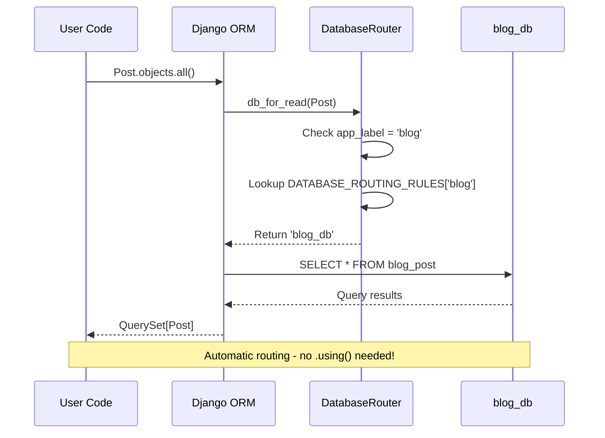
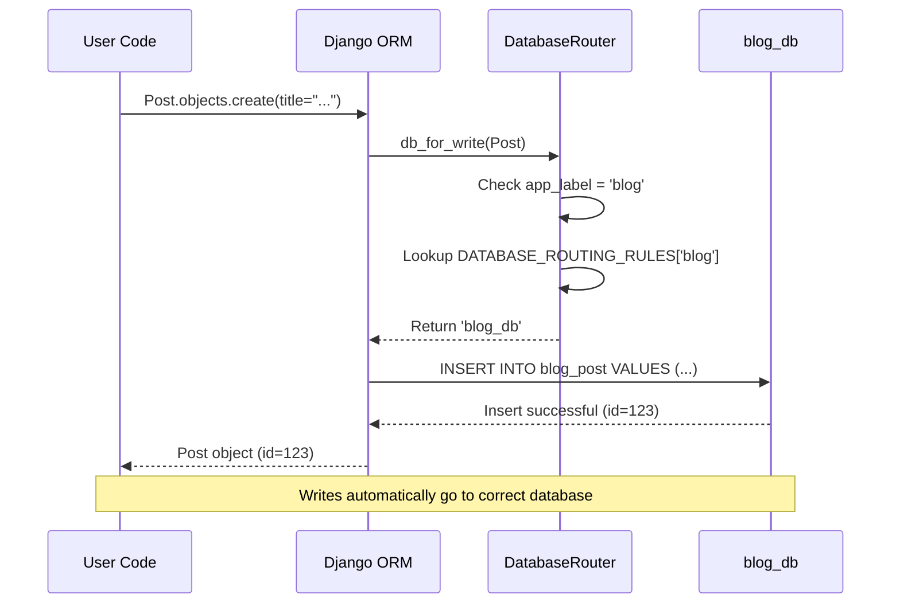
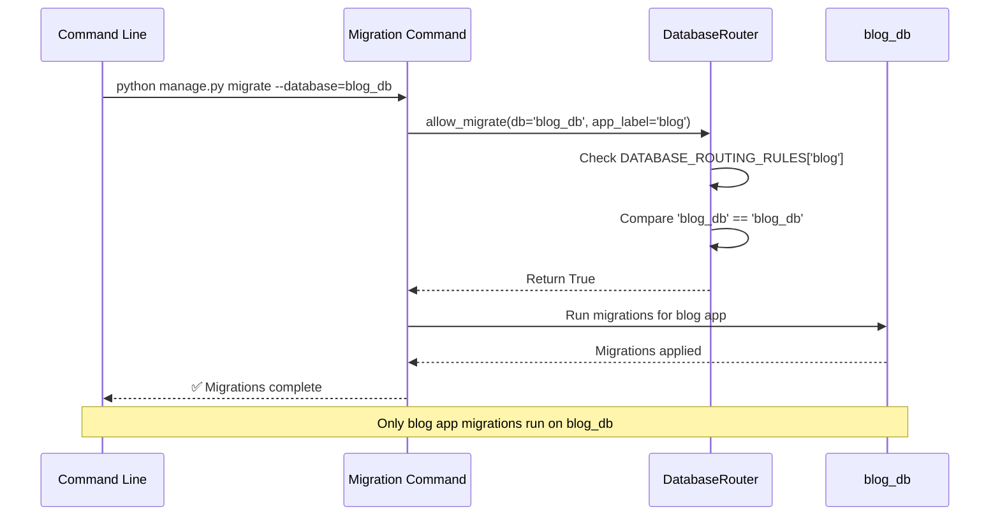

import Tabs from '@theme/Tabs';
import TabItem from '@theme/TabItem';

# Database Routing

Django-CFG provides automatic database routing based on app labels with zero manual `.using()` calls.

:::info[Automatic Routing]
The `DatabaseRouter` automatically routes **100% of queries** to the correct database based on app labels—no manual `.using()` calls needed!
:::

## How It Works

The `DatabaseRouter` automatically routes database operations based on `DATABASE_ROUTING_RULES`:

```python
# settings.py
DATABASE_ROUTERS = ['django_cfg.routing.DatabaseRouter']

DATABASE_ROUTING_RULES = {
    'blog': 'blog_db',
    'shop': 'shop_db',
    # Apps not listed → default database
}
```

## Router Implementation

The `DatabaseRouter` provides four key methods:

<Tabs groupId="router-methods">
  <TabItem value="read" label="Read Operations" default>

```python
def db_for_read(self, model, **hints):
    """Route read operations to appropriate database."""
    rules = getattr(settings, 'DATABASE_ROUTING_RULES', {})
    app_label = model._meta.app_label

    return rules.get(app_label, 'default')
```

**Use Case**: Routes `SELECT` queries to the correct database based on model's app_label.

  </TabItem>
  <TabItem value="write" label="Write Operations">

```python
def db_for_write(self, model, **hints):
    """Route write operations to appropriate database."""
    rules = getattr(settings, 'DATABASE_ROUTING_RULES', {})
    app_label = model._meta.app_label

    return rules.get(app_label, 'default')
```

**Use Case**: Routes `INSERT`, `UPDATE`, `DELETE` operations to the correct database.

  </TabItem>
  <TabItem value="relations" label="Relationships">

```python
def allow_relation(self, obj1, obj2, **hints):
    """
    Allow relations between objects.

    - Both routed to SAME db → allow
    - One or both NOT routed → allow (enables cross-db FK)
    - Both routed to DIFFERENT dbs → deny
    """
    rules = getattr(settings, 'DATABASE_ROUTING_RULES', {})
    db1 = rules.get(obj1._meta.app_label)
    db2 = rules.get(obj2._meta.app_label)

    # If both are routed, they must be in the same database
    if db1 and db2:
        return db1 == db2

    # If one or both are not routed, allow the relation
    # This enables cross-database ForeignKeys to shared models (e.g., User)
    return True
```

**Use Case**: Controls whether ForeignKey relationships are allowed between models in different databases.

  </TabItem>
  <TabItem value="migrations" label="Migrations">

```python
def allow_migrate(self, db, app_label, **hints):
    """Control which apps can migrate on which databases."""
    rules = getattr(settings, 'DATABASE_ROUTING_RULES', {})
    target_db = rules.get(app_label)

    if target_db:
        # App IS routed → allow only on target db
        return db == target_db

    # Check if this db is used by other apps
    if db in rules.values():
        # This db is used by other apps → don't migrate default apps here
        return False

    # Default apps → migrate on default database
    return db == 'default'
```

**Use Case**: Controls which migrations run on which databases. Prevents accidental migrations to wrong database.

  </TabItem>
</Tabs>

## Configuration

### Setup

```python
# settings.py
import dj_database_url
from django_cfg import load_config

config = load_config()

DATABASES = {
    'default': dj_database_url.parse(config.database.url),
    'blog_db': dj_database_url.parse(config.database.url_blog),
    'shop_db': dj_database_url.parse(config.database.url_shop),
}

# Enable routing
DATABASE_ROUTERS = ['django_cfg.routing.DatabaseRouter']

# Define routing rules
DATABASE_ROUTING_RULES = {
    'blog': 'blog_db',
    'shop': 'shop_db',
}
```

### YAML Configuration

```yaml
# config.yaml
database:
  url: "postgresql://localhost/main"
  url_blog: "postgresql://localhost/blog_db"
  url_shop: "postgresql://localhost/shop_db"
```

## Usage Examples

### Automatic Routing

```python
# Blog operations automatically use blog_db
from apps.blog.models import Post

post = Post.objects.create(title="New Post")
# Automatically routed to blog_db

posts = Post.objects.all()
# Automatically routed to blog_db

# Shop operations automatically use shop_db
from apps.shop.models import Product

product = Product.objects.create(name="Django Book", price=29.99)
# Automatically routed to shop_db

# User operations automatically use default
from django.contrib.auth import get_user_model

User = get_user_model()
user = User.objects.create_user(email="user@example.com")
# Automatically routed to default database
```

### Manual Routing (When Needed)

```python
# Explicitly specify database
post = Post.objects.using('blog_db').get(id=1)

# Write to specific database
product = Product.objects.using('shop_db').create(name="Special Product")

# Query across all databases
all_databases = ['default', 'blog_db', 'shop_db']
for db in all_databases:
    count = Post.objects.using(db).count()
    print(f"Posts in {db}: {count}")
```

## Routing Flow

<Tabs groupId="routing-flow">
  <TabItem value="read" label="Read Operation" default>



**Flow Steps:**
1. User calls: `Post.objects.all()`
2. Django calls: `router.db_for_read(Post)`
3. Router checks: `Post._meta.app_label = 'blog'`
4. Router looks up: `DATABASE_ROUTING_RULES['blog'] = 'blog_db'`
5. Django executes query on: `blog_db`

  </TabItem>
  <TabItem value="write" label="Write Operation">



**Flow Steps:**
1. User calls: `Post.objects.create(title="...")`
2. Django calls: `router.db_for_write(Post)`
3. Router checks: `Post._meta.app_label = 'blog'`
4. Router looks up: `DATABASE_ROUTING_RULES['blog'] = 'blog_db'`
5. Django executes INSERT on: `blog_db`

  </TabItem>
  <TabItem value="migrate" label="Migration">



**Flow Steps:**
1. User runs: `python manage.py migrate --database=blog_db`
2. Django calls: `router.allow_migrate(db='blog_db', app_label='blog')`
3. Router checks: `DATABASE_ROUTING_RULES['blog'] = 'blog_db'`
4. Router returns: `db == 'blog_db'` → `True`
5. Django migrates: blog app on blog_db

  </TabItem>
</Tabs>

## Debugging Routing

### Check Which Database Will Be Used

```python
from django.db import router
from apps.blog.models import Post

# For reading
db = router.db_for_read(Post)
print(f"Post reads from: {db}")  # blog_db

# For writing
db = router.db_for_write(Post)
print(f"Post writes to: {db}")  # blog_db

# Check if migration is allowed
allowed = router.allow_migrate('blog_db', 'blog')
print(f"Migrate blog on blog_db: {allowed}")  # True
```

### View Active Router

```python
from django.conf import settings

print("Active routers:", settings.DATABASE_ROUTERS)
print("Routing rules:", settings.DATABASE_ROUTING_RULES)
```

### Test Routing

```python
# Test automatic routing
post = Post.objects.create(title="Test")
print(post._state.db)  # blog_db

user = User.objects.create_user(email="test@example.com")
print(user._state.db)  # default
```

## Advanced Patterns

<details>
  <summary>📚 Read Replicas - Scale Read Operations</summary>

### Read Replicas Setup

```python
# settings.py
DATABASE_ROUTING_RULES = {
    'blog': 'blog_db',
    'blog_replica': 'blog_replica_db',
}
```

### Custom Router for Load Distribution

```python
class ReplicaRouter:
    def db_for_read(self, model, **hints):
        if model._meta.app_label == 'blog':
            # 80% of reads go to replica
            import random
            return 'blog_replica_db' if random.random() < 0.8 else 'blog_db'
        return None  # Fall through to next router

    def db_for_write(self, model, **hints):
        if model._meta.app_label == 'blog':
            return 'blog_db'  # All writes to primary
        return None
```

### Enable Multi-Router Chain

```python
# settings.py
DATABASE_ROUTERS = [
    'myapp.routers.ReplicaRouter',  # Custom read replica logic
    'django_cfg.routing.DatabaseRouter',  # Fallback routing
]
```

:::tip[Performance Gain]
Read replicas can handle **80% of database load**, reducing primary database pressure and improving response times.
:::

</details>

<details>
  <summary>🔀 Sharding by User - Horizontal Scaling</summary>

### User-Based Sharding

```python
def get_user_shard(user_id):
    """Determine database shard for user."""
    shard_count = 4
    shard_id = user_id % shard_count
    return f"shard_{shard_id}"

# Use in queries
shard = get_user_shard(user.id)
user_posts = Post.objects.using(shard).filter(author=user)
```

### Advanced Sharding Router

```python
class ShardingRouter:
    def db_for_read(self, model, **hints):
        if 'user_id' in hints:
            return get_user_shard(hints['user_id'])
        return None

    def db_for_write(self, model, **hints):
        if 'user_id' in hints:
            return get_user_shard(hints['user_id'])
        return None
```

:::warning[Complexity Trade-off]
Sharding adds complexity. Consider read replicas first—only shard when you exceed **100M+ records** or **10K+ writes/sec**.
:::

</details>

## Best Practices

### 1. Use Automatic Routing

```python
# ✅ Good: Automatic routing
post = Post.objects.create(title="My Post")

# ❌ Bad: Manual routing (unless necessary)
post = Post.objects.using('blog_db').create(title="My Post")
```

### 2. Avoid Cross-Database JOINs

```python
# ✅ Good: Query from the correct side
orders = Order.objects.filter(user_id=user.id)

# ❌ Bad: Cross-database relationship traversal
orders = user.order_set.all()  # May not work across databases
```

### 3. Document Routing Rules

```python
# settings.py
DATABASE_ROUTING_RULES = {
    # Blog app → blog_db (PostgreSQL on db-blog.example.com)
    'blog': 'blog_db',

    # Shop app → shop_db (PostgreSQL on db-shop.example.com)
    'shop': 'shop_db',

    # Analytics app → analytics (PostgreSQL read-only warehouse)
    'analytics': 'analytics',
}
```

## Troubleshooting

:::danger[Common Issue: Routing Not Working]
**Symptom**: Queries still go to default database

**Solution**:
```python
# 1. Check if router is configured
from django.conf import settings
print(settings.DATABASE_ROUTERS)
# Should show: ['django_cfg.routing.DatabaseRouter']

# 2. Check routing rules exist
print(settings.DATABASE_ROUTING_RULES)
# Should show: {'blog': 'blog_db', ...}

# 3. Verify app_label matches
from apps.blog.models import Post
print(Post._meta.app_label)  # Should be 'blog', not 'apps.blog'
```
:::

:::warning[Wrong Database Being Used]
**Symptom**: Model saves to unexpected database

**Debug Steps**:
```python
# 1. Check which database is actually being used
from django.db import connections
print(connections['blog_db'].queries)  # Show recent queries

# 2. Inspect model after save
post = Post.objects.create(title="Test")
print(post._state.db)  # Should show 'blog_db'

# 3. Test router directly
from django.db import router
db = router.db_for_write(Post)
print(f"Router selected: {db}")  # Should be 'blog_db'
```
:::

:::tip[Migration Issues - Quick Fix]
**Symptom**: Migrations applied to wrong database

**Solution**:
```bash
# 1. Check migration status for all databases
python manage.py showmigrations

# 2. Migrate specific database
python manage.py migrate --database=blog_db

# 3. Use migrate_all for all databases (Django-CFG helper)
python manage.py migrate_all

# 4. Rollback if needed
python manage.py migrate blog 0003 --database=blog_db
```
:::

<details>
  <summary>🔍 Advanced Debugging Techniques</summary>

### Enable Query Logging

```python
# settings.py
LOGGING = {
    'version': 1,
    'handlers': {
        'console': {'class': 'logging.StreamHandler'},
    },
    'loggers': {
        'django.db.backends': {
            'handlers': ['console'],
            'level': 'DEBUG',  # Shows all SQL queries with database alias
        },
    },
}
```

### Test Routing Programmatically

```python
# test_routing.py
from django.test import TestCase
from django.db import router
from apps.blog.models import Post

class RoutingTestCase(TestCase):
    def test_read_routing(self):
        db = router.db_for_read(Post)
        self.assertEqual(db, 'blog_db')

    def test_write_routing(self):
        db = router.db_for_write(Post)
        self.assertEqual(db, 'blog_db')

    def test_actual_database_used(self):
        post = Post.objects.create(title="Test")
        self.assertEqual(post._state.db, 'blog_db')
```

</details>

## See Also

- [**Multi-Database**](./multi-database) - Multi-database setup
- [**Migrations**](./migrations) - Migration commands
- [**Cross-Database Relations**](./cross-database-relations) - ForeignKeys across databases
- [**Sample Project**](/guides/sample-project/multi-database) - Complete example
