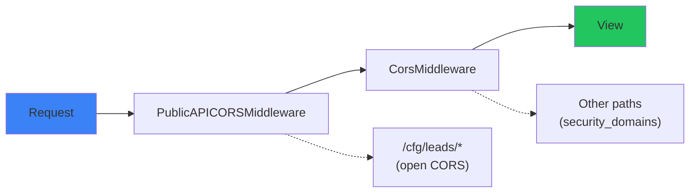

# CORS Configuration

Django-CFG provides **automatic CORS handling** for public API endpoints via middleware, plus decorators for custom configurations.

## Architecture



**Key components:**
- `PublicAPICORSMiddleware` - Handles CORS for public API paths (e.g., `/cfg/leads/`)
- `CorsMiddleware` (django-cors-headers) - Handles CORS for other paths based on `security_domains`
- `PublicAPIMixin` - Removes authentication for public endpoints
- Decorators - For custom CORS on function-based views

## Quick Start

### Public API Endpoint (Recommended)

Public endpoints like lead submission work automatically:

```python
from django_cfg.mixins import PublicAPIMixin
from rest_framework import viewsets

class LeadViewSet(PublicAPIMixin, viewsets.ModelViewSet):
    """Public API - no auth required, CORS handled by middleware."""
    queryset = Lead.objects.all()
    serializer_class = LeadSerializer
```

CORS is handled automatically by `PublicAPICORSMiddleware` for paths matching `PUBLIC_API_CORS_PATHS`.

### Function-Based Views

```python
from django_cfg.core.decorators import cors_allow_all
from django.http import JsonResponse

@cors_allow_all
def webhook_handler(request):
    return JsonResponse({'received': True})
```

## Middleware Configuration

### PUBLIC_API_CORS_PATHS

Configure which paths have open CORS in `settings.py`:

```python
# Default: ['/cfg/leads/']
PUBLIC_API_CORS_PATHS = [
    '/cfg/leads/',      # Lead submission API
    '/api/webhooks/',   # Webhook handlers
    '/api/public/',     # Other public endpoints
]
```

### PUBLIC_API_CORS_REGEX

For complex path matching:

```python
PUBLIC_API_CORS_REGEX = r'^/(cfg/leads|api/webhooks|api/public)/'
```

### CORS Headers Added

For matching paths, middleware adds:

```http
Access-Control-Allow-Origin: *
Access-Control-Allow-Methods: GET, POST, PUT, PATCH, DELETE, OPTIONS
Access-Control-Allow-Headers: Content-Type, Authorization, X-Requested-With, Accept, Origin
Access-Control-Max-Age: 86400
```

## PublicAPIMixin

Mixin for public API endpoints without authentication.

```python
from django_cfg.mixins import PublicAPIMixin
from rest_framework import viewsets
from rest_framework.decorators import action
from rest_framework.response import Response

class ContactFormViewSet(PublicAPIMixin, viewsets.GenericViewSet):
    """
    Public contact form API.

    - No authentication required (AllowAny)
    - CORS handled by PublicAPICORSMiddleware
    """

    @action(detail=False, methods=['post'])
    def submit(self, request):
        serializer = ContactSerializer(data=request.data)
        if serializer.is_valid():
            serializer.save()
            return Response({'success': True}, status=201)
        return Response({'errors': serializer.errors}, status=400)
```

**What PublicAPIMixin provides:**
- `permission_classes = [AllowAny]`
- `authentication_classes = []`

**What it does NOT provide:**
- CORS headers (handled by middleware)

## Decorators Reference

### @cors_allow_all

Decorator for open CORS on function-based views.

```python
from django_cfg.core.decorators import cors_allow_all
from rest_framework.decorators import api_view
from rest_framework.response import Response

@cors_allow_all
@api_view(['POST'])
def submit_lead(request):
    """Lead submission endpoint with open CORS."""
    return Response({'success': True})
```

**Features:**
- Adds CORS headers to response
- Handles OPTIONS preflight automatically
- Disables CSRF protection

### @cors_origins

Decorator for restricted CORS origins.

```python
from django_cfg.core.decorators import cors_origins

@cors_origins([
    "https://myapp.com",
    "https://admin.myapp.com",
])
def restricted_api(request):
    """Only accessible from whitelisted origins."""
    return JsonResponse({'data': 'restricted'})
```

**With credentials:**

```python
@cors_origins(
    allowed_origins=["https://myapp.com"],
    credentials=True,
)
def authenticated_api(request):
    return JsonResponse({'user': request.user.username})
```

**Parameters:**

| Parameter | Type | Default | Description |
|-----------|------|---------|-------------|
| `allowed_origins` | `List[str]` | required | Allowed origin URLs |
| `methods` | `str` | `"GET, POST, ..."` | Allowed HTTP methods |
| `headers` | `str` | `"Content-Type, ..."` | Allowed headers |
| `max_age` | `int` | `86400` | Preflight cache (seconds) |
| `credentials` | `bool` | `True` | Allow credentials |

### @cors_exempt

Alias for `@cors_allow_all`:

```python
from django_cfg.core.decorators import cors_exempt

@cors_exempt
def webhook_handler(request):
    return JsonResponse({'received': True})
```

## Usage Patterns

### Lead Submission (Built-in)

Django-CFG's lead system works out of the box:

```python
# Already configured in django_cfg.apps.business.leads
class LeadViewSet(PublicAPIMixin, viewsets.ModelViewSet):
    queryset = Lead.objects.all()
    serializer_class = LeadSubmissionSerializer

    @action(detail=False, methods=['post'])
    def submit(self, request):
        # ... submission logic
```

**Frontend usage:**

```typescript
await fetch('https://api.example.com/cfg/leads/submit/', {
  method: 'POST',
  headers: { 'Content-Type': 'application/json' },
  body: JSON.stringify({
    name: 'John Doe',
    email: 'john@example.com',
    message: 'Hello!'
  })
});
```

### Webhook Handler

```python
from django_cfg.core.decorators import cors_allow_all
from django.http import JsonResponse
import json

@cors_allow_all
def stripe_webhook(request):
    payload = json.loads(request.body)
    # Process webhook...
    return JsonResponse({'status': 'ok'})
```

### Mixed Authentication

```python
from django_cfg.mixins import AdminAPIMixin
from rest_framework import viewsets
from rest_framework.permissions import AllowAny

class ProductViewSet(AdminAPIMixin, viewsets.ModelViewSet):
    """
    - List/Retrieve: Public
    - Create/Update/Delete: Admin only
    """
    queryset = Product.objects.all()

    def get_permissions(self):
        if self.action in ['list', 'retrieve']:
            return [AllowAny()]
        return super().get_permissions()
```

## Frontend Integration

### ContactPage Component

```tsx
import { ContactPage } from '@djangocfg/layouts';

function Contact() {
  return <ContactPage />;  // Uses default API URL
}
```

### Custom API URL

```tsx
import { ContactPage } from '@djangocfg/layouts';

function Contact() {
  return (
    <ContactPage
      apiUrl="https://api.myapp.com/cfg/leads/submit/"
    />
  );
}
```

## Security Best Practices

### 1. Use middleware for public endpoints

```python
# settings.py
PUBLIC_API_CORS_PATHS = ['/cfg/leads/']  # Only truly public paths
```

### 2. Never expose sensitive data without auth

```python
# WRONG
class UserViewSet(PublicAPIMixin, viewsets.ModelViewSet):
    queryset = User.objects.all()  # Exposes all users!

# CORRECT
class UserViewSet(AdminAPIMixin, viewsets.ModelViewSet):
    queryset = User.objects.all()
```

### 3. Use security_domains for authenticated APIs

```python
# config.py
config = DjangoConfig(
    security_domains=[
        "myapp.com",
        "admin.myapp.com",
    ],
    # ...
)
```

## Middleware Order

`PublicAPICORSMiddleware` must be before `CorsMiddleware`:

```python
MIDDLEWARE = [
    'django.middleware.security.SecurityMiddleware',
    'whitenoise.middleware.WhiteNoiseMiddleware',
    'django_cfg.core.middleware.PublicAPICORSMiddleware',  # Before CorsMiddleware
    'corsheaders.middleware.CorsMiddleware',
    # ...
]
```

This is configured automatically by Django-CFG.

## Related Documentation

- [Middleware System](../middleware)
- [Lead Management](/docs/features/built-in-apps/user-management/leads)
- [Security Guide](/docs/deployment/security)

TAGS: cors, api, middleware, public-api, security
DEPENDS_ON: [rest-framework, django-views]
USED_BY: [leads, contact-forms, webhooks]
