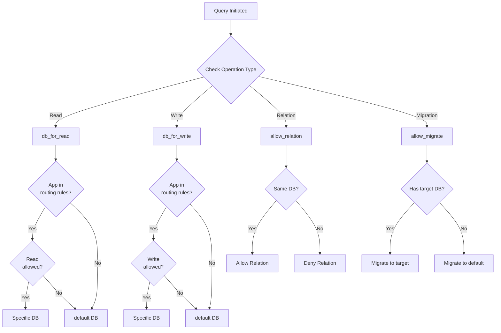

import Tabs from '@theme/Tabs';
import TabItem from '@theme/TabItem';

# Routing System - Database Routing & URL Management

:::info[Smart Routing System]
Django-CFG provides **intelligent routing** for databases and URLs—**zero manual configuration** needed!
:::

The **Routing System** provides intelligent database routing and automatic URL management for Django-CFG projects.

## Overview

The Routing System includes:

- **Database Routing** - Automatic multi-database routing
- **URL Management** - Smart URL pattern integration
- **Performance Optimization** - Efficient query routing
- **Security Features** - Access control and validation
- **Configuration-Driven** - Zero-code routing setup

## Database Routing

### Automatic Database Routing

Django-CFG provides intelligent database routing based on your configuration:

```python
# api/config.py
class MyProjectConfig(DjangoConfig):
    databases: Dict[str, DatabaseConfig] = {
        "default": DatabaseConfig(
            engine="django.db.backends.sqlite3",
            name="db/main.sqlite3",
            # Main database for core data
        ),
        "blog_db": DatabaseConfig(
            engine="django.db.backends.sqlite3",
            name="db/blog.sqlite3",
            # Automatic routing for blog app
            apps=["apps.blog"],
            operations=["read", "write"],
            migrate_to="default",  # Migrations go to main DB
        ),
        "analytics_db": DatabaseConfig(
            engine="django.db.backends.postgresql",
            name="analytics",
            host="analytics.example.com",
            # Read-only analytics database
            apps=["apps.analytics"],
            operations=["read"],  # Read-only
        )
    }
```

### Database Router Implementation

#### Routing Flow Diagram



#### Router Implementation

<Tabs groupId="router-methods">
  <TabItem value="implementation" label="Full Implementation" default>

```python
class DatabaseRouter:
    """
    Intelligent database router for Django-CFG projects.

    Routes database operations based on app labels and configuration.
    """

    def db_for_read(self, model, **hints):
        """Route read operations to appropriate database."""
        rules = getattr(settings, 'DATABASE_ROUTING_RULES', {})
        app_label = model._meta.app_label

        # Check if app has specific database
        if app_label in rules:
            db_name = rules[app_label]
            db_config = settings.DATABASES.get(db_name, {})

            # Check if read operations are allowed
            operations = db_config.get('operations', ['read', 'write'])
            if 'read' in operations:
                return db_name

        return 'default'

    def db_for_write(self, model, **hints):
        """Route write operations to appropriate database."""
        rules = getattr(settings, 'DATABASE_ROUTING_RULES', {})
        app_label = model._meta.app_label

        # Check if app has specific database
        if app_label in rules:
            db_name = rules[app_label]
            db_config = settings.DATABASES.get(db_name, {})

            # Check if write operations are allowed
            operations = db_config.get('operations', ['read', 'write'])
            if 'write' in operations:
                return db_name

        return 'default'

    def allow_relation(self, obj1, obj2, **hints):
        """Allow relations between objects in same database."""
        rules = getattr(settings, 'DATABASE_ROUTING_RULES', {})

        db1 = rules.get(obj1._meta.app_label, 'default')
        db2 = rules.get(obj2._meta.app_label, 'default')

        # Allow relations within same database
        return db1 == db2

    def allow_migrate(self, db, app_label, **hints):
        """Control which apps can migrate to which databases."""
        rules = getattr(settings, 'DATABASE_ROUTING_RULES', {})
        target_db = rules.get(app_label)

        if target_db:
            # App has specific database configured
            db_config = settings.DATABASES.get(target_db, {})
            migrate_to = db_config.get('migrate_to', target_db)
            return db == migrate_to

        # Default apps migrate to default database
        return db == 'default'
```

  </TabItem>
  <TabItem value="read-write" label="Read/Write Methods">

```python
def db_for_read(self, model, **hints):
    """Route read operations to appropriate database."""
    rules = getattr(settings, 'DATABASE_ROUTING_RULES', {})
    app_label = model._meta.app_label

    if app_label in rules:
        db_name = rules[app_label]
        db_config = settings.DATABASES.get(db_name, {})
        operations = db_config.get('operations', ['read', 'write'])

        if 'read' in operations:
            return db_name

    return 'default'

def db_for_write(self, model, **hints):
    """Route write operations to appropriate database."""
    rules = getattr(settings, 'DATABASE_ROUTING_RULES', {})
    app_label = model._meta.app_label

    if app_label in rules:
        db_name = rules[app_label]
        db_config = settings.DATABASES.get(db_name, {})
        operations = db_config.get('operations', ['read', 'write'])

        if 'write' in operations:
            return db_name

    return 'default'
```

:::tip[Read-Only Databases]
Set `operations=["read"]` in DatabaseConfig to create read-only database connections (perfect for analytics/reporting databases).
:::

  </TabItem>
  <TabItem value="relations" label="Relations & Migrations">

```python
def allow_relation(self, obj1, obj2, **hints):
    """Allow relations between objects in same database."""
    rules = getattr(settings, 'DATABASE_ROUTING_RULES', {})

    db1 = rules.get(obj1._meta.app_label, 'default')
    db2 = rules.get(obj2._meta.app_label, 'default')

    # Allow relations within same database
    return db1 == db2

def allow_migrate(self, db, app_label, **hints):
    """Control which apps can migrate to which databases."""
    rules = getattr(settings, 'DATABASE_ROUTING_RULES', {})
    target_db = rules.get(app_label)

    if target_db:
        db_config = settings.DATABASES.get(target_db, {})
        migrate_to = db_config.get('migrate_to', target_db)
        return db == migrate_to

    return db == 'default'
```

:::warning[Cross-Database Relations]
Relations are **only allowed** between models in the **same database**. Cross-database ForeignKeys will be blocked by the router.
:::

  </TabItem>
</Tabs>

### Routing Configuration

Configure routing rules automatically from Django-CFG config:

```python
# Generated routing rules
DATABASE_ROUTING_RULES = {
    'blog': 'blog_db',
    'shop': 'shop_db', 
    'analytics': 'analytics_db',
}

# Router configuration
DATABASE_ROUTERS = [
    'django_cfg.routing.routers.DatabaseRouter',
]
```

### Usage Examples

Database routing works transparently:

```python
# Blog operations automatically use blog_db
from apps.blog.models import Post, Comment

# These queries automatically go to blog_db
posts = Post.objects.all()
post = Post.objects.create(title="New Post", content="Content")

# Shop operations automatically use shop_db
from apps.shop.models import Product, Order

# These queries automatically go to shop_db
products = Product.objects.filter(active=True)
order = Order.objects.create(user=user, total=99.99)

# Analytics operations use read-only analytics_db
from apps.analytics.models import PageView

# Read operations go to analytics_db
views = PageView.objects.filter(date__gte=yesterday)

# Write operations would fail (read-only database)
# PageView.objects.create(...)  # This would raise an error
```

## URL Management

### Automatic URL Integration

Django-CFG provides automatic URL integration:

```python
from django_cfg import add_django_cfg_urls

# Your main urls.py
urlpatterns = [
    path('admin/', admin.site.urls),
    path('api/', include('api.urls')),
    path('blog/', include('apps.blog.urls')),
]

# Automatically add Django-CFG URLs
urlpatterns = add_django_cfg_urls(urlpatterns)
```

### Built-in URL Patterns

Django-CFG automatically adds these URLs:

```python
# Health and monitoring
/cfg/status/              # System health check
/cfg/info/                # System information
/cfg/metrics/             # Performance metrics

# Management
/cfg/commands/            # Management commands interface
/cfg/config/              # Configuration viewer
/cfg/urls/                # URL patterns list

# Development tools
/cfg/debug/               # Debug information (DEBUG=True only)
/cfg/logs/                # Log viewer (DEBUG=True only)
```

### Custom URL Integration

Add custom URLs to the Django-CFG namespace:

```python
from django_cfg.routing import register_cfg_url

# Register custom URLs
@register_cfg_url('custom-tool/', name='custom_tool')
def custom_tool_view(request):
    """Custom management tool."""
    return JsonResponse({'status': 'ok', 'tool': 'custom'})

# Register URL patterns
register_cfg_urls([
    path('backup/', BackupView.as_view(), name='backup'),
    path('restore/', RestoreView.as_view(), name='restore'),
])
```

### URL Information API

Get information about registered URLs:

```python
from django_cfg.routing import get_django_cfg_urls_info

# Get URL information
url_info = get_django_cfg_urls_info()
print(f"Registered URLs: {len(url_info['urls'])}")

for url_pattern in url_info['urls']:
    print(f"  {url_pattern['pattern']} -> {url_pattern['name']}")

# Check specific URL
if url_info['health_check_available']:
    print("Health check available at /cfg/status/")
```

## Performance Optimization

### Query Optimization

Optimize database queries with routing:

```python
class OptimizedDatabaseRouter(DatabaseRouter):
    """Enhanced router with query optimization."""
    
    def __init__(self):
        super().__init__()
        self.read_replicas = getattr(settings, 'READ_REPLICAS', {})
        self.query_cache = {}
    
    def db_for_read(self, model, **hints):
        """Route reads to read replicas when available."""
        app_label = model._meta.app_label
        
        # Check for read replica
        if app_label in self.read_replicas:
            replica_db = self.read_replicas[app_label]
            if self._is_database_available(replica_db):
                return replica_db
        
        # Fall back to standard routing
        return super().db_for_read(model, **hints)
    
    def _is_database_available(self, db_name: str) -> bool:
        """Check if database is available."""
        if db_name in self.query_cache:
            return self.query_cache[db_name]
        
        try:
            from django.db import connections
            connection = connections[db_name]
            connection.ensure_connection()
            self.query_cache[db_name] = True
            return True
        except Exception:
            self.query_cache[db_name] = False
            return False
```

### Connection Pooling

Implement connection pooling for better performance:

```python
class PooledDatabaseRouter(DatabaseRouter):
    """Router with connection pooling support."""
    
    def __init__(self):
        super().__init__()
        self.connection_pools = {}
    
    def get_connection_pool(self, db_name: str):
        """Get or create connection pool for database."""
        if db_name not in self.connection_pools:
            from django.db import connections
            
            # Create connection pool
            self.connection_pools[db_name] = {
                'connections': [],
                'max_connections': 10,
                'active_connections': 0
            }
        
        return self.connection_pools[db_name]
    
    def acquire_connection(self, db_name: str):
        """Acquire connection from pool."""
        pool = self.get_connection_pool(db_name)
        
        if pool['connections']:
            return pool['connections'].pop()
        elif pool['active_connections'] < pool['max_connections']:
            from django.db import connections
            connection = connections[db_name]
            pool['active_connections'] += 1
            return connection
        else:
            # Pool exhausted, wait or create temporary connection
            return None
```

## Security Features

### Access Control

Implement access control in routing:

```python
class SecureDatabaseRouter(DatabaseRouter):
    """Router with security controls."""
    
    def db_for_read(self, model, **hints):
        """Check read permissions before routing."""
        request = hints.get('request')
        if request and not self._check_read_permission(request, model):
            raise PermissionDenied("Read access denied")
        
        return super().db_for_read(model, **hints)
    
    def db_for_write(self, model, **hints):
        """Check write permissions before routing."""
        request = hints.get('request')
        if request and not self._check_write_permission(request, model):
            raise PermissionDenied("Write access denied")
        
        return super().db_for_write(model, **hints)
    
    def _check_read_permission(self, request, model) -> bool:
        """Check if user has read permission for model."""
        if not request.user.is_authenticated:
            return False
        
        app_label = model._meta.app_label
        model_name = model._meta.model_name
        
        permission = f"{app_label}.view_{model_name}"
        return request.user.has_perm(permission)
    
    def _check_write_permission(self, request, model) -> bool:
        """Check if user has write permission for model."""
        if not request.user.is_authenticated:
            return False
        
        app_label = model._meta.app_label
        model_name = model._meta.model_name
        
        # Check both add and change permissions
        add_perm = f"{app_label}.add_{model_name}"
        change_perm = f"{app_label}.change_{model_name}"
        
        return (request.user.has_perm(add_perm) or 
                request.user.has_perm(change_perm))
```

### Audit Logging

Add audit logging to routing:

```python
class AuditDatabaseRouter(DatabaseRouter):
    """Router with audit logging."""
    
    def db_for_write(self, model, **hints):
        """Log write operations for auditing."""
        db_name = super().db_for_write(model, **hints)
        
        # Log the operation
        self._log_database_operation(
            operation='write',
            model=model,
            database=db_name,
            hints=hints
        )
        
        return db_name
    
    def _log_database_operation(self, operation: str, model, database: str, hints: dict):
        """Log database operation for audit trail."""
        import logging
        
        audit_logger = logging.getLogger('django_cfg.audit')
        
        audit_data = {
            'operation': operation,
            'model': f"{model._meta.app_label}.{model._meta.model_name}",
            'database': database,
            'timestamp': timezone.now().isoformat(),
        }
        
        # Add user information if available
        request = hints.get('request')
        if request and hasattr(request, 'user'):
            audit_data['user'] = str(request.user)
            audit_data['user_id'] = getattr(request.user, 'id', None)
        
        audit_logger.info("Database operation", extra=audit_data)
```

## Configuration Examples

### Multi-Database Setup

Complete multi-database configuration:

```python
# api/config.py
class MultiDatabaseConfig(DjangoConfig):
    databases: Dict[str, DatabaseConfig] = {
        # Main application database
        "default": DatabaseConfig(
            engine="django.db.backends.postgresql",
            name="myapp_main",
            host="db.example.com",
            port=5432,
            user=env.database.user,
            password=env.database.password,
        ),
        
        # Blog database with read replica
        "blog_db": DatabaseConfig(
            engine="django.db.backends.postgresql",
            name="myapp_blog",
            host="blog-db.example.com",
            apps=["apps.blog"],
            operations=["read", "write"],
            migrate_to="default",
        ),
        
        # Read-only analytics database
        "analytics_db": DatabaseConfig(
            engine="django.db.backends.postgresql",
            name="analytics",
            host="analytics.example.com",
            apps=["apps.analytics"],
            operations=["read"],  # Read-only
        ),
        
        # High-performance cache database
        "cache_db": DatabaseConfig(
            engine="django.db.backends.redis",
            location="redis://cache.example.com:6379/1",
            apps=["django_cache"],
            operations=["read", "write"],
        )
    }
    
    # Custom router configuration
    database_routers: List[str] = [
        "myapp.routers.CustomDatabaseRouter",
        "django_cfg.routing.routers.DatabaseRouter",
    ]
```

### Environment-Specific Routing

Configure different routing for different environments:

```yaml
# config.dev.yaml
database:
  routing_strategy: "single_db"
  enable_read_replicas: false

# config.prod.yaml  
database:
  routing_strategy: "multi_db"
  enable_read_replicas: true
  read_replica_hosts:
    blog_db: "blog-replica.example.com"
    analytics_db: "analytics-replica.example.com"
```

## Best Practices

### 1. Database Design

Design databases for optimal routing:

```python
# Good: Clear app separation
databases = {
    "user_db": {"apps": ["accounts", "profiles"]},
    "content_db": {"apps": ["blog", "cms"]},
    "commerce_db": {"apps": ["shop", "orders", "payments"]}
}

# Bad: Mixed responsibilities
databases = {
    "mixed_db": {"apps": ["accounts", "blog", "shop"]}  # Too mixed
}
```

### 2. Read/Write Separation

Separate read and write operations:

```python
# Good: Explicit read/write separation
"analytics_db": {
    "operations": ["read"],  # Read-only for analytics
}

"cache_db": {
    "operations": ["read", "write"],  # Read-write for cache
}

# Bad: Unclear operation permissions
"some_db": {
    # No operations specified - unclear intent
}
```

### 3. Migration Strategy

Plan migration strategy carefully:

```python
# Good: Centralized migration management
"blog_db": {
    "apps": ["blog"],
    "migrate_to": "default",  # Migrations in main DB
}

# Bad: Distributed migrations (hard to manage)
"blog_db": {
    "apps": ["blog"],
    "migrate_to": "blog_db",  # Migrations scattered
}
```

### 4. Error Handling

Handle routing errors gracefully:

```python
class RobustDatabaseRouter(DatabaseRouter):
    def db_for_read(self, model, **hints):
        try:
            return super().db_for_read(model, **hints)
        except Exception as e:
            logger.warning(f"Routing failed for {model}: {e}")
            return 'default'  # Fallback to default
```

### 5. Testing

Test routing behavior thoroughly:

```python
from django.test import TestCase, override_settings

class DatabaseRoutingTest(TestCase):
    @override_settings(DATABASE_ROUTERS=['myapp.routers.TestRouter'])
    def test_blog_routing(self):
        """Test that blog models route to blog_db."""
        from apps.blog.models import Post
        
        # Test read routing
        with self.assertNumQueries(1, using='blog_db'):
            list(Post.objects.all())
        
        # Test write routing
        post = Post.objects.create(title="Test")
        self.assertEqual(post._state.db, 'blog_db')
```

## Related Documentation

- [**Configuration Guide**](/fundamentals/configuration) - Configure routing
- [**Modules System**](/features/modules/overview) - Modules using routing
- [**Built-in Apps**](/features/built-in-apps/user-management/accounts) - Apps with routing
- [**CLI Tools**](/cli/introduction) - Routing management commands

The Routing System provides intelligent, automatic routing for complex Django applications.
