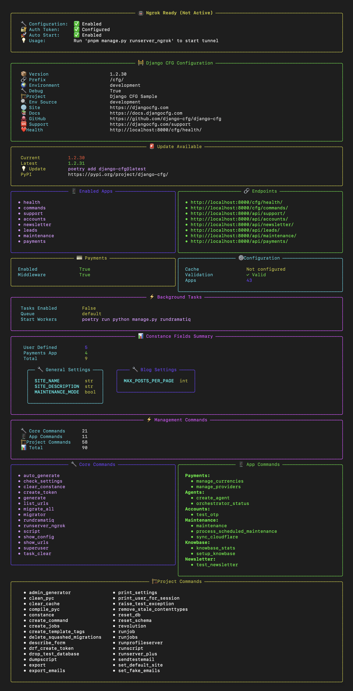

# Startup Information Display

Django-CFG provides a **comprehensive startup information system** that gives you complete visibility into your application's configuration, status, and available features when your Django server starts.



## Overview

The startup information system displays:

- **System Configuration**: Version, environment, project details
- **Application Status**: Enabled apps, endpoints, and integrations  
- **Dynamic Settings**: Constance fields from multiple sources
- **Development Tools**: Management commands, background tasks
- **Health Monitoring**: Service status and update notifications

## Display Modes

Control the verbosity of startup information with three configurable modes:

### 🔴 NONE Mode
**Perfect for**: Production, CI/CD, Docker containers

```
Django CFG v1.2.30 • production • My Project • 🚨 UPDATE AVAILABLE
```

**Features**:
- Single line output
- Critical information only
- Update notifications
- Minimal resource usage

### 🟡 SHORT Mode  
**Perfect for**: Development, staging, quick checks

**Shows**:
- Compact header with version and environment
- Apps grid (up to 8 apps)
- Essential endpoints (up to 6)
- System status metrics
- Update notifications
- Commands summary

**Layout**: Horizontal columns, space-efficient

### 🟢 FULL Mode (Default)
**Perfect for**: Development, debugging, system analysis

**Shows comprehensive system overview**:

#### Main Information Panels
- **Django CFG Configuration**: Version, environment, project info, health endpoint
- **Update Notifications**: Version comparison and upgrade instructions
- **Background Tasks**: ReArq status, queue configuration, worker commands
- **Management Commands**: Complete breakdown of available CLI tools

#### Dynamic Configuration
- **Constance Fields Summary**: Runtime settings breakdown by source
  - User-defined fields
  - Tasks module fields  
  - Knowbase app fields
  - Payments app fields
  - Total field count

#### Application Overview
- **Enabled Apps & Endpoints**: Side-by-side view of active applications and their API endpoints
- **App-Specific Status**: Payment systems, task queues, knowledge base
- **System Configuration**: Cache, validation, installed apps count

#### Detailed Breakdowns
- **Core & App Commands**: Django-CFG commands alongside app-specific tools
- **Project Commands**: Local management commands in organized columns
- **Settings Details**: Constance field details grouped by category (General, Blog, etc.)

## Configuration

### In your DjangoConfig:

```python
from django_cfg.core.config import DjangoConfig, StartupInfoMode

class MyProjectConfig(DjangoConfig):
    project_name: str = "My Project"
    
    # Control startup information display
    startup_info_mode: StartupInfoMode = StartupInfoMode.FULL  # Default
```

### Environment Variables:

```bash
# Control via environment variable
DJANGO_STARTUP_INFO_MODE=none    # Minimal
DJANGO_STARTUP_INFO_MODE=short   # Essential  
DJANGO_STARTUP_INFO_MODE=full    # Complete (default)
```

### Environment-Based Configuration:

```python
import os
from django_cfg.core.config import StartupInfoMode

class MyProjectConfig(DjangoConfig):
    startup_info_mode: StartupInfoMode = (
        StartupInfoMode.NONE if os.getenv('DJANGO_ENV') == 'production'
        else StartupInfoMode.FULL
    )
```

## Key Features

### Rich Visual Layout
- **Consistent Width**: All panels use standardized 120-character width
- **Balanced Columns**: Perfect 50/50 split for two-column layouts
- **Integrated Blocks**: Complex information organized in nested components
- **Color Coding**: Different colors for different types of information

### Smart Information Discovery
- **Dynamic App Detection**: Automatically discovers enabled Django-CFG apps
- **Constance Integration**: Collects runtime settings from all sources
- **Command Collection**: Finds and categorizes all available management commands
- **Version Monitoring**: Checks for updates with intelligent caching

### Performance Optimized
- **Lazy Loading**: Information gathered only when needed
- **Caching**: Version checks cached to prevent redundant API calls
- **Error Resilience**: Graceful degradation when services unavailable
- **Resource Efficient**: Mode-based resource usage

## What You'll See

### System Information
```
🚧 Django CFG Configuration
Version: 1.2.30
🌍 Environment: development  
🏗️ Project: My Django Project
❤️ Health: http://localhost:8000/cfg/health/
```

### Application Status
```
📱 Enabled Apps          🔗 Endpoints
• health                 • http://localhost:8000/cfg/health/
• commands               • http://localhost:8000/cfg/commands/
• payments               • http://localhost:8000/api/payments/
• knowbase               • http://localhost:8000/api/knowbase/
```

### Dynamic Configuration
```
📊 Constance Fields Summary
User Defined     5
Payments App     4  
Knowbase App     3
Total           12

General Settings      Blog Settings
SITE_NAME        str     MAX_POSTS_PER_PAGE  int
SITE_DESCRIPTION str     FEATURED_POSTS      bool
MAINTENANCE_MODE bool
```

### Development Tools
```
Management Commands
Core Commands      21
📱 App Commands       11  
🏗️ Project Commands    58
📊 Total              90
```

## Benefits

### For Developers
- **Instant Overview**: See your entire application status at a glance
- **Configuration Validation**: Spot misconfigurations immediately
- **Feature Discovery**: Find available commands and endpoints
- **Debug Information**: Rich context for troubleshooting

### For Teams
- **Consistent Experience**: Same information display across environments
- **Documentation**: Self-documenting application structure
- **Onboarding**: New team members understand the system quickly
- **Monitoring**: Easy to spot when services are down or misconfigured

### For Operations
- **Health Monitoring**: Immediate visibility into system status
- **Version Management**: Clear update notifications
- **Environment Validation**: Confirm correct environment configuration
- **Resource Optimization**: Choose appropriate verbosity for each environment

## Troubleshooting

### Common Scenarios

**Missing Information**: If expected apps or endpoints don't appear, check:
- App is properly installed in `INSTALLED_APPS`
- App configuration is enabled in your DjangoConfig
- No errors in app initialization

**Performance Issues**: If startup feels slow:
- Use `SHORT` or `NONE` mode for faster startup
- Check for network issues affecting version checking
- Review app initialization code for bottlenecks

**Layout Problems**: If information appears misaligned:
- Ensure terminal width is at least 120 characters
- Check for special characters in app names or descriptions
- Verify Rich library is properly installed

## Best Practices

### Development Workflow
```python
# During active development - see everything
startup_info_mode = StartupInfoMode.FULL

# For quick testing - essential info only  
startup_info_mode = StartupInfoMode.SHORT

# For production - minimal noise
startup_info_mode = StartupInfoMode.NONE
```

### Environment Configuration
```python
# Automatic mode selection based on environment
class ProductionConfig(DjangoConfig):
    startup_info_mode: StartupInfoMode = StartupInfoMode.NONE

class DevelopmentConfig(DjangoConfig):  
    startup_info_mode: StartupInfoMode = StartupInfoMode.FULL

class StagingConfig(DjangoConfig):
    startup_info_mode: StartupInfoMode = StartupInfoMode.SHORT
```

### CI/CD Integration
```bash
# In your deployment scripts
export DJANGO_STARTUP_INFO_MODE=none

# In your development docker-compose
environment:
  - DJANGO_STARTUP_INFO_MODE=short
```

## 🔮 Advanced Features

### AI Development Hints

Django-CFG displays helpful hints for AI assistants (Claude, GPT, Cursor, etc.) in the startup output. These hints help AI tools understand Django 5.2+ async patterns and best practices.

**Example output (FULL mode):**
```
┌──────────────────────────────────────────────────────────────────┐
│ 🤖 AI Development Hints (Django 5.2+)                            │
├──────────────────────────────────────────────────────────────────┤
│ ━━ ASYNC ━━                                                      │
│ ● Django 5.2 Async ORM    Use a-prefixed methods: aget(),       │
│                           acreate(), aupdate(), adelete()        │
│ ● Async QuerySet...       Use 'async for' for iteration         │
│ ━━ TYPING ━━                                                     │
│ ● Pydantic for RPC        Use Pydantic models instead of        │
│                           Optional[dict] for handler params      │
└──────────────────────────────────────────────────────────────────┘
```

**Configuration:**
```python
from django_cfg.core.config import DjangoConfig

class MyProjectConfig(DjangoConfig):
    project_name: str = "My Project"

    # Enable/disable AI hints (default: True)
    show_ai_hints: bool = True
```

**Environment variable:**
```bash
DJANGO_SHOW_AI_HINTS=false  # Disable AI hints
```

**Included hints:**
- **Django 5.2 Async ORM**: Use `aget()`, `acreate()`, `aupdate()`, `adelete()` methods
- **Async QuerySet Iteration**: Use `async for` instead of list comprehensions
- **Sync to Async**: Use `sync_to_async()` wrapper for sync functions
- **Pydantic for RPC**: Use Pydantic models for type-safe API params

### Ngrok Integration
When using ngrok for local development, the system automatically detects and displays:
- Tunnel status and configuration
- Public URL for webhook testing
- Usage instructions

### Update Monitoring
- Automatic checking for new Django-CFG versions
- Prominent display when updates are available
- Direct upgrade commands provided

### Background Tasks
- ReArq queue status and configuration
- Worker startup commands
- Task-related management commands

The startup information system is designed to be your **mission control center** - giving you complete visibility and control over your Django-CFG application from the moment it starts.
