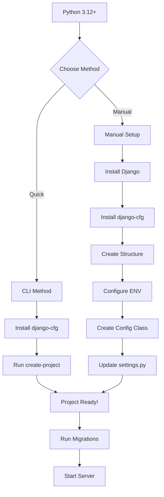

import { HowToSchema } from '@site/src/components/Schema';
import Tabs from '@theme/Tabs';
import TabItem from '@theme/TabItem';

<HowToSchema
  name="Install Django-CFG"
  description="Complete installation guide for Django-CFG with pip, poetry, and manual setup instructions"
  steps={[
    { text: 'Install Django and Django-CFG with pip or poetry', url: '#quick-installation' },
    { text: 'Create project structure with CLI', url: '#2-create-project-with-cli' },
    { text: 'Set up environment configuration module', url: '#4-create-environment-module' },
    { text: 'Create configuration class with Pydantic models', url: '#5-create-configuration-class' },
    { text: 'Update Django settings.py', url: '#6-update-settingspy' },
    { text: 'Run migrations and start server', url: '#7-run-django' }
  ]}
/>

# Installation Guide

:::tip[Quick Start]
Get a production-ready Django project in **30 seconds** with the CLI: `django-cfg create-project "My Project"`
:::

## Installation Process Overview



## Requirements

:::info[Python Version]
**Python 3.12+** is required. Django-CFG uses modern Python features and type hints.
:::

**Django** must be installed separately (peer dependency). Compatible with Django 4.2+ and Django 5.x.

## Quick Installation

### 1. Install Django-CFG

<Tabs groupId="package-manager">
  <TabItem value="pip" label="pip" default>

```bash
# Create virtual environment
python3.12 -m venv .venv
source .venv/bin/activate  # Windows: .venv\Scripts\activate

# Install Django and Django-CFG
pip install django
pip install django-cfg
```

  </TabItem>
  <TabItem value="poetry" label="Poetry">

```bash
# Create project directory
mkdir my-project && cd my-project

# Initialize Poetry
poetry init --no-interaction

# Add dependencies
poetry add django django-cfg

# Activate environment
poetry shell
```

  </TabItem>
  <TabItem value="pipenv" label="pipenv">

```bash
# Create environment and install
pipenv install django django-cfg

# Activate environment
pipenv shell
```

  </TabItem>
</Tabs>

:::warning[Virtual Environment]
Always use a virtual environment to avoid dependency conflicts. Never install Django-CFG globally.
:::

### 2. Create Project with CLI

```bash
# Create complete project structure
django-cfg create-project "My Project"

# Navigate to project
cd my-project

# Run development server
python manage.py runserver
```

::::note[What Gets Created]
The CLI creates a complete production-ready project with:
- Type-safe configuration with pydantic-settings
- Environment variable configuration (.env files)
- Modern admin interface (Unfold)
- API documentation (DRF Spectacular)
- All migrations and initial data
:::

Access your application:
- Main app: http://127.0.0.1:8000/
- Admin panel: http://127.0.0.1:8000/admin/
- API docs: http://127.0.0.1:8000/api/docs/

## Alternative Installation Methods

<details>
  <summary>Using different package managers</summary>

### Using Poetry (Recommended)

```bash
# Create project directory
mkdir my-project && cd my-project

# Initialize Poetry
poetry init --no-interaction

# Add dependencies
poetry add django django-cfg

# Create project structure
poetry run django-cfg create-project "My Project"
```

### Using pipenv

```bash
# Create environment and install
pipenv install django django-cfg

# Create project
pipenv run django-cfg create-project "My Project"
```

### Using uv (Fast)

```bash
# Create environment
uv venv
source .venv/bin/activate

# Install dependencies
uv pip install django django-cfg

# Create project
django-cfg create-project "My Project"
```

</details>

## Manual Project Setup

If you prefer manual setup instead of `create-project` CLI:

### 1. Install Django

<Tabs groupId="package-manager">
  <TabItem value="pip" label="pip" default>

```bash
pip install django
```

  </TabItem>
  <TabItem value="poetry" label="Poetry">

```bash
poetry add django
```

  </TabItem>
</Tabs>

### 2. Create Django Project

```bash
django-admin startproject myproject
cd myproject
```

### 3. Install Django-CFG

<Tabs groupId="package-manager">
  <TabItem value="pip" label="pip" default>

```bash
pip install django-cfg
```

  </TabItem>
  <TabItem value="poetry" label="Poetry">

```bash
poetry add django-cfg
```

  </TabItem>
</Tabs>

### 4. Create Environment Module

Create `myproject/environment/` directory:

```
myproject/
├── myproject/
│   ├── __init__.py
│   ├── environment/           # New directory
│   │   ├── __init__.py
│   │   ├── loader.py
│   │   ├── config.dev.yaml
│   │   ├── config.prod.yaml
│   │   └── config.test.yaml
│   ├── config.py              # New file
│   └── settings.py
└── manage.py
```

<Tabs>
  <TabItem value="init" label="__init__.py" default>

```python title="environment/__init__.py"
from .loader import env

__all__ = ["env"]
```

  </TabItem>
  <TabItem value="loader" label="loader.py">

```python title="environment/loader.py"
# See Configuration Guide for complete implementation
from pydantic import BaseModel
import yaml

# Load YAML configuration based on environment
# Full example: /getting-started/configuration
```

  </TabItem>
  <TabItem value="yaml" label="config.dev.yaml">

```yaml title="environment/config.dev.yaml"
secret_key: "dev-secret-key-at-least-fifty-characters-long"
debug: true

app:
  name: "My Project"
  site_url: "http://localhost:3000"
  api_url: "http://localhost:8000"

security_domains:
  - "localhost"
  - "127.0.0.1"

database:
  url: "sqlite:///db.sqlite3"
```

  </TabItem>
</Tabs>

:::tip[Configuration Guide]
See [Configuration Guide](/getting-started/configuration) for complete loader.py implementation with Pydantic models.
:::

### 5. Create Configuration Class

```python title="myproject/config.py"
from django_cfg import DjangoConfig, DatabaseConfig
from typing import Dict
from .environment import env


class MyProjectConfig(DjangoConfig):
    """Project configuration loaded from YAML"""

    # From environment YAML
    secret_key: str = env.secret_key
    debug: bool = env.debug

    project_name: str = env.app.name
    site_url: str = env.app.site_url
    api_url: str = env.app.api_url

    # Security
    security_domains: list[str] = env.security_domains or []

    # Database from URL
    databases: Dict[str, DatabaseConfig] = {
        "default": DatabaseConfig.from_url(url=env.database.url)
    }


# Create instance
config = MyProjectConfig()
```

### 6. Update settings.py

Replace settings.py content with:

```python title="settings.py"
from .config import config

# Import all Django-CFG settings
globals().update(config.get_all_settings())

# Optional: add custom Django settings
STATIC_URL = '/static/'
MEDIA_URL = '/media/'
```

:::warning[Settings Order]
Always import `config.get_all_settings()` **first**, then add custom settings. This ensures proper override behavior.
:::

### 7. Run Django

```bash
python manage.py migrate
python manage.py createsuperuser
python manage.py runserver
```

## Optional Features

Django-CFG supports optional feature groups (extras) for specific use cases. Install only what you need:

<Tabs>
  <TabItem value="full" label="Full (Recommended)" default>

```bash
pip install django-cfg[full]
```

**Includes:** All optional dependencies (grpc, centrifugo, rq, ai, and more)

**Use case:** Full-featured production setup with all integrations

  </TabItem>
  <TabItem value="ai" label="AI Agents">

```bash
pip install django-cfg[ai]
```

**Includes:** pydantic-ai

**Use case:** Build AI-powered workflows with Django integration

  </TabItem>
  <TabItem value="grpc" label="gRPC">

```bash
pip install django-cfg[grpc]
```

**Includes:** grpcio, grpcio-tools, grpcio-reflection, grpcio-health-checking, protobuf

**Use case:** Build microservices with gRPC communication

  </TabItem>
  <TabItem value="centrifugo" label="Centrifugo (WebSocket)">

```bash
pip install django-cfg[centrifugo]
```

**Includes:** cent, websockets

**Use case:** Real-time WebSocket communication and live updates

  </TabItem>
  <TabItem value="rq" label="Redis Queue (RQ)">

```bash
pip install django-cfg[rq]
```

**Includes:** django-rq, rq, rq-scheduler, redis, hiredis

**Use case:** Background tasks and job queue processing with Redis

  </TabItem>
</Tabs>

:::tip[Combine Multiple Extras]
You can install multiple extras at once:
```bash
pip install django-cfg[grpc,centrifugo,rq]
# or with Poetry
poetry add django-cfg[grpc,centrifugo,rq]
```
:::

## Troubleshooting

### Python Version Error

<Tabs groupId="operating-system">
  <TabItem value="macos" label="macOS" default>

```bash
# Using Homebrew
brew install python@3.12

# Verify installation
python3.12 --version
```

  </TabItem>
  <TabItem value="ubuntu" label="Ubuntu/Debian">

```bash
# Add deadsnakes PPA
sudo apt update
sudo apt install software-properties-common
sudo add-apt-repository ppa:deadsnakes/ppa

# Install Python 3.12
sudo apt install python3.12 python3.12-venv

# Verify installation
python3.12 --version
```

  </TabItem>
  <TabItem value="pyenv" label="pyenv (Recommended)">

```bash
# Install pyenv first (see pyenv docs)

# Install Python 3.12
pyenv install 3.12.0

# Set as global default
pyenv global 3.12.0

# Verify
python --version
```

  </TabItem>
  <TabItem value="windows" label="Windows">

```powershell
# Download from https://www.python.org/downloads/
# or use winget

winget install Python.Python.3.12

# Verify installation
python --version
```

  </TabItem>
</Tabs>

### Virtual Environment Not Activating

<Tabs groupId="operating-system">
  <TabItem value="linux-mac" label="Linux/macOS" default>

```bash
# Check available Python versions
ls /usr/bin/python*
ls /usr/local/bin/python*

# Try full path
/usr/local/bin/python3.12 -m venv .venv

# Or use virtualenv
pip install virtualenv
virtualenv -p python3.12 .venv
```

  </TabItem>
  <TabItem value="windows" label="Windows">

```powershell
# Allow script execution (run as Administrator)
Set-ExecutionPolicy RemoteSigned

# Create venv
python -m venv .venv

# Activate
.venv\Scripts\activate
```

  </TabItem>
</Tabs>

### Django Not Installed

:::danger[Peer Dependency]
Django is a **peer dependency** and is **not installed automatically** with django-cfg. You must install it separately.
:::

```bash
pip install django
```

**Compatible versions:**
- Django 4.2+ ✅
- Django 5.0+ ✅
- Django 5.1+ ✅

## Dependencies

Django-CFG automatically installs:

<details>
  <summary>Core Dependencies</summary>

**Type Validation & Configuration:**
- pydantic >=2.11.0 - Type validation
- pydantic-settings >=2.0.0 - Environment configuration
- python-dotenv >=1.0.0 - .env file loading
- click >=8.2.0 - CLI interface

**Django Integration:**
- djangorestframework >=3.16.0
- djangorestframework-simplejwt >=5.5.0
- django-cors-headers >=4.7.0
- django-redis >=6.0.0
- django-unfold >=0.64.0 - Modern admin

**Database:**
- psycopg >=3.2.0 - PostgreSQL driver
- dj-database-url >=3.0.0 - Database URL parsing

See [pyproject.toml](https://github.com/markolofsen/django-cfg/blob/main/pyproject.toml) for complete dependency list.

</details>

## Verification

Verify installation:

<Tabs>
  <TabItem value="python" label="Python Shell" default>

```python
# In Python shell
import django_cfg
print(django_cfg.__version__)  # Should print version

from django_cfg import DjangoConfig
# Should not raise ImportError
```

  </TabItem>
  <TabItem value="cli" label="CLI">

```bash
django-cfg --version
django-cfg --help
```

  </TabItem>
</Tabs>

## Next Steps

### Start Building
- **[Configuration Guide](/getting-started/configuration)** - Set up YAML configuration with Pydantic models
- **[First Project](/getting-started/first-project)** - Complete step-by-step tutorial
- **[Why Django-CFG?](/getting-started/why-django-cfg)** - Learn the benefits and features

### Explore Features
- **[Sample Project Guide](/guides/sample-project/overview)** - Complete production example with all features
- **[Examples](/guides/examples)** - Real-world code examples and use cases
- **[Built-in Apps](/features/built-in-apps/overview)** - Production-ready apps (support, AI agents, payments)
- **[AI Agents](/ai-agents/ai-django-development-framework)** - AI-first Django framework capabilities
- **[API Generation](/features/api-generation/overview)** - Auto-generate TypeScript/Python clients

### Configuration Deep Dive
- **[Configuration Models](/fundamentals/configuration)** - Complete API reference for DjangoConfig
- **[Type-Safe Configuration](/fundamentals/core/type-safety)** - Pydantic validation benefits
- **[Environment Detection](/fundamentals/configuration/environment)** - Auto-detect dev/staging/production

### Migration
- **[Migration Guide](/guides/migration-guide)** - Migrate existing Django project to Django-CFG
- **[vs Alternatives](/getting-started/django-cfg-vs-alternatives)** - Compare with django-environ, decouple

### Troubleshooting
- **[Troubleshooting](/guides/troubleshooting)** - Common installation and configuration issues
- **[FAQ](/guides/faq)** - Frequently asked questions

TAGS: installation, setup, pip, poetry, django-cfg
DEPENDS_ON: [intro]
USED_BY: [configuration, first-project]
