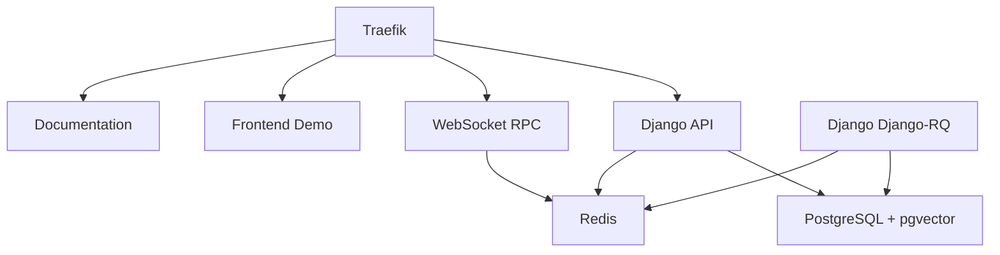

# 🐳 Docker Setup Overview


<Callout type="info">
**Complete Docker Infrastructure**
Django-CFG provides **production-ready Docker infrastructure** with modular compose files, automated health checks, and integrated task processing for scalable Django applications.

</Callout>

## Quick Navigation

Choose your Docker journey:

### 🚀 Get Started Fast
- **[Development Setup](../development)** - Local development with Docker Compose
- **[Production Deployment](../production)** - Production-grade Docker setup
- **[Configuration Strategy](../configuration)** - YAML + env vars configuration

### 🔧 Advanced Topics
- **[Build Optimization](../build-optimization)** - Critical lessons for multi-stage builds
- **[Troubleshooting](../troubleshooting)** - Common issues and quick fixes

---

## Overview

Django-CFG's Docker setup provides a complete containerized environment:



### Architecture Components

#### Infrastructure Layer
- **Traefik** - Reverse proxy with automatic routing
- **PostgreSQL + pgvector** - Database with vector extension for AI/embeddings
- **Redis** - Caching and task queue management

#### Backend Services
- **Django API** - Main application server (port 8300)
- **Django ReArq** - Background task workers
- **WebSocket RPC** - Real-time communication (port 9065)

#### Frontend Services
- **Demo App** - Next.js demo application (port 3300)
- **Documentation** - Nuxt.js documentation site (port 3301)

---

## Quick Start

### Prerequisites


<Callout type="info">
**System Requirements**
Before starting, ensure you have:
- ✅ **Docker Desktop 4.0+** or Docker Engine with Compose V2
- ✅ **8GB RAM minimum** (16GB recommended for all services)
- ✅ **20GB free disk space**
- ✅ **Ports available**: 8300, 3300, 3301, 9065, 380, 743, 8390

</Callout>

### 1. Start All Services

```bash
cd docker
docker compose up -d
```

### 2. Check Status

```bash
docker compose ps
```

All services should show **healthy** status:
```
NAME               STATUS              PORTS
djangocfg_traefik  Up (healthy)        380/tcp, 743/tcp, 8390/tcp
djangocfg_postgres Up (healthy)        5432/tcp
djangocfg_redis    Up (healthy)        6379/tcp
django             Up (healthy)        8300/tcp
django-rearq       Up (healthy)        -
websocket          Up (healthy)        9065/tcp, 9066/tcp
frontend-demo      Up (healthy)        3300/tcp
frontend-web       Up (healthy)        3301/tcp
```

### 3. Access Services

| Service | URL | Description |
|---------|-----|-------------|
| Django API | http://api.localhost:380 | Main REST API |
| Admin Panel | http://api.localhost:380/admin/ | Django admin interface |
| Demo App | http://demo.localhost:380 | Interactive demo |
| Documentation | http://localhost:3301 | Full documentation |
| Traefik Dashboard | http://localhost:8390 | Service monitoring |


<Callout type="info">
**First Time Setup**
Create a superuser to access the admin panel:
```bash
docker exec -it django python manage.py createsuperuser
```

</Callout>

---

## Configuration Approaches

Django-CFG uses a modern hybrid configuration system combining YAML structure with environment variable overrides:

### Universal `__` Notation (Recommended)

**Best for**: All environments - no rebuilds needed for credential changes

```bash
# docker/.env.secrets (git-ignored!)
EMAIL__HOST=mail.example.com
EMAIL__PORT=465
EMAIL__PASSWORD=your-password-here

# Nested sections
API_KEYS__OPENAI=sk-proj-your-key-here
API_KEYS__CLOUDFLARE=your-cloudflare-key

TELEGRAM__BOT_TOKEN=123456789:ABC...
TELEGRAM__CHAT_ID=-123456
```

**Benefits:**
- ✅ No secrets in git
- ✅ Just restart (no rebuild) to apply changes
- ✅ Works with any config value
- ✅ Automatic type conversion

### Configuration Priority

Settings load in this order (highest priority first):

1. **Environment variables** - `SECTION__FIELD` notation (e.g., `EMAIL__HOST`)
2. **`.env.secrets`** file - Sensitive credentials (git-ignored)
3. **`config.*.docker.yaml`** - Docker-specific configs (git-ignored)
4. **`config.*.yaml`** - Base templates (in git)
5. **Built-in defaults** - Pydantic model defaults

[Learn Complete Configuration Strategy →](../configuration)

### Quick Example: Add New API Key

```bash
# Add to .env.secrets
echo "API_KEYS__NEW_SERVICE=your-key-here" >> docker/.env.secrets

# Restart (no rebuild!)
docker compose restart django
```


<Callout type="info">
**No Rebuild Needed**
**Credential changes only require restart!**

```bash
# Old way (slow): Rebuild entire image
docker compose build django --no-cache  # ❌ 5+ minutes

# New way (fast): Just restart
docker compose restart django  # ✅ 10 seconds
```

</Callout>


<Callout type="warning">
**Security Best Practice**
**Never commit credentials to git!** Always use:
- **`.env.secrets`** file for Docker (git-ignored)
- **`config.*.docker.yaml`** for structure (git-ignored)
- **Environment variables** from secrets manager (AWS Secrets Manager, Vault)

See [Configuration Security Guide](../configuration#security-best-practices) for details.

</Callout>

---

## Docker Compose Structure

```
docker/
├── docker-compose.yaml              # Main compose file
├── .env                            # Base environment variables (in git)
├── .env.secrets                    # Sensitive credentials (git-ignored!)
├── .dockerignore                   # Build exclusions (includes poetry.lock)
├── services/
│   ├── django/
│   │   ├── Dockerfile              # Django app image
│   │   └── entrypoint.sh          # Container startup script
│   ├── demo/Dockerfile            # Next.js demo
│   ├── websocket/Dockerfile       # WebSocket RPC
│   ├── web/Dockerfile             # Documentation site
│   └── postgres/init.sql          # Database initialization
├── volumes/                        # Persistent data (git-ignored)
│   ├── postgres/                  # Database files
│   ├── django/
│   │   ├── media/                # User uploads
│   │   └── logs/                 # Application logs
│   └── .gitkeep
└── @docs/                          # Docker documentation
    ├── README.md                   # Complete guide
    ├── CONFIG_STRATEGY.md         # Universal __ notation + YAML
    ├── NETWORK_TRAEFIK.md         # Networking & routing
    ├── CHANGELOG.md               # Recent changes & migration
    ├── DOCKER_BUILD_LESSONS.md    # Build optimization
    └── QUICK_REFERENCE.md         # Common commands

projects/django/api/environment/
├── config.dev.yaml                 # Development template (in git)
├── config.dev.docker.yaml          # Docker dev config (git-ignored!)
├── config.prod.yaml                # Production template (in git)
└── config.prod.docker.yaml         # Docker prod config (git-ignored!)
```

[Explore Development Setup →](../development)

---

## Development Workflow

### Common Tasks

```bash
# View logs
docker compose logs -f django

# Run migrations
docker exec django python manage.py migrate

# Create superuser
docker exec -it django python manage.py createsuperuser

# Django shell
docker exec -it django python manage.py shell

# Restart service
docker compose restart django

# Rebuild after changes
docker compose up -d --build django
```

[See all commands in Quick Reference →](../troubleshooting#essential-commands)

### Database Operations

```bash
# Access PostgreSQL
docker exec -it djangocfg_postgres psql -U postgres -d djangocfg

# Backup database
docker exec djangocfg_postgres pg_dump -U postgres djangocfg > backup.sql

# Restore database
docker exec -i djangocfg_postgres psql -U postgres djangocfg < backup.sql
```

---

## Production Deployment

For production-ready deployment with SSL/TLS, health monitoring, and scaling:

**[Complete Production Setup Guide →](../production)**

Key features:
- ✅ Multi-stage builds for minimal image sizes
- ✅ Health checks for all services
- ✅ Automated database initialization
- ✅ Environment-based configuration
- ✅ Logging and monitoring
- ✅ Horizontal scaling support

---

## Performance Optimization

### Build Performance

Django-CFG Docker setup uses advanced techniques to minimize build times:

- **`.dockerignore`** - Excludes `node_modules`, `.next`, build artifacts
- **Multi-stage builds** - Separate dependency installation from runtime
- **Layer caching** - Optimized layer ordering for maximum cache hits
- **Turborepo pruning** - Only builds required packages in monorepo

**Before optimization**: 2.13GB context, 380s transfer time ❌
**After optimization**: 280KB context, 4s transfer time ✅

[Learn Build Optimization Techniques →](../build-optimization)

### Runtime Performance

- **Connection pooling** - PostgreSQL connection reuse
- **Redis caching** - Multi-tier caching strategy
- **ReArq workers** - Configurable processes and threads
- **Nginx/Traefik** - Reverse proxy with load balancing

---

## Troubleshooting

### Quick Fixes

**Services won't start?**
```bash
docker compose logs service-name
docker compose ps
```

**Port conflicts?**
```bash
# Find process using port
lsof -i :8300
# Kill process
kill -9 <PID>
```

**Configuration not loading?**
```bash
docker exec django python -c "from api.environment.loader import env; print(env)"
```

**Database connection issues?**
```bash
docker exec djangocfg_postgres pg_isready -U postgres
```

[Complete Troubleshooting Guide →](../troubleshooting)

---

## Learning Paths

### 🎓 Beginner Path
1. [Docker Development Setup](../development) - Start here
2. [Configuration Basics](../configuration)
3. [First Django-CFG Project](/docs/getting-started/first-project)

### 🚀 Production Path
1. [Production Docker Setup](../production)
2. [Security Configuration](/docs/deployment/security)
3. [Monitoring Setup](/docs/deployment/monitoring)

### 🔧 Advanced Path
1. [Build Optimization](../build-optimization)
2. [Multi-Database Setup](../../multi-database)
3. [Scaling Strategies](../../production-config)

---

## See Also

### Docker Guides
- **[Development Setup](../development)** - Local Docker environment
- **[Production Setup](../production)** - Production deployment
- **[Configuration](../configuration)** - YAML + env vars strategy
- **[Build Optimization](../build-optimization)** - Critical Docker lessons
- **[Troubleshooting](../troubleshooting)** - Common issues solved

### Deployment
- **[Deployment Overview](/docs/deployment/overview)** - All deployment options
- **[Environment Setup](/docs/deployment/environment-setup)** - Environment variables
- **[Logging Configuration](/docs/deployment/logging)** - Structured logging
- **[Security Settings](/docs/deployment/security)** - Production security

### Configuration
- **[Database Configuration](/docs/fundamentals/configuration/database)** - PostgreSQL setup
- **[Cache Configuration](/docs/fundamentals/configuration/cache)** - Redis caching
- **[Environment Detection](/docs/fundamentals/configuration/environment)** - Multi-environment

### Integrations
- **[ReArq Integration](/docs/features/integrations/django-rq/overview)** - Background tasks
- **[Background Task Commands](/docs/features/integrations/django-rq/overview)** - Manage workers via CLI
- **[Centrifugo WebSocket RPC](/docs/features/integrations/centrifugo/)** - Real-time communication

---

## Next Steps

Ready to get started? Choose your path:

**[Start Development →](../development)**
Set up local Docker environment

**[Deploy to Production →](../production)**
Production-ready Docker setup

**[Learn Configuration →](../configuration)**
Master YAML + env var strategy


<Callout type="info">
**Need Help?**
- **Issues?** Check [Troubleshooting Guide](../troubleshooting)
- **Questions?** See [FAQ](../../faq)
- **Bugs?** Report on [GitHub](https://github.com/your-repo/issues)

</Callout>

---

TAGS: docker, deployment, docker-compose, containerization, production, development
DEPENDS_ON: [docker, docker-compose, postgresql, redis]
USED_BY: [deployment, production, development, ci-cd]
%%PRIORITY:HIGH%%
