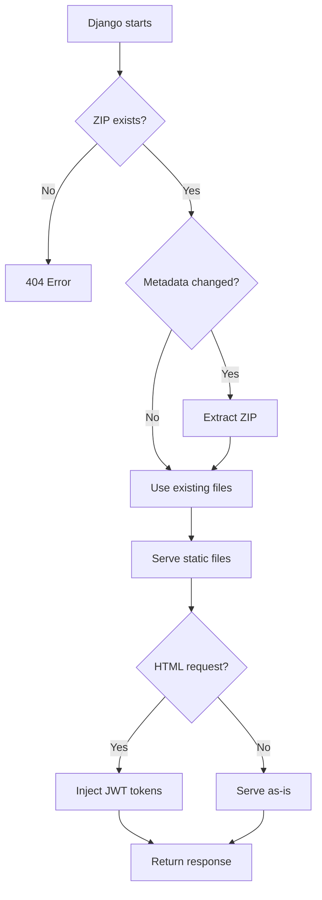

import { Callout, Steps } from 'nextra/components'

# Deployment

Build your Next.js admin panel for production and integrate it with Django.

## Build Process

<Steps>

### Regenerate API Clients

Ensure all clients are up to date:

```bash
cd solution/projects/django
make api
```

### Type Check

Verify TypeScript types are correct:

```bash
cd solution/projects/frontend/apps/admin
pnpm typecheck  # tsc --noEmit
```

### Build Static Export

Create the production build:

```bash
pnpm build:static
# or
NEXT_PUBLIC_STATIC_BUILD=true pnpm build
```

### Create ZIP Archive

Package the build for Django:

```bash
pnpm export:zip
```

This creates `solution/projects/django/static/nextjs_admin.zip`

</Steps>

## Automated Build

The `make api` command can run the full pipeline:

```bash
cd solution/projects/django
make api
# Prompts: "Build Next.js admin? [y/N]"
# Answer "y" to run type check, build, and create ZIP
```

## ZIP Structure

The generated ZIP contains:

```
nextjs_admin.zip
├── admin/
│   ├── index.html
│   ├── items/
│   │   └── index.html
│   └── users/
│       └── index.html
├── _next/
│   ├── static/
│   │   ├── chunks/
│   │   └── css/
│   └── data/
└── index.html
```

## How Production Works



### ZIP Metadata Tracking

Django-CFG tracks ZIP changes using a marker file:

```
static/nextjs_admin/.zip_meta
```

Contains: `{zip_size}:{zip_mtime}`

When ZIP is updated:
1. Compare metadata with marker file
2. If different: delete old files, extract new ZIP
3. Update marker file

<Callout type="info">
This approach is reliable in Docker containers where file timestamps can be inconsistent.
</Callout>

## Production Configuration

### Static URL

Default: `/cfg/nextjs-admin/`

```python
NextJsAdminConfig(
    static_url="/cfg/nextjs-admin/",  # Change if needed
)
```

### Cache Headers

HTML files have no-cache headers to ensure JWT tokens are fresh:

```http
Cache-Control: no-store, no-cache, must-revalidate, max-age=0
Pragma: no-cache
Expires: 0
```

Static assets (`_next/`) use normal caching.

## Docker Deployment

### Dockerfile

```dockerfile
# Build stage for Next.js
FROM node:20-alpine AS frontend-builder
WORKDIR /app/frontend
COPY frontend/apps/admin/package.json frontend/apps/admin/pnpm-lock.yaml ./
RUN corepack enable && pnpm install --frozen-lockfile
COPY frontend/apps/admin .
RUN NEXT_PUBLIC_STATIC_BUILD=true pnpm build

# Django stage
FROM python:3.12-slim
WORKDIR /app

# Copy Django code
COPY solution/projects/django .

# Copy Next.js build as ZIP
COPY --from=frontend-builder /app/frontend/out ./static/nextjs_admin_temp/
RUN cd static && zip -r nextjs_admin.zip nextjs_admin_temp/* \
    && mv nextjs_admin_temp nextjs_admin \
    && rm -rf nextjs_admin

# Or if you build ZIP separately:
COPY static/nextjs_admin.zip ./static/

CMD ["gunicorn", "api.wsgi:application", "--bind", "0.0.0.0:8000"]
```

### docker-compose.yml

```yaml
version: '3.8'

services:
  django:
    build: .
    ports:
      - "8000:8000"
    environment:
      - DEBUG=False
      - DJANGO_SETTINGS_MODULE=api.settings
    volumes:
      - static_files:/app/static
```

## CI/CD Pipeline

### GitHub Actions Example

```yaml filename=".github/workflows/deploy.yml"
name: Deploy

on:
  push:
    branches: [main]

jobs:
  build:
    runs-on: ubuntu-latest

    steps:
      - uses: actions/checkout@v4

      - name: Setup Node.js
        uses: actions/setup-node@v4
        with:
          node-version: '20'

      - name: Setup Python
        uses: actions/setup-python@v5
        with:
          python-version: '3.12'

      - name: Install pnpm
        run: corepack enable && corepack prepare pnpm@latest --activate

      - name: Install frontend dependencies
        working-directory: frontend/apps/admin
        run: pnpm install --frozen-lockfile

      - name: Build frontend
        working-directory: frontend/apps/admin
        run: |
          pnpm typecheck
          NEXT_PUBLIC_STATIC_BUILD=true pnpm build

      - name: Create ZIP
        working-directory: frontend/apps/admin
        run: |
          cd out
          zip -r ../../../solution/projects/django/static/nextjs_admin.zip .

      - name: Deploy
        # Your deployment step
        run: echo "Deploy to production"
```

## Verification

After deployment, verify the integration:

### Check ZIP Extraction

```bash
# In Django container/server
ls -la static/nextjs_admin/
# Should show: admin/, _next/, index.html
```

### Check Marker File

```bash
cat static/nextjs_admin/.zip_meta
# Should show: 12345678:1699876543
```

### Test Admin Panel

1. Login to Django Admin
2. Click "External Admin" tab
3. Verify pages load correctly
4. Check browser console for JWT injection logs

## Rollback

To rollback to a previous version:

```bash
# Replace ZIP with previous version
cp nextjs_admin.zip.backup static/nextjs_admin.zip

# Remove marker file to force re-extraction
rm static/nextjs_admin/.zip_meta

# Restart Django (or wait for next request)
```

<Callout type="warning">
Always keep backups of working ZIP files before deploying new versions.
</Callout>
