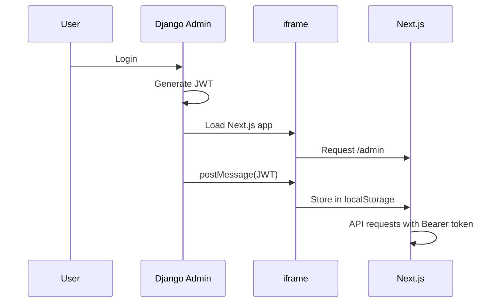

import { Callout, Steps } from 'nextra/components'

# Development

Develop your custom admin panel with full hot reload support and seamless Django integration.

## Development Setup

<Steps>

### Start Django Server

```bash
cd solution/projects/django
make run  # or: poetry run python manage.py runserver 8000
```

### Start Next.js Dev Server

```bash
cd solution/projects/frontend/apps/admin
pnpm dev  # Runs on http://localhost:3000
```

### Access Admin Panel

Open Django Admin at `http://localhost:8000/cfg/admin/`

The "External Admin" tab will automatically load your Next.js dev server.

</Steps>

## How Dev Mode Works

```
┌─────────────────────────────────────────────────────────────────┐
│                     Django Admin (port 8000)                    │
│  ┌────────────────────────────────────────────────────────────┐│
│  │                    External Admin Tab                       ││
│  │  ┌──────────────────────────────────────────────────────┐  ││
│  │  │              iframe src="localhost:3000"              │  ││
│  │  │                                                       │  ││
│  │  │   Next.js Dev Server (Hot Reload)                     │  ││
│  │  │                                                       │  ││
│  │  │   ← postMessage(JWT tokens) ←                         │  ││
│  │  │                                                       │  ││
│  │  └──────────────────────────────────────────────────────┘  ││
│  └────────────────────────────────────────────────────────────┘│
└─────────────────────────────────────────────────────────────────┘
```

### Automatic Dev Server Detection

Django-CFG automatically detects if Next.js dev server is running on port 3000:

1. **Dev server running** → iframe loads `http://localhost:3000/admin`
2. **Dev server not running** → iframe loads static files from ZIP

<Callout type="info">
JWT tokens are passed via `postMessage` in dev mode and injected into HTML in static mode.
</Callout>

## Development Workflow

### 1. Make Django Changes

Edit models, serializers, or views:

```python filename="apps/myapp/views.py"
class ItemViewSet(viewsets.ModelViewSet):
    # ... existing code ...

    @action(detail=False, methods=['get'])
    def featured(self, request):
        """New endpoint: get featured items."""
        featured = self.queryset.filter(is_featured=True)
        return Response(self.serializer_class(featured, many=True).data)
```

### 2. Regenerate API Clients

```bash
make api
```

This updates TypeScript types and SWR hooks automatically.

### 3. Use New Endpoint in Next.js

```tsx filename="app/(pages)/admin/featured/page.tsx"
import { useMyappItemsFeatured } from '@/app/_lib/api/generated/custom/_utils/hooks';

export default function FeaturedPage() {
  const { data, isLoading } = useMyappItemsFeatured();

  if (isLoading) return <div>Loading...</div>;

  return (
    <div>
      <h1>Featured Items</h1>
      <ul>
        {data?.map((item) => (
          <li key={item.id}>{item.name}</li>
        ))}
      </ul>
    </div>
  );
}
```

### 4. See Changes Instantly

Next.js hot reload updates the UI immediately without page refresh.

## Authentication in Dev Mode

### Token Flow



### Checking Authentication

```tsx
import { useAuth } from '@/app/_layouts/AppLayout';

export function ProtectedComponent() {
  const { isAuthenticated, token } = useAuth();

  if (!isAuthenticated) {
    return <div>Please login through Django Admin</div>;
  }

  return <div>Welcome! Token: {token?.substring(0, 20)}...</div>;
}
```

## Debugging

### Console Logs

Open browser DevTools to see:

```
[Next.js Admin] JWT tokens received via postMessage
[Next.js Admin] Token stored in localStorage
```

### Network Tab

Check API requests have `Authorization: Bearer <token>` header.

### Django Logs

Enable debug logging:

```python filename="settings.py"
LOGGING = {
    'version': 1,
    'handlers': {
        'console': {'class': 'logging.StreamHandler'},
    },
    'loggers': {
        'django_cfg.modules.nextjs_admin': {
            'handlers': ['console'],
            'level': 'DEBUG',
        },
    },
}
```

## Common Development Tasks

### Add New Page

```tsx filename="app/(pages)/admin/users/page.tsx"
export default function UsersPage() {
  return (
    <div>
      <h1>Users Management</h1>
      {/* Your content */}
    </div>
  );
}
```

### Add to Navigation

Update your layout:

```tsx filename="app/_layouts/AdminLayout.tsx"
const menuGroups = [
  {
    title: 'Management',
    items: [
      { label: 'Items', href: '/admin/items' },
      { label: 'Users', href: '/admin/users' },  // New page
    ],
  },
];
```

### Create Reusable Component

```tsx filename="app/(pages)/admin/_components/DataTable.tsx"
interface Column<T> {
  key: keyof T;
  label: string;
}

interface DataTableProps<T> {
  data: T[];
  columns: Column<T>[];
}

export function DataTable<T>({ data, columns }: DataTableProps<T>) {
  return (
    <table className="w-full">
      <thead>
        <tr>
          {columns.map((col) => (
            <th key={String(col.key)}>{col.label}</th>
          ))}
        </tr>
      </thead>
      <tbody>
        {data.map((row, i) => (
          <tr key={i}>
            {columns.map((col) => (
              <td key={String(col.key)}>{String(row[col.key])}</td>
            ))}
          </tr>
        ))}
      </tbody>
    </table>
  );
}
```

## Tips

<Callout type="tip">
**Hot Reload Shortcuts:**
- `Ctrl+S` / `Cmd+S` - Save and trigger hot reload
- `Ctrl+Shift+R` / `Cmd+Shift+R` - Hard refresh (clears cache)
</Callout>

<Callout type="warning">
**CORS Issues?** Make sure Django's CORS settings allow `localhost:3000`:

```python
CORS_ALLOWED_ORIGINS = [
    "http://localhost:3000",
]
```
</Callout>
