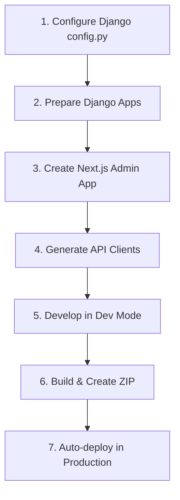

import { Cards, Callout, Steps } from 'nextra/components'

# Next.js Admin Setup

Create a custom admin panel using Next.js that integrates seamlessly with Django-CFG's dual-tab admin architecture.

<Callout type="info">
This guide covers creating a **custom** Next.js admin panel. For built-in admin features, see [Features > Integrations > Next.js Admin](/docs/features/integrations/nextjs-admin).
</Callout>

## Overview

Django-CFG supports a dual-tab admin architecture:

```
┌─────────────────────────────────────────────────────────────────┐
│                     Django Admin Interface                       │
│  ┌───────────────────────────────┬───────────────────────────┐  │
│  │   Tab 1: Built-in Dashboard   │  Tab 2: External Admin    │  │
│  └───────────────────────────────┴───────────────────────────┘  │
│                                                                  │
│  Dev Mode:                        Dev Mode:                      │
│  ↓ http://localhost:3777/admin    ↓ http://localhost:3000/admin  │
│                                                                  │
│  Production (Static):             Production (Static):           │
│  ↓ /cfg/admin/admin/              ↓ /cfg/nextjs-admin/admin/     │
└─────────────────────────────────────────────────────────────────┘
```

## Process Flow



## Guide Sections

<Cards>
  <Cards.Card title="Django Setup" href="./django-setup" />
  <Cards.Card title="Next.js Setup" href="./nextjs-setup" />
  <Cards.Card title="API Generation" href="./api-generation" />
  <Cards.Card title="Development" href="./development" />
  <Cards.Card title="Deployment" href="./deployment" />
  <Cards.Card title="Troubleshooting" href="./troubleshooting" />
</Cards>

## Quick Start

<Steps>

### Configure Django

Add `NextJsAdminConfig` and `OpenAPIConfig` to your `config.py`:

```python filename="config.py"
from django_cfg import DjangoCfg
from django_cfg.modules.nextjs_admin import NextJsAdminConfig
from django_cfg.modules.django_client import OpenAPIConfig, OpenAPIGroupConfig

config = DjangoCfg(
    nextjs_admin=NextJsAdminConfig(
        project_path="../frontend/apps/admin",
        api_output_path="app/_lib/api/generated",
    ),
    openapi=OpenAPIConfig(
        enabled=True,
        groups=[
            OpenAPIGroupConfig(
                name="custom",
                apps=["myapp"],
                title="Custom API",
            ),
        ],
        generate_typescript=True,
        generate_swr_hooks=True,
    ),
)
```

### Create Next.js App

Set up a Next.js project with the standard structure:

```
frontend/apps/admin/
├── app/
│   ├── _core/settings.ts
│   ├── _layouts/AdminLayout.tsx
│   ├── _lib/api/generated/
│   └── (pages)/admin/
└── package.json
```

### Generate API Clients

```bash
cd solution/projects/django
make api
```

### Start Development

```bash
cd frontend/apps/admin
pnpm dev  # http://localhost:3000
```

### Build for Production

```bash
make api  # Regenerate clients and build ZIP
```

</Steps>

## Key Features

- **Automatic JWT injection** - Tokens are injected into iframe HTML
- **postMessage authentication** - Seamless token passing between Django and Next.js
- **Hot reload in dev mode** - No Django restart required
- **Static export** - ZIP-based deployment for production
- **SPA routing support** - Full client-side routing in static mode
