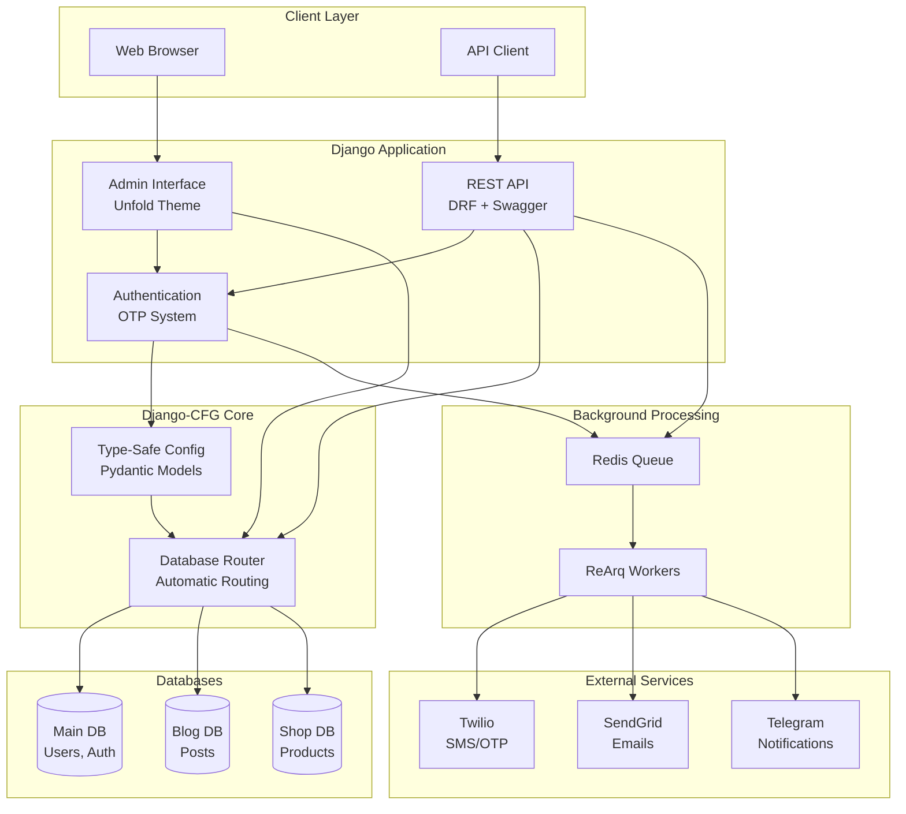
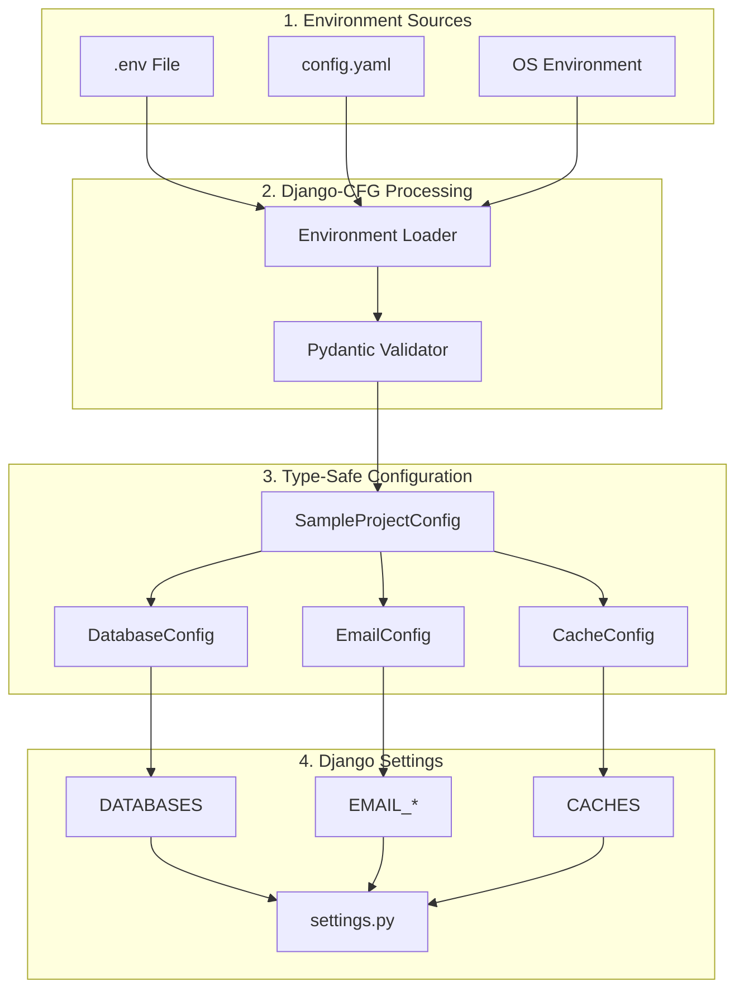

# Sample Project Overview

The **Django-CFG Sample Project** is a comprehensive demonstration of all Django-CFG features and capabilities. This guide walks you through every aspect of the project, from setup to advanced features.

## Architecture Overview



## What You'll Learn

- **🚀 Project Creation** - Using `django-cfg create-project`
- **⚙️ Configuration Management** - Type-safe settings with Pydantic v2
- **🗄️ Multi-Database Setup** - Automatic routing and migrations
- **🎨 Admin Customization** - Modern Unfold interface with dashboards
- **📊 API Documentation** - Auto-generated OpenAPI/Swagger
- **🔐 Authentication System** - OTP-based user management
- **⚡ Background Tasks** - ReArq integration
- **📱 Service Integrations** - Twilio, SendGrid, Telegram
- **🐳 Docker Deployment** - Production-ready containerization

## Quick Start

### 1. Create the Sample Project

```bash
# Create new project
django-cfg create-project "My Django-CFG Demo"

# Navigate to project
cd my_django_cfg_demo

# The project is ready to run!
poetry run python manage.py runserver
```

### 2. Explore the Admin Interface

Visit `http://127.0.0.1:8000/admin/` and login with:
- **Email**: `admin@example.com`
- **Password**: `admin123`

### 3. Check API Documentation

Visit `http://127.0.0.1:8000/api/schema/swagger-ui/` for interactive API docs.

### 4. Monitor System Health

Visit `http://127.0.0.1:8000/cfg/status/` for system health checks.

## What's Included

The sample project includes:

### Multi-Database Architecture
Demonstrates sophisticated database routing with separate databases for different apps:
- **Main Database** - Users, sessions, admin
- **Blog Database** - Posts, comments, categories
- **Shop Database** - Products, orders, inventory

See [Multi-Database Setup](./multi-database) for details.

### Modern Admin Interface
Built on the Unfold theme with:
- Custom dashboard with real-time metrics
- Organized navigation structure
- Beautiful UI with Material Design icons
- Responsive design for mobile access

See [Admin Interface](./admin-interface) for customization options.

### Comprehensive API
Auto-generated REST API with:
- OpenAPI/Swagger documentation
- JWT authentication
- Endpoint versioning
- Interactive testing interface

See [API Documentation](./api-documentation) for endpoint details.

### Service Integrations
Production-ready integrations with:
- **Twilio** - SMS and WhatsApp messaging
- **SendGrid** - Professional email delivery
- **Telegram** - Real-time notifications and bot commands

See [Service Integrations](./service-integrations) for configuration.

### Background Task Processing
ReArq integration for:
- Asynchronous email sending
- Order processing
- Scheduled cleanup tasks
- Scalable worker management

See [Background Tasks](/features/integrations/django-rq/overview) for task examples.

## Project Structure Overview

```
my_django_cfg_demo/
├── 📁 api/                          # Configuration & Settings
│   ├── 🔧 config.py                 # Main Django-CFG configuration
│   ├── ⚙️ settings.py               # Auto-generated Django settings
│   ├── 🔗 urls.py                   # Root URL configuration
│   └── 📁 environment/              # Environment-specific configs
├── 📁 apps/                         # Django Applications
│   ├── 📝 blog/                     # Blog with posts & comments
│   ├── 🛒 shop/                     # E-commerce with products & orders
│   └── 👥 profiles/                 # User profiles & preferences
├── 📁 core/                         # Core utilities
├── 📁 db/                           # Database files (SQLite)
├── 📁 docker/                       # Docker configuration
├── 📁 static/                       # Static files
├── 📁 templates/                    # Django templates
├── 🎛️ manage.py                    # Django management script
└── 📋 pyproject.toml               # Poetry dependencies
```

For a detailed explanation of each directory, see [Project Structure](./project-structure).

## Configuration Architecture

The sample project showcases Django-CFG's type-safe configuration system:



### Configuration Code Example

```python
from django_cfg import DjangoConfig

class SampleProjectConfig(DjangoConfig):
    """Complete Django-CFG sample configuration."""

    # Project metadata
    project_name: str = "Django CFG Sample"
    debug: bool = env.debug
    secret_key: str = env.secret_key

    # Multi-database configuration
    databases: Dict[str, DatabaseConfig] = {...}

    # Service integrations
    email: EmailConfig = EmailConfig(...)
    twilio: TwilioConfig = TwilioConfig(...)
    telegram: TelegramConfig = TelegramConfig(...)

    # Admin interface
    unfold: UnfoldConfig = UnfoldConfig(...)

    # API configuration
    drf: DRFConfig = DRFConfig(...)

# Create global config instance
config = SampleProjectConfig()
```

For complete configuration details, see [Configuration Setup](./configuration).

## Best Practices Demonstrated

### 1. Type-Safe Configuration

```python
# ✅ Good: Type-safe configuration
class MyProjectConfig(DjangoConfig):
    email: EmailConfig = EmailConfig(...)

# ❌ Bad: Raw Django settings
EMAIL_BACKEND = 'django.core.mail.backends.smtp.EmailBackend'
```

### 2. Automatic Database Routing

```python
# ✅ Good: Automatic routing
post = Post.objects.create(title="My Post")  # Goes to blog_db automatically

# ❌ Bad: Manual database selection
post = Post.objects.using('blog_db').create(title="My Post")
```

### 3. Module-Based Services

```python
# ✅ Good: Module-based services
email = DjangoEmailService()  # Auto-configured
email.send_simple("Test", "Hello!", ["user@example.com"])

# ❌ Bad: Manual configuration
from django.core.mail import send_mail
send_mail("Test", "Hello!", "from@example.com", ["user@example.com"])
```

## Next Steps

Now that you have an overview, explore these topics:

1. **[Project Structure](./project-structure)** - Understand the folder organization
2. **[Configuration Setup](./configuration)** - Learn about configuration management
3. **[Multi-Database Setup](./multi-database)** - Master database routing
4. **[Admin Interface](./admin-interface)** - Customize the admin dashboard
5. **[API Documentation](./api-documentation)** - Explore the REST API
6. **[Authentication](./authentication)** - Implement OTP authentication
7. **[Background Tasks](/features/integrations/django-rq/overview)** - Process tasks asynchronously
8. **[Service Integrations](./service-integrations)** - Connect external services
9. **[Deployment](./deployment)** - Deploy to production with Docker

## Related Documentation

- [**CLI Tools**](/cli/introduction) - Manage your project via CLI
- [**Configuration Guide**](/fundamentals/configuration) - Advanced configuration
- [**Modules System**](/features/modules/overview) - Available modules
- [**Built-in Apps**](/features/built-in-apps/user-management/accounts) - Authentication and more
- [**Integrations**](/features/integrations/patterns) - External services

The sample project demonstrates the full power of Django-CFG - from simple setup to production deployment! 🚀
