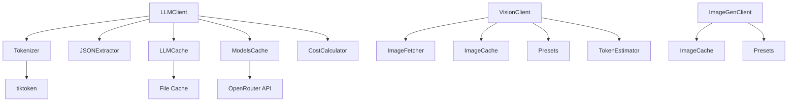
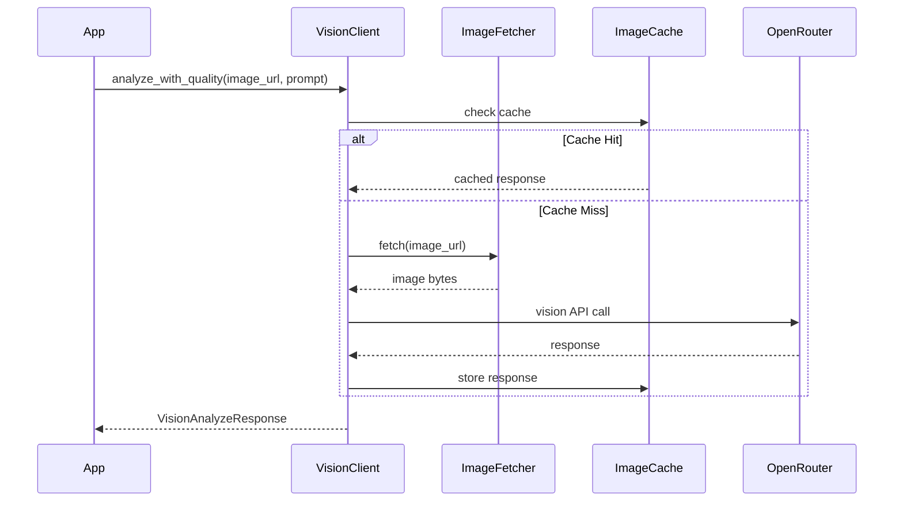
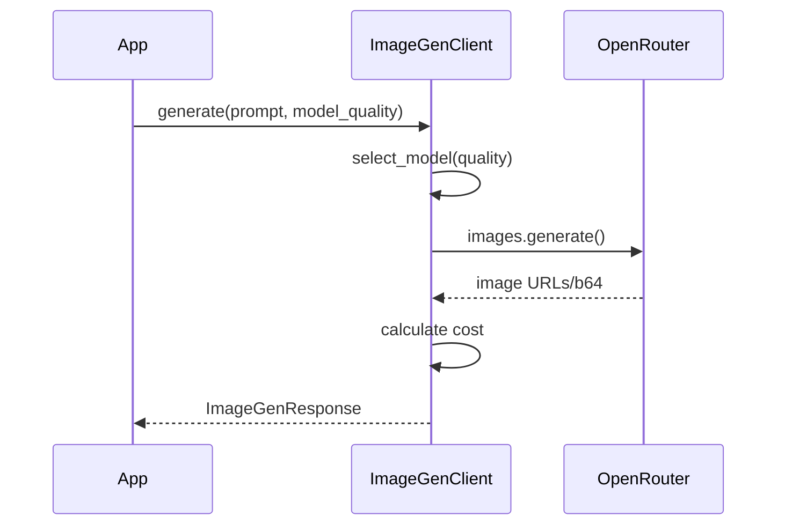

# Django LLM Module

## Overview

**Django LLM** is a modular, type-safe LLM integration system for Django applications built with `django-cfg`. It provides multi-provider support, intelligent caching, cost tracking, vision/OCR capabilities, and image generation.

**Key Features:**
- Multi-provider support (OpenAI, OpenRouter)
- Vision analysis with model quality presets
- OCR with multiple extraction modes
- Image generation (DALL-E, FLUX, etc.)
- Automatic cost calculation and tracking
- Intelligent caching with TTL
- Type-safe configuration with Pydantic 2
- Token counting and usage analytics
- JSON extraction utilities

---

## Modules

### Core Components

```
django_llm/
├── llm/
│   ├── client.py              # Main LLMClient class
│   ├── cache.py               # LLM response caching
│   ├── models_cache.py        # Model pricing cache
│   ├── costs.py               # Cost calculation utilities
│   ├── tokenizer.py           # Token counting utilities
│   ├── extractor.py           # JSON extraction utilities
│   ├── config.py              # VisionConfig, ImageGenConfig
│   ├── vision/
│   │   ├── client.py          # VisionClient for image analysis
│   │   ├── models.py          # Request/Response models
│   │   ├── presets.py         # Model quality & OCR mode presets
│   │   ├── tokens.py          # Image token estimation
│   │   ├── image_fetcher.py   # URL fetching with validation
│   │   └── cache.py           # Image caching with TTL
│   └── image_gen/
│       ├── client.py          # ImageGenClient
│       └── models.py          # ImageGenRequest/Response
└── __init__.py                # Public API exports
```

### Architecture



---

## Vision & OCR

### VisionClient

**Image analysis and OCR with model quality presets**

```python
from django_cfg.modules.django_llm.llm.vision import VisionClient

# Initialize (API key auto-detected from django config)
client = VisionClient()

# Simple image analysis
response = client.analyze(
    image_url="https://example.com/image.jpg",
    prompt="Describe this image"
)
print(response.content)
print(f"Cost: ${response.cost_usd:.4f}")

# Analysis with quality preset
response = client.analyze_with_quality(
    image_url="https://example.com/image.jpg",
    prompt="What objects are in this image?",
    model_quality="balanced"  # fast, balanced, best
)
print(response.description)
```

### Model Quality Presets

| Preset | Model | Use Case |
|--------|-------|----------|
| `fast` | Auto-select cheapest | Quick checks, high volume |
| `balanced` | llama-3.2-11b-vision | General purpose |
| `best` | gpt-4o | Complex analysis, accuracy critical |

### OCR Methods

```python
# Simple text extraction
text = client.extract_text(image_url="https://example.com/document.jpg")

# OCR with mode selection
response = client.ocr(
    image_url="https://example.com/receipt.jpg",
    mode="base"  # tiny, small, base, gundam
)
print(response.text)

# Async OCR
response = await client.aocr(
    image="base64_encoded_image_data",
    mode="gundam"  # Most detailed extraction
)
```

### OCR Modes

| Mode | Description |
|------|-------------|
| `tiny` | Minimal prompt, fastest |
| `small` | Basic OCR prompt |
| `base` | Standard detailed extraction |
| `gundam` | Maximum detail, preserves formatting |

### Async Methods

```python
# Async analysis
response = await client.aanalyze(
    image_url="https://example.com/image.jpg",
    prompt="Analyze this"
)

# Async with quality preset
response = await client.aanalyze_with_quality(
    image="base64_data",
    model_quality="best"
)

# Async OCR
response = await client.aocr(image_url="https://example.com/doc.jpg")
```

### Token Estimation

```python
from django_cfg.modules.django_llm.llm.vision import estimate_image_tokens

# Estimate tokens for image
tokens = estimate_image_tokens(width=1024, height=1024, detail="high")
# Returns: 765 (85 base + 170 * 4 tiles)

# Auto-detect optimal detail mode
from django_cfg.modules.django_llm.llm.vision import get_optimal_detail_mode
mode = get_optimal_detail_mode(width=512, height=512)  # Returns "low"
mode = get_optimal_detail_mode(width=2048, height=2048)  # Returns "high"
```

---

## Image Generation

### ImageGenClient

```python
from django_cfg.modules.django_llm.llm.image_gen import ImageGenClient

# Initialize (API key auto-detected)
client = ImageGenClient()

# Generate image
response = client.generate(
    prompt="A sunset over mountains, photorealistic",
    model_quality="best",  # fast, balanced, best
    size="1024x1024",
    quality="hd",
    style="vivid"
)
print(response.first_url)
print(f"Cost: ${response.cost_usd:.4f}")

# Quick generation (returns URL directly)
url = client.generate_quick("A cute cat wearing a hat")

# Async generation
response = await client.agenerate(
    prompt="Abstract art",
    size="1792x1024"
)
```

### Image Generation Presets

| Preset | Model | Best For |
|--------|-------|----------|
| `fast` | Auto-select | Quick prototypes |
| `balanced` | DALL-E 3 | General use |
| `best` | FLUX Pro | Highest quality |

### Supported Sizes

- `256x256`, `512x512`, `1024x1024`
- `1792x1024`, `1024x1792` (wide/tall)

---

## Image Fetching

### ImageFetcher

```python
from django_cfg.modules.django_llm.llm.vision import ImageFetcher

fetcher = ImageFetcher(
    timeout=30.0,
    max_size_mb=10,
    allowed_domains=["example.com", "cdn.example.com"]  # Optional whitelist
)

# Fetch as bytes
data, content_type = await fetcher.fetch("https://example.com/image.jpg")

# Fetch as base64 data URL
data_url = await fetcher.fetch_as_base64_url("https://example.com/image.jpg")
# Returns: "data:image/jpeg;base64,/9j/4AAQ..."

# Sync versions
data, content_type = fetcher.fetch_sync("https://example.com/image.jpg")
data_url = fetcher.fetch_as_base64_url_sync("https://example.com/image.jpg")

# Format detection from base64
content_type = ImageFetcher.detect_format_from_base64("/9j/4AAQ...")  # "image/jpeg"
content_type = ImageFetcher.detect_format_from_base64("iVBORw0KGgo...")  # "image/png"
```

---

## Caching

### Image Cache

```python
from django_cfg.modules.django_llm.llm.vision import ImageCache, get_image_cache

# Get global cache instance
cache = get_image_cache(cache_dir=Path("cache/images"), ttl_hours=168)

# Store/retrieve images
cache.set_image(url, image_bytes, "image/jpeg")
result = cache.get_image(url)  # Returns (bytes, content_type) or None

# Store/retrieve responses
cache.set_response(cache_key, {"text": "extracted", "cost": 0.001})
result = cache.get_response(cache_key)

# Cache management
stats = cache.get_stats()  # {"enabled": True, "image_count": 10, ...}
count = cache.clear()  # Returns number of files cleared
count = cache.cleanup_expired()  # Remove expired entries
```

---

## Configuration

### VisionConfig

```python
from django_cfg.modules.django_llm.llm.config import VisionConfig

config = VisionConfig(
    enabled=True,
    default_model="openai/gpt-4o",
    default_model_quality="balanced",
    default_ocr_mode="base",
    fetch_enabled=True,
    fetch_timeout=30.0,
    max_image_size_mb=10,
    allowed_domains=None,  # None = all allowed
    cache_enabled=True,
    cache_ttl_hours=168,
)
```

### ImageGenConfig

```python
from django_cfg.modules.django_llm.llm.config import ImageGenConfig

config = ImageGenConfig(
    enabled=True,
    default_model="openai/dall-e-3",
    default_size="1024x1024",
    default_quality="standard",
    default_style="vivid",
    cache_enabled=True,
    cache_ttl_hours=168,
    cache_max_size_mb=500,
)
```

---

## LLM Client (Text)

### Basic Usage

```python
from django_cfg.modules.django_llm.llm.client import LLMClient

client = LLMClient(
    apikey_openrouter="sk-or-v1-...",
    apikey_openai="sk-proj-...",
    cache_dir=Path("cache/llm"),
    cache_ttl=3600
)

# Chat completion
response = client.chat_completion(
    messages=[{"role": "user", "content": "Explain quantum computing"}],
    model="openai/gpt-4o-mini"
)

# Generate embeddings
embedding = client.generate_embedding(
    text="Sample text",
    model="text-embedding-ada-002"
)
```

### Cost Calculation

```python
from django_cfg.modules.django_llm.llm.costs import calculate_chat_cost

cost = calculate_chat_cost(
    model="openai/gpt-4o-mini",
    input_tokens=100,
    output_tokens=50,
    models_cache=models_cache
)
```

### Tokenizer

```python
from django_cfg.modules.django_llm.llm.tokenizer import Tokenizer

tokenizer = Tokenizer()
count = tokenizer.count_tokens("Hello world", "gpt-4o-mini")
count = tokenizer.count_messages_tokens(messages, "gpt-4o-mini")
```

### JSON Extraction

```python
from django_cfg.modules.django_llm.llm.extractor import JSONExtractor

extractor = JSONExtractor()
json_data = extractor.extract_json_from_response("Here's the data: {'name': 'John'}")
```

---

## Data Models

### Vision Models

```python
from django_cfg.modules.django_llm.llm.vision import (
    VisionAnalyzeRequest,
    VisionAnalyzeResponse,
    OCRRequest,
    OCRResponse,
)

# Request with validation
request = VisionAnalyzeRequest(
    image_url="https://example.com/image.jpg",
    prompt="Describe this",
    model_quality="balanced",
    ocr_mode="base"
)

# Response with computed properties
response = VisionAnalyzeResponse(
    extracted_text="Hello World",
    description="A greeting message",
    model="openai/gpt-4o",
    cost_usd=0.001,
    tokens_input=100,
    tokens_output=50
)
print(response.tokens_total)  # 150
```

### Image Generation Models

```python
from django_cfg.modules.django_llm.llm.image_gen import (
    ImageGenRequest,
    ImageGenResponse,
    GeneratedImage,
)

request = ImageGenRequest(
    prompt="A sunset",
    n=2,
    size="1024x1024",
    quality="hd",
    style="vivid"
)

response = ImageGenResponse(
    model="openai/dall-e-3",
    prompt="A sunset",
    images=[GeneratedImage(url="https://...")],
    cost_usd=0.08
)
print(response.first_url)
print(response.count)
```

---

## Flows

### Vision Analysis Flow



### Image Generation Flow



---

## API Keys

API keys are automatically detected from `django_config.api_keys`:

```python
# VisionClient and ImageGenClient auto-detect keys:
client = VisionClient()  # Uses django_config.api_keys.get_openrouter_key()
client = ImageGenClient()  # Uses django_config.api_keys.get_openrouter_key()

# Or provide explicitly:
client = VisionClient(api_key="sk-or-v1-...")
```

---

## Terms

| Term | Description |
|------|-------------|
| **LLM Client** | Main interface for text-based LLM operations |
| **VisionClient** | Client for image analysis and OCR |
| **ImageGenClient** | Client for image generation |
| **Model Quality** | Preset (fast/balanced/best) for automatic model selection |
| **OCR Mode** | Extraction intensity (tiny/small/base/gundam) |
| **Token** | Smallest unit of text processing in LLMs |
| **Image Tokens** | Estimated tokens for image based on size and detail |
| **Provider** | External LLM service (OpenAI, OpenRouter) |
| **Cache Hit** | Request served from local cache |
| **TTL** | Time-to-live for cached items |
