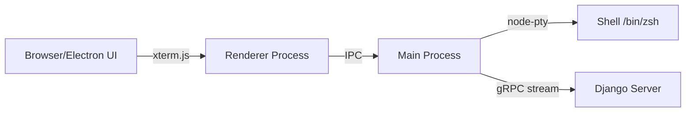

# DjangoCfg Electron Terminal

Desktop application with integrated terminal, built with Electron + xterm.js + gRPC.

## Overview

This app demonstrates bidirectional streaming between a web-based terminal UI and a native shell process, connected via gRPC to a Django backend.



## Quick Start

```bash
# Development
make dev

# Build
make build

# Package
make package
```

## Project Structure

```
apps/electron/
├── src/
│   ├── main.ts              # Main process
│   ├── preload.ts           # Preload scripts
│   ├── App.tsx              # Root component
│   ├── pages/               # App pages
│   └── features/terminal/   # Terminal feature
├── @docs/
│   ├── README.md            # This file
│   └── tasks/               # Implementation details
└── Makefile
```

## Key Features

- **Auto-connect** - Terminal connects on page load
- **Auto-restart** - Shell restarts after `exit`
- **ANSI colors** - Full color support via xterm.js
- **Vercel theme** - Clean dark theme

## Packages

| Package | Description |
|---------|-------------|
| `@djangocfg/electron` | Main Electron app |
| `@djangocfg/grpc-terminal` | gRPC client + PTY manager |
| `@djangocfg/electron-ui` | UI components (PrettyCode, AnsiOutput) |

## Documentation

- [01 - Django gRPC Setup](./tasks/01-django-setup.md)
- [02 - gRPC Terminal Package](./tasks/02-grpc-server.md)
- [03 - Electron Application](./tasks/03-electron-client.md)
- [04 - Terminal UI Components](./tasks/04-browser-ui.md)
- [05 - Integration & Testing](./tasks/05-integration.md)

## Environment

| Variable | Default | Description |
|----------|---------|-------------|
| `GRPC_HOST` | `localhost` | gRPC server host |
| `GRPC_PORT` | `50051` | gRPC server port |
| `GRPC_USE_TLS` | `false` | Enable TLS |

## Tech Stack

- **Electron** 39.x + Electron Forge
- **React** 19.x
- **Tailwind CSS** 4.x
- **xterm.js** 5.x
- **node-pty** 1.x
- **gRPC** via @grpc/grpc-js
