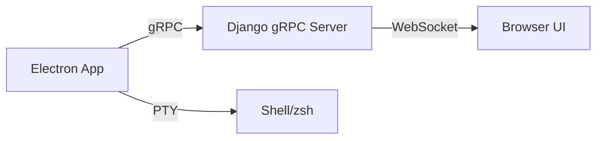
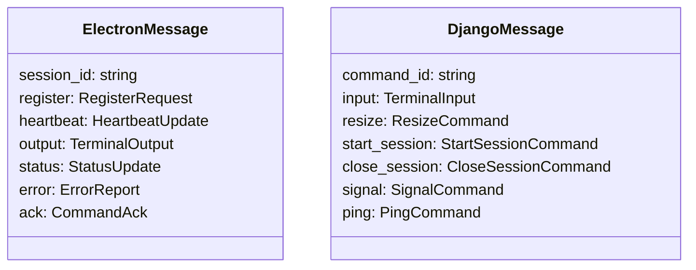

# Task 01: Django gRPC Server Setup

## Overview

Django gRPC server provides terminal streaming service for Electron client communication.

## Architecture



## Configuration

### gRPC Port

Default: `50051` (configurable via environment)

### Environment Variables

| Variable | Default | Description |
|----------|---------|-------------|
| `GRPC_HOST` | `localhost` | gRPC server host |
| `GRPC_PORT` | `50051` | gRPC server port |
| `GRPC_USE_TLS` | `false` | Enable TLS |

## Proto Files

Location: `packages/grpc-terminal/src/grpc/proto/`

- `common.proto` - Shared types (SessionStatus, TerminalSize)
- `terminal_streaming_service.proto` - Main bidirectional streaming service

### Key Message Types



## Code Generation

```bash
cd packages/grpc-terminal
pnpm run proto:generate
```

Output: `src/grpc/generated/`

## Verification

- [ ] gRPC server starts on configured port
- [ ] Health check responds
- [ ] Proto files generated successfully
