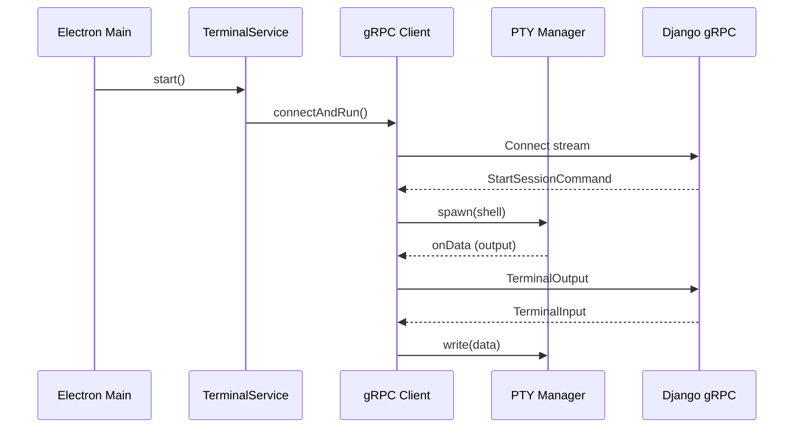

# Task 02: gRPC Terminal Package

## Overview

`@djangocfg/grpc-terminal` - shared package providing gRPC client and PTY manager.

## Package Structure

```
packages/grpc-terminal/
├── src/
│   ├── core/
│   │   └── service.ts       # TerminalService - main orchestrator
│   ├── grpc/
│   │   ├── client.ts        # TerminalStreamingClient
│   │   ├── generated/       # Proto-generated TypeScript
│   │   └── proto/           # Proto source files
│   ├── pty/
│   │   └── manager.ts       # PTYManager - node-pty wrapper
│   ├── models/
│   │   └── config.ts        # Configuration types
│   └── index.ts             # Public exports
├── package.json
└── tsup.config.ts
```

## Service Architecture



## Key Components

### TerminalService

Main entry point. Orchestrates gRPC client and PTY manager.

**Events:**
- `onConnected` - Connected to Django
- `onDisconnected` - Connection lost
- `onOutput` - Terminal output data
- `onError` - Error occurred
- `onExit` - PTY process exited

**Methods:**
- `start()` - Start service
- `stop()` - Stop service
- `write(data)` - Write to PTY
- `resize(cols, rows)` - Resize PTY

### PTYManager

Manages node-pty pseudo-terminal.

**Configuration:**
- Shell: `/bin/zsh` (default)
- Environment: `TERM=xterm-256color`, `COLORTERM=truecolor`
- Login shell: `-l` flag for .zshrc loading

### gRPC Client

Handles bidirectional streaming with Django.

**Message handling:**
- Input from Django → PTY write
- PTY output → Django stream
- Heartbeat every 30s
- Command acknowledgements

## Usage

```typescript
import { createTerminalService, createClientConfig } from '@djangocfg/grpc-terminal';

const config = createClientConfig(sessionId, {
  grpc: { host: 'localhost', port: 50051 },
  terminal: { shell: '/bin/zsh' }
});

const service = createTerminalService(config);
service.on('onOutput', (data) => console.log(data));
await service.start();
```

## Build

```bash
pnpm --filter @djangocfg/grpc-terminal run build
```

## Verification

- [ ] Package builds without errors
- [ ] gRPC client connects
- [ ] PTY spawns shell
- [ ] Bidirectional streaming works
