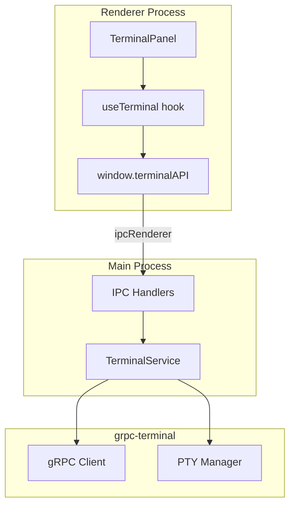

# Task 03: Electron Application

## Overview

`@djangocfg/electron` - Desktop application with integrated terminal.

## Project Structure

```
apps/electron/
├── src/
│   ├── main.ts                    # Main process entry
│   ├── preload.ts                 # Preload script
│   ├── renderer.tsx               # Renderer entry
│   ├── App.tsx                    # Root component
│   ├── env.ts                     # Environment config
│   ├── pages/
│   │   ├── Home.tsx
│   │   ├── About.tsx
│   │   ├── Settings.tsx
│   │   └── Terminal.tsx
│   └── features/
│       └── terminal/
│           ├── components/
│           │   ├── TerminalPanel.tsx
│           │   ├── TerminalToolbar.tsx
│           │   └── TerminalView.tsx
│           ├── hooks/
│           │   └── useTerminal.ts
│           ├── ipc/
│           │   ├── main.ts        # Main process IPC
│           │   └── preload.ts     # Preload API
│           └── types/
├── forge.config.ts
├── vite.main.config.ts
├── vite.preload.config.ts
└── vite.renderer.config.ts
```

## IPC Architecture



## Terminal API (Preload)

Exposed via `contextBridge`:

```typescript
interface TerminalAPI {
  start(config: TerminalConfig): Promise<void>;
  stop(): Promise<void>;
  write(data: string): void;
  resize(cols: number, rows: number): void;
  onOutput(callback: (data: string) => void): () => void;
  onStatus(callback: (status: string) => void): () => void;
  onError(callback: (error: string) => void): () => void;
  onExit(callback: (code: number) => void): () => void;
}
```

## IPC Channels

| Channel | Direction | Description |
|---------|-----------|-------------|
| `terminal:start` | R→M | Start terminal session |
| `terminal:stop` | R→M | Stop terminal session |
| `terminal:input` | R→M | Send input to PTY |
| `terminal:resize` | R→M | Resize PTY |
| `terminal:output` | M→R | PTY output data |
| `terminal:status` | M→R | Status changes |
| `terminal:error` | M→R | Error messages |
| `terminal:exit` | M→R | PTY exit event |

## Terminal Features

### Auto-connect
Terminal connects automatically on mount.

### Auto-restart
When shell exits (`exit` command), automatically restarts after 500ms.

### Theme
Vercel-style dark theme:
- Background: `#000000`
- Foreground: `#ededed`
- Green: `#3ecf8e`
- Red: `#ff6369`
- Blue: `#0070f3`
- Cyan: `#79ffe1`

### Environment
PTY spawns with:
- `TERM=xterm-256color`
- `COLORTERM=truecolor`
- `CLICOLOR=1`
- `CLICOLOR_FORCE=1`

## Commands

```bash
# Development
make dev
# or
pnpm --filter @djangocfg/electron run start

# Build
make build
# or
pnpm --filter @djangocfg/electron run build

# Package
make package
```

## Verification

- [ ] App starts without errors
- [ ] Terminal connects and displays prompt
- [ ] Input works (keyboard)
- [ ] Output displays with colors
- [ ] `exit` restarts shell automatically
- [ ] Theme matches Vercel style
