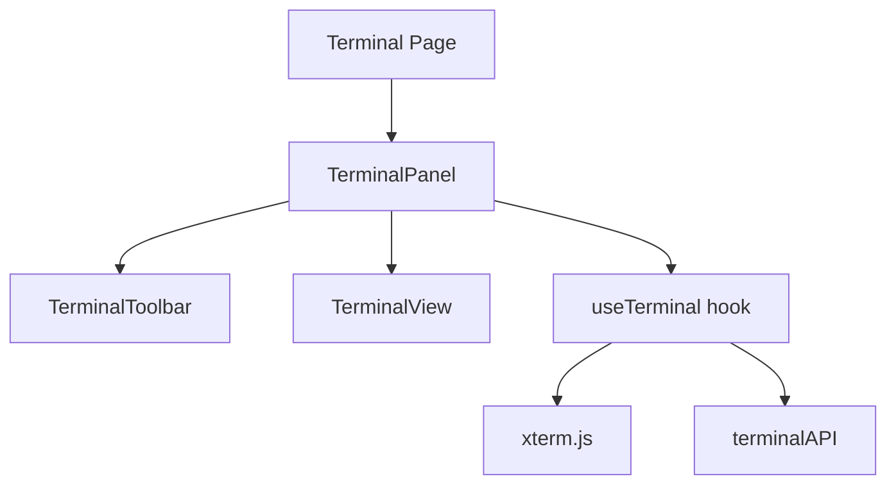

# Task 04: Terminal UI Components

## Overview

Terminal UI built with xterm.js, React, and Tailwind CSS.

## Component Hierarchy



## Components

### TerminalPanel

Main container with toolbar and terminal view.

**Features:**
- Auto-connect on mount
- Status overlay (connecting/error)
- Retry button on error

**File:** `src/features/terminal/components/TerminalPanel.tsx`

### TerminalToolbar

Header bar with status and controls.

**Elements:**
- Terminal icon
- Status badge (connected/disconnected/error)
- Clear button

**File:** `src/features/terminal/components/TerminalToolbar.tsx`

### TerminalView

Standalone xterm.js wrapper (alternative to TerminalPanel).

**File:** `src/features/terminal/components/TerminalView.tsx`

## useTerminal Hook

Manages xterm.js instance and IPC communication.

**Returns:**
```typescript
{
  containerRef: RefObject<HTMLDivElement>;
  status: 'idle' | 'connecting' | 'connected' | 'disconnected' | 'error';
  error: string | null;
  start: () => Promise<void>;
  stop: () => Promise<void>;
  fit: () => void;
  clear: () => void;
  focus: () => void;
}
```

**File:** `src/features/terminal/hooks/useTerminal.ts`

## xterm.js Configuration

### Addons
- `FitAddon` - Auto-resize to container
- `WebLinksAddon` - Clickable URLs

### Theme (Vercel-style)

```typescript
{
  background: '#000000',
  foreground: '#ededed',
  cursor: '#ffffff',
  selection: 'rgba(255, 255, 255, 0.15)',
  black: '#000000',
  red: '#ff6369',
  green: '#3ecf8e',
  yellow: '#f5a623',
  blue: '#0070f3',
  magenta: '#f81ce5',
  cyan: '#79ffe1',
  white: '#ededed',
}
```

### Font
- Family: `JetBrains Mono, Menlo, Monaco, monospace`
- Size: `14px`

## Styling

Uses Tailwind CSS classes:
- Container: `bg-black`, `rounded-lg`, `overflow-hidden`
- Toolbar: `bg-black`, `border-b`, `border-neutral-800`
- Status badges: Color-coded backgrounds

## Verification

- [ ] xterm.js renders in container
- [ ] FitAddon resizes on window resize
- [ ] Input captured and sent
- [ ] Output displayed correctly
- [ ] ANSI colors render
- [ ] URLs are clickable
- [ ] Clear button works
