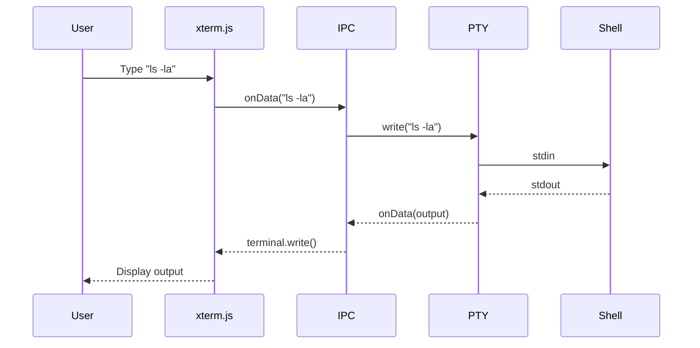

# Task 05: Integration & Testing

## Full Architecture

```mermaid
flowchart TB
    subgraph Electron["Electron App (@djangocfg/electron)"]
        subgraph Renderer["Renderer Process"]
            TP[TerminalPanel]
            XT[xterm.js]
        end

        subgraph Main["Main Process"]
            IPC[IPC Handlers]
        end

        subgraph GrpcPkg["@djangocfg/grpc-terminal"]
            TS[TerminalService]
            GC[gRPC Client]
            PM[PTY Manager]
        end
    end

    subgraph Django["Django Server"]
        GRPC[gRPC Server :50051]
    end

    subgraph Shell["System"]
        ZSH[/bin/zsh]
    end

    TP --> XT
    XT -->|onData| IPC
    IPC --> TS
    TS --> GC
    TS --> PM
    GC <-->|Bidirectional Stream| GRPC
    PM <-->|node-pty| ZSH
```

## Data Flow



## Quick Start

### 1. Start Django gRPC Server

```bash
cd solution/projects/django
source .venv/bin/activate
python manage.py rungrpc --port 50051
```

### 2. Start Electron

```bash
cd solution/projects/frontend/apps/electron
make dev
```

## Testing Checklist

### Basic Functionality

- [ ] Terminal connects automatically
- [ ] Shell prompt displays
- [ ] Commands execute (`ls`, `pwd`, `whoami`)
- [ ] Output displays correctly

### ANSI Colors

Test with:
```bash
echo -e "\033[31mRed\033[0m \033[32mGreen\033[0m \033[34mBlue\033[0m"
```

### Interactive Programs

- [ ] `vim` works
- [ ] `htop` works (if installed)
- [ ] `python3` REPL works
- [ ] Arrow keys for history

### Shell Features

- [ ] Tab completion
- [ ] Ctrl+C (SIGINT)
- [ ] Ctrl+D (EOF)
- [ ] Ctrl+Z (SIGTSTP)

### Auto-restart

- [ ] Type `exit` → shell restarts after 500ms

### Resize

- [ ] Window resize adjusts terminal
- [ ] `FitAddon` recalculates dimensions

## Troubleshooting

### Terminal not connecting

1. Check gRPC server is running
2. Verify port configuration in `env.ts`
3. Check Electron console for errors

### No output / input not working

1. Check IPC channel registration
2. Verify `terminalAPI` is exposed
3. Check PTY manager logs

### Colors not displaying

1. Verify `TERM=xterm-256color`
2. Check `CLICOLOR=1` environment
3. Try `ls -G` explicitly

### Shell not loading .zshrc

PTY spawns with `-l` flag for login shell. If still not working:
1. Check shell path (`/bin/zsh`)
2. Verify working directory

## Performance

| Metric | Expected |
|--------|----------|
| Startup time | < 2s |
| Input latency | < 50ms |
| Output rendering | Real-time |
| Memory usage | < 200MB |

## Success Criteria

1. **Functional terminal** - All commands work
2. **ANSI support** - Colors render correctly
3. **Auto-restart** - Shell restarts on exit
4. **Responsive UI** - No lag on input/output
5. **Stable connection** - No random disconnects
